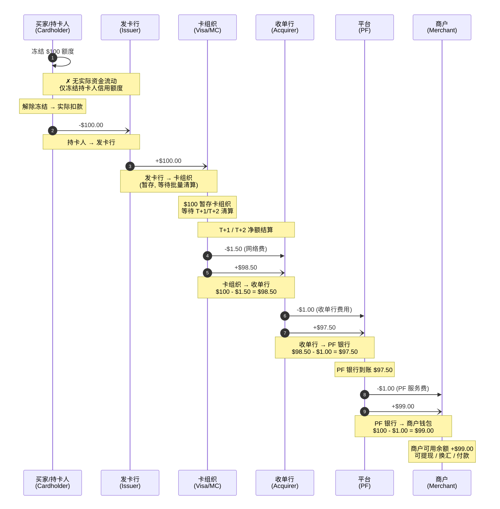

# 收单资金流（Acquiring Fund Flow）



## 各环节资金明细

```
买家支付:                               $100.00
                                      ────────
卡组织网络费 (Visa/MC):                  -$1.50
收单行手续费 (Acquirer):                 -$1.00
PF 服务费:                                -$1.00
                                      ────────
商户实收:                                $96.50

总费率: 3.5%
```

## 资金在各节点的停留时间

```
买家刷卡 ──→ 发卡行扣款 ──→ 卡组织暂存 ──→ 收单行 ──→ PF银行 ──→ 商户钱包
   │             │              │             │            │              │
   │         实时(秒级)      T+1~T+2       T+1~T+2      T+0~T+1        按周期
   │                          批量清算       到账通知     银行入账       (日/周)
   │
 Auth                               Capture ──────────────── Settle ────── Settle
 (实时)                              (实时)                  (Acq→PF)     (PF→Merchant)
```

## 关键风险点

| 风险 | 发生阶段 | 影响 | 应对 |
|------|----------|------|------|
| **Auth 过期** | ①→② 之间 | 授权超时未请款，交易失效 | 设置请款时限提醒 |
| **部分请款** | ② | 金额与 Auth 不一致 | 支持部分 Capture，记录差异 |
| **退单 (Chargeback)** | ④ 之后 | 资金从商户扣回 | 备付金/Reserve 机制 |
| **批量结算差异** | ③ | 银行到账总额与逐笔 Capture 不匹配 | 自动对账 + 异常标记 |
| **跨日结算** | ③ | Capture 和 Settle 跨日，汇率波动 | 记账以 Capture 日汇率为准 |
```
