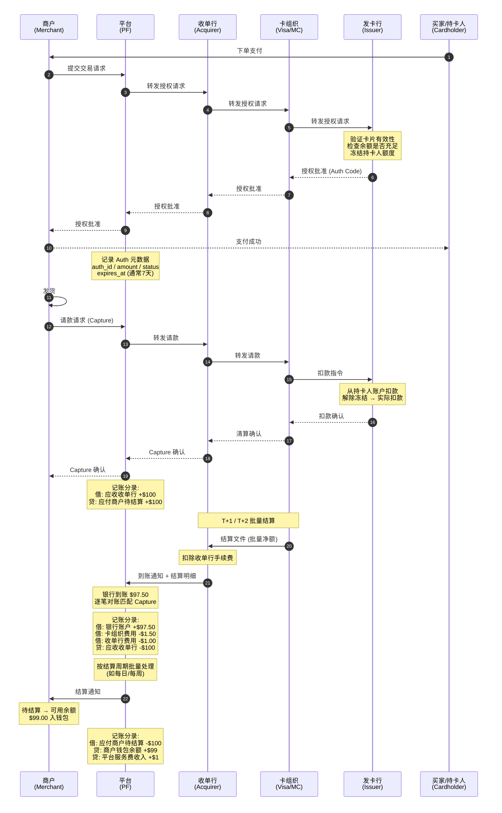

# 收单信息流（Acquiring Information Flow）

## 各阶段信息要素

| 阶段 | 关键信息 | 时效 | 可逆性 |
|------|----------|------|--------|
| **Auth** | auth_id, amount, currency, card_token, expires_at | 实时 | 可撤销（超时/商户主动取消） |
| **Capture** | capture_id, auth_id, amount, shipping_info | 实时 | 可部分请款 |
| **Clearing** | 费用计算、保证金扣减、余额更新 | CAPTURE 时实时触发 | — |
| **Settle(Acq→PF)** | settlement_id, batch_id, net_amount, fee_detail, txn_list | T+1/T+2 批量 | 可调账 |
| **Settle(PF→Merchant)** | settlement_id, merchant_id, gross, fee, net, period | 按结算周期 | 可调账 |

### Clearing 流程（实时清分）

交易 CAPTURE 时立即触发：

1. **费用计算** — MDR + 按笔费用（网关费、3DS 等）
2. **保证金扣减** — 滚动/固定保证金
3. **净额计算** — 交易金额 - 费用 - 保证金
4. **余额更新** — 商户 pending 余额可见

**注：** 实时清分 ≠ 实时结算。清分是平台内部计算，结算依赖 acquirer 的资金划转（T+1/T+2）。

详见 [ADR 0003 交易状态模型](adr/0003-transaction-status-model.md)。
