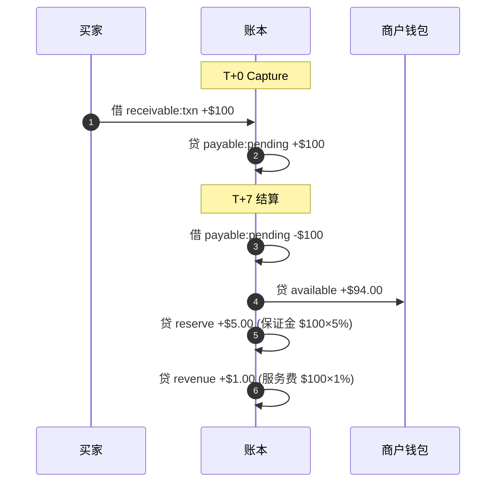
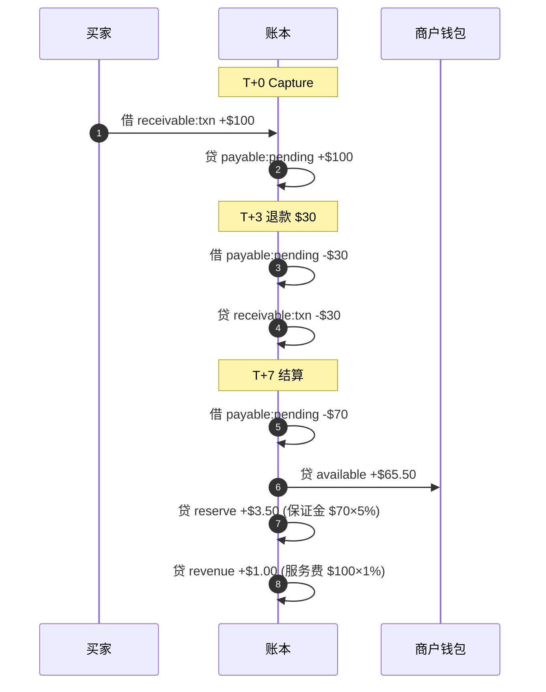
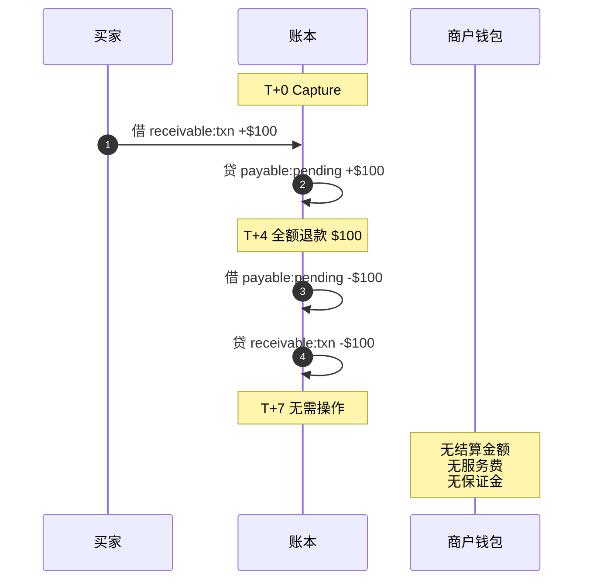

# 收单清算逻辑（Acquiring Settlement Clearing）

## 概述

上游（收单行 → PF）与下游（PF → 商户）是**两本独立的账**，互不影响：

- **上游**：收单行结算时间、到账金额、通道费 —— PF 与收单行之间
- **下游**：基于原始交易金额，按约定费率和保证金规则给商户结算 —— PF 与商户之间

```
上游账本（PF ↔ 收单行）              下游账本（PF ↔ 商户）
┌──────────────────────┐           ┌──────────────────────┐
│ 收单行结算: $97.50    │           │ 原交易金额: $100      │
│ 通道费: $2.50         │           │ 退款: -$30            │
│                      │    独立   │ 服务费 1%×$100: -$1   │
│ PF 银行到账           │◄─ ─ ─ ─►│ 保证金 5%×$70: -$3.50 │
│                      │           │                      │
│ PF 的成本             │           │ 商户实收: $65.50      │
│ 影响 PF 利润          │           │                      │
└──────────────────────┘           └──────────────────────┘
```

## 结算公式

```
商户实收 = 原交易金额 - 退款金额 - 服务费 - 保证金

其中：
  服务费 = 原交易金额 × 服务费率
  保证金 = (原交易金额 - 退款金额) × 保证金比率
```

## 时间线

```
T+0   买家付款 $100（Capture 请款）
T+2   收单行结算给 PF（上游，独立事件）
T+?   可能发生退款（T+0 ~ T+7 之间任意时点）
T+7   PF 结算给商户（下游）
```

## 账户定义

| 类型 | 账户 | 说明 |
|------|------|------|
| 资产 | `house:bank:USD` | PF 银行账户 |
| 资产 | `receivable:txn:USD` | 应收交易款 |
| 负债 | `customer:{id}:pending:{ccy}` | 商户待结算余额 |
| 负债 | `customer:{id}:available:{ccy}` | 商户可用余额 |
| 负债 | `customer:{id}:reserve:{ccy}` | 商户保证金 |
| 收入 | `revenue:fee:acquiring` | 收单服务费收入 |
| 费用 | `expense:refund` | 退款支出 |

---

## 场景一：无退款

原交易 $100，无退款，服务费 1%，保证金 5%



### 分录明细

```
── T+0 Capture 请款 ──────────────────────────────────

  借  receivable:txn:USD                  +$100.00
  贷  customer:abc:pending:USD            +$100.00

  余额:
    receivable:txn      = $100
    pending             = $100
    available           = $0

── T+7 结算给商户 ─────────────────────────────────────

  借  customer:abc:pending:USD            -$100.00
  贷  customer:abc:available:USD          +$94.00    ← 商户可用余额
  贷  customer:abc:reserve:USD            +$5.00     ← 保证金
  贷  revenue:fee:acquiring               +$1.00     ← 服务费

  余额:
    pending             = $0
    available           = $94.00
    reserve             = $5.00
    revenue             = $1.00
```

---

## 场景二：部分退款 $30

原交易 $100，退款 $30，服务费 1%，保证金 5%



### 分录明细

```
── T+0 Capture 请款 ──────────────────────────────────

  借  receivable:txn:USD                  +$100.00
  贷  customer:abc:pending:USD            +$100.00

── T+3 发生退款 $30 ──────────────────────────────────

  借  customer:abc:pending:USD            -$30.00
  贷  receivable:txn:USD                  -$30.00

  余额:
    receivable:txn      = $70     ($100 - $30)
    pending             = $70     ($100 - $30)

── T+7 结算给商户 ─────────────────────────────────────

  借  customer:abc:pending:USD            -$70.00
  贷  customer:abc:available:USD          +$65.50    ← 商户可用余额
  贷  customer:abc:reserve:USD            +$3.50     ← 保证金 = $70 × 5%
  贷  revenue:fee:acquiring               +$1.00     ← 服务费 = $100 × 1%

  余额:
    pending             = $0
    available           = $65.50
    reserve             = $3.50
    revenue             = $1.00
```

---

## 场景三：全额退款

原交易 $100，退款 $100，服务费和保证金均不产生



### 分录明细

```
── T+0 Capture 请款 ──────────────────────────────────

  借  receivable:txn:USD                  +$100.00
  贷  customer:abc:pending:USD            +$100.00

── T+4 发生全额退款 $100 ─────────────────────────────

  借  customer:abc:pending:USD            -$100.00
  贷  receivable:txn:USD                  -$100.00

  余额:
    receivable:txn      = $0
    pending             = $0

── T+7 结算给商户 ─────────────────────────────────────

  无需操作。
  pending 已为 $0，无结算金额，无服务费，无保证金。
```

---

## 三场景汇总对比

| 指标 | 无退款 | 部分退款 $30 | 全额退款 |
|------|--------|-------------|----------|
| T+0 pending | $100 | $100 | $100 |
| 退款扣减 | — | pending -$30 | pending -$100 |
| T+7 pending | $100 | $70 | $0 |
| 服务费 1%×$100 | $1.00 | $1.00 | — |
| 保证金 5% | $5.00 ($100×5%) | $3.50 ($70×5%) | — |
| **商户实收** | **$94.00** | **$65.50** | **$0** |
| **平台收入** | **$1.00** | **$1.00** | **$0** |

## 关键设计规则

1. **服务费基于原交易金额** — 不受退款影响，因为服务已经提供
2. **保证金基于实际结算金额** — `(原交易金额 - 退款金额) × 保证金比率`
3. **全额退款 = 一切归零** — 无结算、无服务费、无保证金
4. **退款在发生时即时记账** — 扣减 pending 和 receivable，不等到 T+7
5. **上游与下游独立** — 收单行何时到账、到账多少，不影响商户结算逻辑
