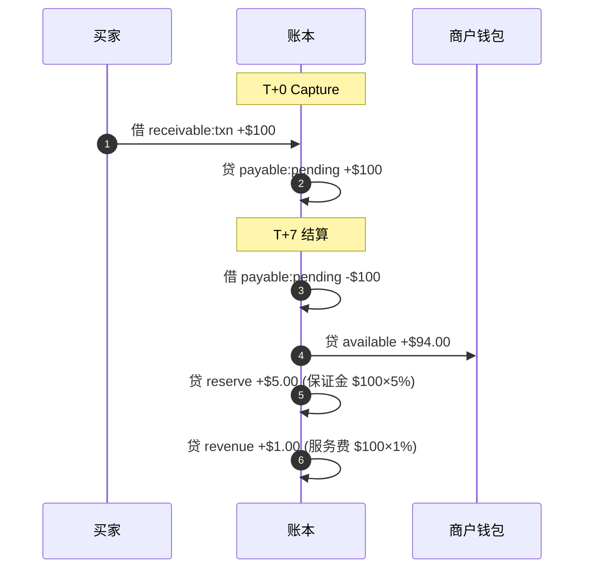
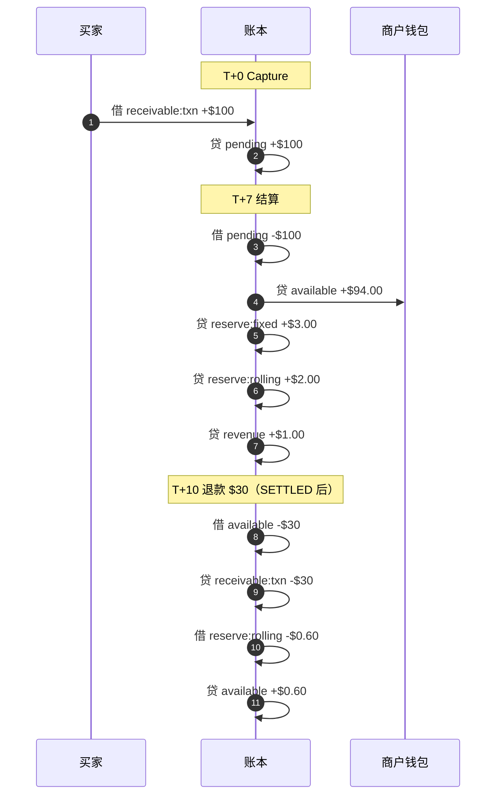
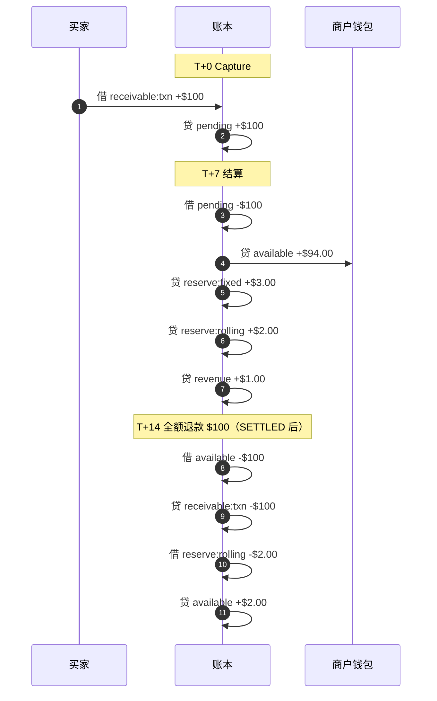

# 收单清算逻辑（Acquiring Settlement Clearing）

## 概述

上游（收单行 → PF）与下游（PF → 商户）是**两本独立的账**，互不影响：

- **上游**：收单行结算时间、到账金额、通道费 —— PF 与收单行之间
- **下游**：基于原始交易金额，按约定费率和保证金规则给商户结算 —— PF 与商户之间

```
上游账本（PF ↔ 收单行）              下游账本（PF ↔ 商户）
┌──────────────────────┐           ┌──────────────────────┐
│ 收单行结算: $97.50    │           │ 原交易金额: $100      │
│ 通道费: $2.50         │           │ 退款: -$30            │
│                      │    独立   │ 服务费 1%×$100: -$1   │
│ PF 银行到账           │◄─ ─ ─ ─►│ 保证金 5%×$70: -$3.50 │
│                      │           │                      │
│ PF 的成本             │           │ 商户实收: $65.50      │
│ 影响 PF 利润          │           │                      │
└──────────────────────┘           └──────────────────────┘
```

## 结算公式

```
商户实收 = 原交易金额 - 退款金额 - 服务费 - 保证金

其中：
  服务费 = 原交易金额 × 服务费率
  保证金 = (原交易金额 - 退款金额) × 保证金比率
```

## 时间线

```
T+0   买家付款 $100（Capture 请款）
T+2   收单行结算给 PF（上游，独立事件）
T+?   可能发生退款（T+0 ~ T+7 之间任意时点）
T+7   PF 结算给商户（下游）
```

## 账户定义

| 类型 | 账户 | 说明 |
|------|------|------|
| 资产 | `house:bank:USD` | PF 银行账户 |
| 资产 | `receivable:txn:USD` | 应收交易款 |
| 负债 | `customer:{id}:pending:{ccy}` | 商户待结算余额 |
| 负债 | `customer:{id}:available:{ccy}` | 商户可用余额 |
| 负债 | `customer:{id}:reserve:fixed:{ccy}` | 商户固定保证金 |
| 负债 | `customer:{id}:reserve:rolling:{ccy}` | 商户滚动保证金 |
| 收入 | `revenue:fee:acquiring` | 收单服务费收入 |
| 费用 | `expense:refund` | 退款支出 |

---

## 场景一：无退款

原交易 $100，无退款，服务费 1%，保证金 5%



### 分录明细

```
── T+0 Capture 请款 ──────────────────────────────────

  借  receivable:txn:USD                  +$100.00
  贷  customer:abc:pending:USD            +$100.00

  余额:
    receivable:txn      = $100
    pending             = $100
    available           = $0

── T+7 结算给商户 ─────────────────────────────────────

  借  customer:abc:pending:USD            -$100.00
  贷  customer:abc:available:USD          +$94.00    ← 商户可用余额
  贷  customer:abc:reserve:fixed:USD      +$3.00     ← 固定保证金 = $100 × 3%
  贷  customer:abc:reserve:rolling:USD    +$2.00     ← 滚动保证金 = $100 × 2%
  贷  revenue:fee:acquiring               +$1.00     ← 服务费

  余额:
    pending             = $0
    available           = $94.00
    reserve:fixed       = $3.00
    reserve:rolling     = $2.00
    revenue             = $1.00
```

---

## 场景二：部分退款 $30（结算后退款）

原交易 $100，结算后退款 $30，服务费 1%，保证金 5%（固定 3% + 滚动 2%）

**注：** 退款只能在 SETTLED 之后发起（见 ADR 0003），settlement 前的撤销走 VOIDED 流程。



### 分录明细

```
── T+0 Capture 请款 ──────────────────────────────────

  借  receivable:txn:USD                  +$100.00
  贷  customer:abc:pending:USD            +$100.00

── T+7 结算给商户 ─────────────────────────────────────

  借  customer:abc:pending:USD            -$100.00
  贷  customer:abc:available:USD          +$94.00
  贷  customer:abc:reserve:fixed:USD      +$3.00     ← 固定保证金 = $100 × 3%
  贷  customer:abc:reserve:rolling:USD    +$2.00     ← 滚动保证金 = $100 × 2%
  贷  revenue:fee:acquiring               +$1.00     ← 服务费 = $100 × 1%

── T+10 退款 $30（SETTLED 后，从 available 扣减）──────

  借  customer:abc:available:USD           -$30.00
  贷  receivable:txn:USD                   -$30.00

  滚动保证金按比例退回 = $30/$100 × $2.00 = $0.60:
  借  customer:abc:reserve:rolling:USD     -$0.60
  贷  customer:abc:available:USD           +$0.60

  余额:
    available       = $94.00 - $30.00 + $0.60 = $64.60
    reserve:fixed   = $3.00（不变）
    reserve:rolling = $2.00 - $0.60 = $1.40
```

---

## 场景三：全额退款（结算后退款）

原交易 $100，结算后全额退款 $100，服务费 1%，保证金 5%（固定 3% + 滚动 2%）

**注：** 退款只能在 SETTLED 之后发起（见 ADR 0003）。



### 分录明细

```
── T+0 Capture 请款 ──────────────────────────────────

  借  receivable:txn:USD                  +$100.00
  贷  customer:abc:pending:USD            +$100.00

── T+7 结算给商户 ─────────────────────────────────────

  借  customer:abc:pending:USD            -$100.00
  贷  customer:abc:available:USD          +$94.00
  贷  customer:abc:reserve:fixed:USD      +$3.00
  贷  customer:abc:reserve:rolling:USD    +$2.00
  贷  revenue:fee:acquiring               +$1.00

── T+14 全额退款 $100（SETTLED 后，从 available 扣减）──

  借  customer:abc:available:USD           -$100.00
  贷  receivable:txn:USD                   -$100.00

  滚动保证金全额退回:
  借  customer:abc:reserve:rolling:USD     -$2.00
  贷  customer:abc:available:USD           +$2.00

  固定保证金: 不退回（全局目标，与单笔交易无关）

  余额:
    available       = $94.00 - $100.00 + $2.00 = -$4.00（负余额）
    reserve:fixed   = $3.00（不变）
    reserve:rolling = $0

  后续收入自动抵扣负余额 -$4.00
```

---

## 三场景汇总对比

| 指标 | 无退款 | 部分退款 $30（结算后） | 全额退款（结算后） |
|------|--------|----------------------|-------------------|
| T+0 pending | $100 | $100 | $100 |
| T+7 结算后 available | $94.00 | $94.00 | $94.00 |
| 退款扣减 available | — | -$30 | -$100 |
| 滚动保证金退回 | — | +$0.60 | +$2.00 |
| 服务费 1%×$100 | $1.00 | $1.00 | $1.00 |
| 固定保证金 3%×$100 | $3.00 | $3.00 | $3.00 |
| 滚动保证金 2%×$100 | $2.00 | $2.00 - $0.60 = $1.40 | $0（全额退回） |
| **商户最终 available** | **$94.00** | **$64.60** | **-$4.00（负余额）** |
| **平台收入** | **$1.00** | **$1.00** | **$1.00** |

## 关键设计规则

1. **服务费基于原交易金额** — 不受退款影响，因为服务已经提供
2. **保证金基于原交易金额** — `原交易金额 × 保证金比率`，不因退款减少
3. **退款只能在 SETTLED 后发起** — settlement 前的撤销走 VOIDED 流程（见 ADR 0003）
4. **退款从 available 扣减** — 已结算资金属于商户，退款从 available 余额扣减
5. **滚动保证金按比例退回** — 退款时同步退回对应的滚动保证金（仅 HELD 状态，见 ADR 0001）
6. **固定保证金不退回** — 全局目标金额，与单笔交易退款无关（见 ADR 0001）
7. **上游与下游独立** — 收单行何时到账、到账多少，不影响商户结算逻辑
