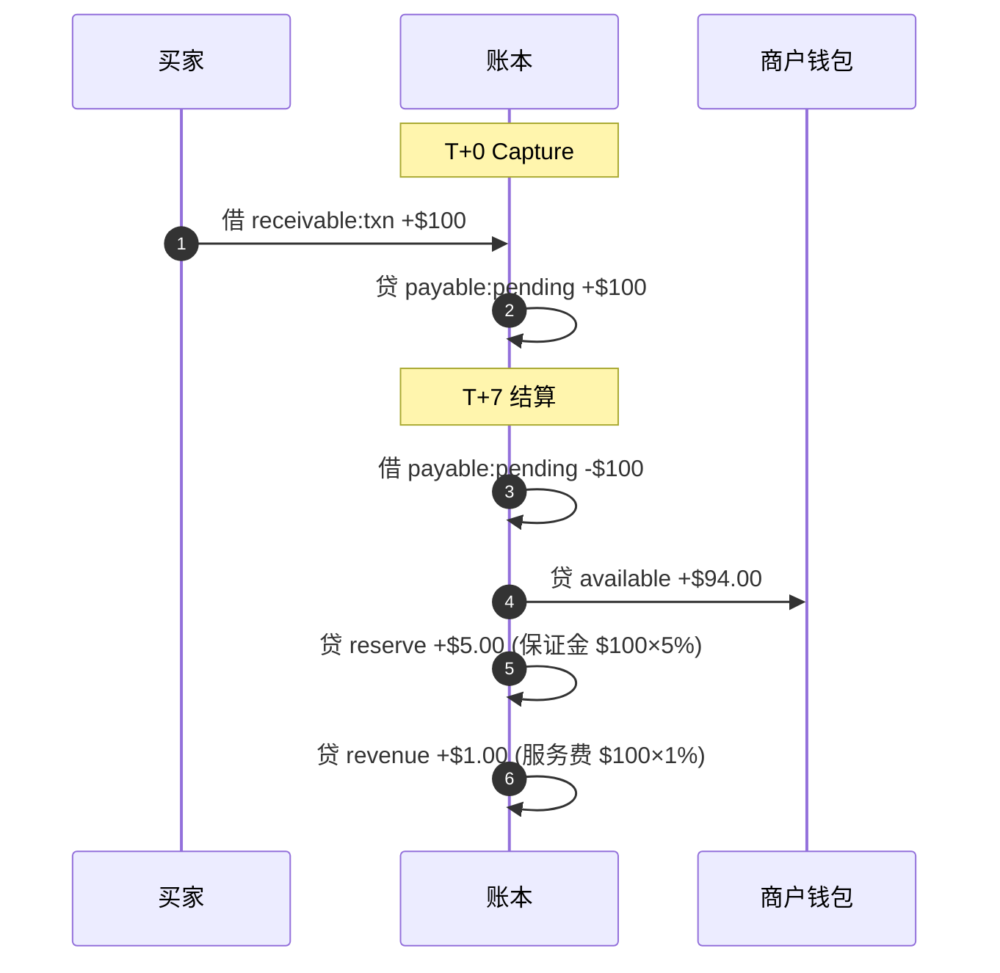
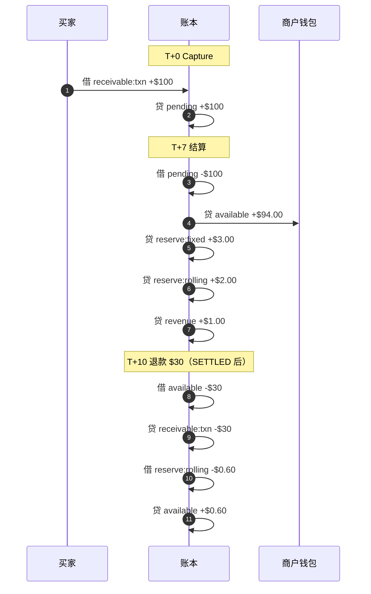
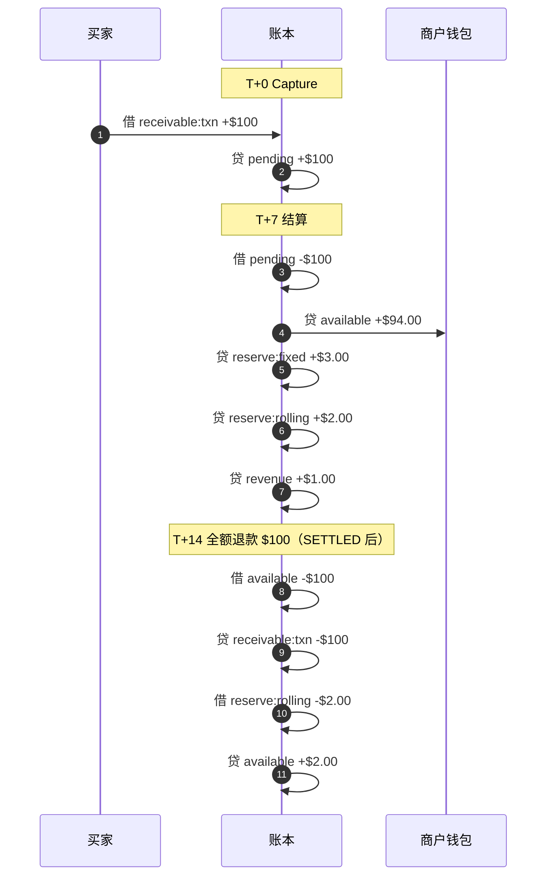

# 收单清算逻辑（Acquiring Settlement Clearing）

规则以 ADR 为准。分录见 [journals/acquiring.md](journals/acquiring.md)。

## 概述

上游（收单行 → PF）与下游（PF → 商户）是**两本独立的账**，互不影响：

- **上游**：收单行结算时间、到账金额、通道费 —— PF 与收单行之间
- **下游**：基于原始交易金额，按约定费率和保证金规则给商户结算 —— PF 与商户之间

```
上游账本（PF ↔ 收单行）              下游账本（PF ↔ 商户）
┌──────────────────────┐           ┌──────────────────────┐
│ 收单行结算: $97.50    │           │ 原交易金额: $100      │
│ 通道费: $2.50         │           │ 退款: -$30            │
│                      │    独立   │ 服务费 1%×$100: -$1   │
│ PF 银行到账           │◄─ ─ ─ ─►│ 保证金 5%×$70: -$3.50 │
│                      │           │                      │
│ PF 的成本             │           │ 商户实收: $65.50      │
│ 影响 PF 利润          │           │                      │
└──────────────────────┘           └──────────────────────┘
```

## 结算公式

CAPTURE 清分（同币种时请款金额 = 入账金额）：

```
入账金额 = 请款金额 × booking_fx_rate
MDR = 请款金额 × 费率，折结算币种
按笔费 = 主币种标价，折结算币种，扣结算钱包
滚动 = 入账金额 × 滚动比率
固定 = 折主币种，受目标封顶
结算净额 = 入账金额 - MDR - 按笔费 - 滚动 - 固定
```

退款（仅 SETTLED 后，ADR 0003 / 0004）：

```
退款入账金额 = 退款请款金额 × refund_fx_rate
退 MDR = 原 MDR × 退款请款 / 原请款
退滚动（HELD）= 原滚动 × 退款请款 / 原请款
按笔费、固定不退
```

跨币种与主币种兜底见 [ADR 0004](adr/0004-multi-currency-clearing.md)。

## 时间线

```
T+0   买家付款 $100（Capture 请款）
T+2   收单行结算给 PF（上游，独立事件）
T+?   SETTLED 之后才可退款；此前撤销走 VOID
T+7   下游 SETTLED（资金归属商户）；费用/保证金在 CAPTURE 已清分
```

## 账户定义

| 类型 | 账户 | 说明 |
|------|------|------|
| 资产 | `house:bank:USD` | PF 银行账户 |
| 资产 | `receivable:txn:USD` | 应收交易款 |
| 负债 | `customer:{id}:pending:{ccy}` | 商户待结算余额 |
| 负债 | `customer:{id}:available:{ccy}` | 商户可用余额 |
| 负债 | `customer:{id}:reserve:fixed:{ccy}` | 商户固定保证金 |
| 负债 | `customer:{id}:reserve:rolling:{ccy}` | 商户滚动保证金 |
| 收入 | `revenue:fee:acquiring` | 收单服务费收入 |
| 费用 | `expense:refund` | 退款支出 |

---

## 场景一：无退款

原交易 $100，无退款，服务费 1%，保证金 5%


```mermaid
sequenceDiagram
    autonumber
    participant C as 买家
    participant T as 账本
    participant M as 商户钱包

    Note over T: T+0 Capture
    C->>T: 借 receivable:txn +$100
    T->>T: 贷 payable:pending +$100

    Note over T: T+7 结算
    T->>T: 借 payable:pending -$100
    T->>M: 贷 available +$94.00
    T->>T: 贷 reserve +$5.00 (保证金 $100×5%)
    T->>T: 贷 revenue +$1.00 (服务费 $100×1%)
```

### 分录明细

```
── T+0 Capture 请款 ──────────────────────────────────

  借  receivable:txn:USD                  +$100.00
  贷  customer:abc:pending:USD            +$100.00

  余额:
    receivable:txn      = $100
    pending             = $100
    available           = $0

── T+7 结算给商户 ─────────────────────────────────────

  借  customer:abc:pending:USD            -$100.00
  贷  customer:abc:available:USD          +$94.00    ← 商户可用余额
  贷  customer:abc:reserve:fixed:USD      +$3.00     ← 固定保证金 = $100 × 3%
  贷  customer:abc:reserve:rolling:USD    +$2.00     ← 滚动保证金 = $100 × 2%
  贷  revenue:fee:acquiring               +$1.00     ← 服务费

  余额:
    pending             = $0
    available           = $94.00
    reserve:fixed       = $3.00
    reserve:rolling     = $2.00
    revenue             = $1.00
```

---

## 场景二：部分退款 $30（结算后退款）

原交易 $100，结算后退款 $30，服务费 1%，保证金 5%（固定 3% + 滚动 2%）

**注：** 退款只能在 SETTLED 之后发起（见 ADR 0003），settlement 前的撤销走 VOIDED 流程。


```mermaid
sequenceDiagram
    autonumber
    participant C as 买家
    participant T as 账本
    participant M as 商户钱包

    Note over T: T+0 Capture
    C->>T: 借 receivable:txn +$100
    T->>T: 贷 pending +$100

    Note over T: T+7 结算
    T->>T: 借 pending -$100
    T->>M: 贷 available +$94.00
    T->>T: 贷 reserve:fixed +$3.00
    T->>T: 贷 reserve:rolling +$2.00
    T->>T: 贷 revenue +$1.00

    Note over T: T+10 退款 $30（SETTLED 后）
    T->>T: 借 available -$30
    T->>T: 贷 receivable:txn -$30
    T->>T: 借 reserve:rolling -$0.60
    T->>T: 贷 available +$0.60
```

### 分录明细

```
── T+0 Capture 请款 ──────────────────────────────────

  借  receivable:txn:USD                  +$100.00
  贷  customer:abc:pending:USD            +$100.00

── T+7 结算给商户 ─────────────────────────────────────

  借  customer:abc:pending:USD            -$100.00
  贷  customer:abc:available:USD          +$94.00
  贷  customer:abc:reserve:fixed:USD      +$3.00     ← 固定保证金 = $100 × 3%
  贷  customer:abc:reserve:rolling:USD    +$2.00     ← 滚动保证金 = $100 × 2%
  贷  revenue:fee:acquiring               +$1.00     ← 服务费 = $100 × 1%

── T+10 退款 $30（SETTLED 后，从 available 扣减）──────

  借  customer:abc:available:USD           -$30.00
  贷  receivable:txn:USD                   -$30.00

  滚动保证金按比例退回 = $30/$100 × $2.00 = $0.60:
  借  customer:abc:reserve:rolling:USD     -$0.60
  贷  customer:abc:available:USD           +$0.60

  MDR 按请款比例退回 = $30/$100 × $1.00 = $0.30:
  借  revenue:fee:acquiring:USD            -$0.30
  贷  customer:abc:available:USD           +$0.30

  余额:
    available       = $94.00 - $30.00 + $0.60 + $0.30 = $64.90
    reserve:fixed   = $3.00（不变）
    reserve:rolling = $2.00 - $0.60 = $1.40
```

---

## 场景三：全额退款（结算后退款）

原交易 $100，结算后全额退款 $100，服务费 1%，保证金 5%（固定 3% + 滚动 2%）

**注：** 退款只能在 SETTLED 之后发起（见 ADR 0003）。


```mermaid
sequenceDiagram
    autonumber
    participant C as 买家
    participant T as 账本
    participant M as 商户钱包

    Note over T: T+0 Capture
    C->>T: 借 receivable:txn +$100
    T->>T: 贷 pending +$100

    Note over T: T+7 结算
    T->>T: 借 pending -$100
    T->>M: 贷 available +$94.00
    T->>T: 贷 reserve:fixed +$3.00
    T->>T: 贷 reserve:rolling +$2.00
    T->>T: 贷 revenue +$1.00

    Note over T: T+14 全额退款 $100（SETTLED 后）
    T->>T: 借 available -$100
    T->>T: 贷 receivable:txn -$100
    T->>T: 借 reserve:rolling -$2.00
    T->>T: 贷 available +$2.00
```

### 分录明细

```
── T+0 Capture 请款 ──────────────────────────────────

  借  receivable:txn:USD                  +$100.00
  贷  customer:abc:pending:USD            +$100.00

── T+7 结算给商户 ─────────────────────────────────────

  借  customer:abc:pending:USD            -$100.00
  贷  customer:abc:available:USD          +$94.00
  贷  customer:abc:reserve:fixed:USD      +$3.00
  贷  customer:abc:reserve:rolling:USD    +$2.00
  贷  revenue:fee:acquiring               +$1.00

── T+14 全额退款 $100（SETTLED 后，从 available 扣减）──

  借  customer:abc:available:USD           -$100.00
  贷  receivable:txn:USD                   -$100.00

  滚动保证金全额退回:
  借  customer:abc:reserve:rolling:USD     -$2.00
  贷  customer:abc:available:USD           +$2.00

  MDR 全额退回:
  借  revenue:fee:acquiring:USD            -$1.00
  贷  customer:abc:available:USD           +$1.00

  固定保证金: 不退回（全局目标，与单笔交易无关）

  余额:
    available       = $94.00 - $100.00 + $2.00 + $1.00 = -$3.00
    reserve:fixed   = $3.00（不变）
    reserve:rolling = $0
    revenue         = $0
```

---

## 三场景汇总对比

| 指标 | 无退款 | 部分退款 $30（结算后） | 全额退款（结算后） |
|------|--------|----------------------|-------------------|
| T+0 pending | $100 | $100 | $100 |
| T+7 结算后 available | $94.00 | $94.00 | $94.00 |
| 退款扣减 available | — | -$30 | -$100 |
| 滚动保证金退回 | — | +$0.60 | +$2.00 |
| 退 MDR | — | +$0.30 | +$1.00 |
| 服务费 1%×$100（剩余） | $1.00 | $0.70 | $0 |
| 固定保证金 3%×$100 | $3.00 | $3.00 | $3.00 |
| 滚动保证金 2%×$100 | $2.00 | $1.40 | $0 |
| **商户最终 available** | **$94.00** | **$64.90** | **-$3.00（负余额=留下的固定）** |
| **平台 MDR 收入** | **$1.00** | **$0.70** | **$0** |

## 关键设计规则

1. **MDR 按请款金额计价** — 退款时按请款比例退回（ADR 0003）
2. **滚动按入账金额抽取** — 退款按请款比例退回 HELD 部分；固定在主币种、退款不退
3. **退款只能在 SETTLED 后发起** — settlement 前的撤销走 VOIDED 流程（见 ADR 0003）
4. **退款从 available 扣减** — 已结算资金属于商户，退款从 available 余额扣减
5. **滚动保证金按比例退回** — 退款时同步退回对应的滚动保证金（仅 HELD 状态，见 ADR 0001）
6. **固定保证金不退回** — 全局目标金额，与单笔交易退款无关（见 ADR 0001）
7. **上游与下游独立** — 收单行何时到账、到账多少，不影响商户结算逻辑
