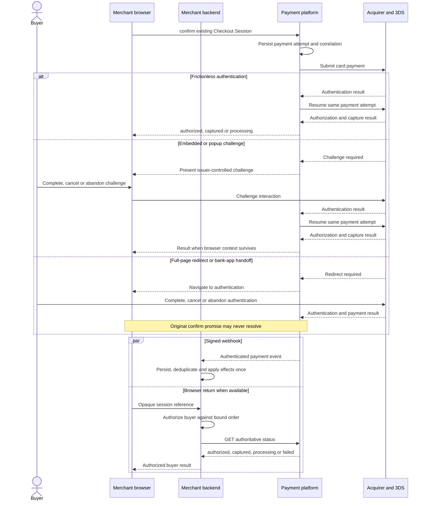

# Payment Element 3DS design

Status: proposed extension design; not an adopted ADR or implemented API.

This document defines 3-D Secure cardholder authentication on top of the base [Payment Element SDK design](payment-element-design.md). It assumes that merchant authentication, Checkout Session creation, browser capability, frame isolation, confirmation, status retrieval and webhook delivery already work as described there.

## Decision summary

3DS is an action orchestrated by `checkout.confirm()`, not a separate merchant integration and not a payment success callback. The SDK detects when the processor requires authentication, presents the supported issuer-controlled experience and resumes the same payment attempt afterward.

The merchant receives coarse action lifecycle events for UX coordination but does not receive issuer challenge payloads or authentication secrets. Completing a challenge means authentication finished; authorization and capture can still fail. Full-page redirect and mobile bank-app handoff may destroy the original JavaScript context, so backend status retrieval and signed webhooks are mandatory completion paths.

## Goals

- Support frictionless and challenged 3DS without exposing processor-specific contracts to merchants.
- Support modal/iframe challenge, popup, full-page redirect and mobile bank-app return.
- Preserve one logical payment attempt across authentication and return.
- Give merchants enough events to manage loading, focus and navigation without treating UI events as money truth.
- Keep 3DS orchestration state out of the ledger and the platform transaction enum.

## Non-goals

- This document does not define exemption strategy, regulatory policy, risk scoring or processor routing.
- It does not expose low-level EMV 3DS messages, directory-server data or issuer challenge payloads.
- It does not add an `AUTHENTICATING` value to `Transaction.status`.
- It does not guarantee one presentation mode across issuers, processors, browsers or wallets.

## Dependency on the base SDK

3DS uses these base features unchanged:

- merchant server authentication and resource ownership checks;
- server-created Checkout Session with immutable amount, currency and order version;
- short-lived browser client secret;
- cross-origin sensitive-field boundary;
- `checkout.confirm()` and duplicate-submit protection;
- `authorized`, `processing`, `captured` and `failed` confirmation outcomes;
- registered return URL, backend status retrieval and signed webhooks;
- stable errors, request IDs, teardown and React lifecycle behavior.

The 3DS layer adds action presentation, action lifecycle events, return correlation and authentication-specific test scenarios.

## End-to-end flow



The webhook and browser return may arrive in either order, and the browser may never return. Both paths call the merchant's same idempotent order-update or fulfillment logic.

## 3DS modes

### Frictionless

The processor and issuer complete authentication without buyer interaction. `confirm()` continues the original attempt and returns the resulting payment status. The merchant may observe `actionstart` and `actionend`, but the SDK may omit visible action UI.

### Embedded or modal challenge

The SDK presents an issuer-controlled challenge in the processor-supported frame or modal. It owns focus trapping inside its surface, announces loading/errors, restores focus afterward and prevents the Payment Element from being resubmitted while the action is active.

### Popup

Where required, the SDK opens a popup from the buyer's submit gesture. It detects popup blocking and returns a recoverable action error or uses a documented fallback. Closing the popup is cancellation, not proof that the underlying payment failed.

### Full-page redirect or bank-app handoff

The SDK navigates to an issuer or processor destination and the current `confirm()` promise is abandoned. The return target is a registered merchant URL containing only an opaque checkout/session reference. On mobile, the same rule applies to system-browser and bank-app round trips.

The merchant return page must query its backend. It must not trust query-string status, browser history or the fact that navigation returned.

## SDK contract

The merchant uses the same base confirmation call:

```ts
const result = await checkout.confirm({
  returnUrl: "https://shop.example/payments/return",
});

switch (result.status) {
  case "authorized":
    showAuthorizedState(result.capture, result.error);
    break;
  case "captured":
    showPaymentReceived();
    break;
  case "processing":
    showProcessing();
    break;
  case "failed":
    showPaymentError(result.error);
    break;
}
```

The SDK normally presents and completes a required action itself. It must not require merchants to submit challenge results manually. A processor adapter may internally exchange action tokens, but those are not part of the public merchant API.

### Action events

```ts
checkout.on("actionstart", ({ type }) => {
  // type: "three_ds" | "redirect" | "wallet"
  disableCheckoutNavigation();
});

checkout.on("actionend", ({ type, outcome }) => {
  // outcome: "completed" | "canceled" | "failed"
  restoreCheckoutNavigation();
});
```

`actionstart` means an external interaction is beginning. `actionend: completed` means that interaction finished, not that authorization or capture succeeded. The subsequent `ConfirmResult`, backend retrieval or webhook provides payment status.

`actionend` is not guaranteed when an action navigates away, the page closes or the browser process is suspended. Merchant correctness must not depend on receiving it; teardown and restored UI are best-effort browser concerns, while status retrieval and webhooks recover the payment outcome.

The SDK should not emit issuer challenge content, authentication values, device data or raw processor results. Diagnostics use stable platform error codes and request/action IDs.

## State model

An SDK or internal payment-attempt implementation may model:

```text
PAYING
  |-- 3DS required -> AUTHENTICATING
  |                     |-- authenticated -> resume same attempt
  |                     |-- canceled      -> reconcile; fail/retry only when definitive
  |                     `-- failed        -> failed
  |-- authorization succeeded -> PAID
  `-- declined/failed

PAID -> CAPTURED -> SETTLED
```

`AUTHENTICATING` is an orchestration state, not a persisted `Transaction.status` proposed by this document. Per [ADR 0003](adr/0003-transaction-status-model.md), an unresolved provider/authentication wait remains platform transaction `PAYING`; authorization success enters `PAID`; capture enters `CAPTURED`; downstream merchant settlement later enters `SETTLED`.

Do not map the following directly to payment success:

- challenge rendered;
- challenge completed;
- browser returned;
- cardholder authenticated;
- processor accepted a request;
- a provider's UI callback named `complete` or `approved`.

## Attempt continuity and idempotency

Authentication resumes the same logical payment attempt. The platform persists its attempt ID and processor correlation before presenting an action. A redirect return, webhook or status query must resolve that attempt rather than creating a new one.

While an action is active:

- repeated `confirm()` calls return the current attempt or a deterministic already-in-progress response;
- a second browser tab cannot create an unrestricted parallel attempt;
- session expiry blocks new initiation but does not discard an in-flight result;
- an uncertain result is queried/reconciled before retry or rerouting;
- a buyer retry after a definitive decline/cancel receives a new attempt ID under the same eligible order/session.

## Return handling

Use an opaque reference only:

```text
https://shop.example/payments/return?checkout_session=cs_01J...
```

Return processing:

1. The page sends the session reference to the merchant backend.
2. The backend authenticates to the platform with its server credential.
3. The platform verifies merchant, environment and resource ownership.
4. The merchant backend authorizes the buyer or guest context against the order immutably bound to the retrieved session; it does not trust a browser-supplied order ID.
5. The backend reads `authorized`, `captured`, `processing` or `failed` and renders the buyer result.
6. Business effects run through the same idempotent logic used by signed webhooks.

The client secret and processor action payload must not be placed in merchant URLs. Return URLs are pre-registered or matched against a constrained allowlist; the browser cannot choose an arbitrary destination during confirmation.

## Failure and recovery behavior

| Situation | Required behavior |
| --- | --- |
| Buyer fails challenge | End the attempt with `authentication_failed`; permit retry when policy allows |
| Buyer cancels/closes challenge | Return `action_canceled` only when cancellation is definitive; otherwise show processing and reconcile. Do not claim issuer decline or payment reversal |
| Popup blocked | Return recoverable `popup_blocked` guidance or use a tested fallback |
| Browser closes during challenge | Keep server attempt unresolved; await webhook or status reconciliation |
| Browser returns before webhook | Query authoritative status; show processing if unresolved |
| Webhook arrives before browser return | Persist and process it; return page reads the resulting state |
| Authentication succeeds, authorization declines | Report `payment_declined`; do not report 3DS success as payment success |
| Authorization succeeds, capture fails | Preserve `PAID`; return `authorized` with `capture: "pending"` while retrying or `capture: "failed"` plus `capture_failed` after a definitive failure |
| Network timeout after authentication | Report unknown/processing and reconcile; do not blindly reroute |
| Session expires during challenge | Block new attempts but continue tracking the submitted attempt and accept a legitimate late result |
| Cart or inventory changes during challenge | Do not mutate the in-flight amount. Record any legitimate late payment, block automatic fulfillment and hand the order to the merchant's configured late-payment policy; never start a second charge merely because the old order version cannot fulfill |

## Security and privacy

- Present challenges only from configured processor/issuer paths; never inject merchant-supplied challenge HTML.
- Validate all cross-frame messages by exact origin, source window, instance/action ID and schema.
- Use opaque, single-purpose action references with bounded lifetime.
- Keep device data, authentication values and issuer payloads out of merchant callbacks and logs.
- Prevent open redirects by validating return destinations at session creation and confirmation.
- Apply clickjacking, CSP, popup and navigation policy according to the selected processor's supported mode.
- Restore focus and accessible context after modal challenge, cancellation or failure.
- Test real mobile browsers and bank-app returns; an in-app WebView is not assumed to preserve context.

3DS authenticates the cardholder with the issuer. It does not authenticate the merchant, prove capture, authorize fulfillment or determine wallet settlement.

## Prototype scenarios

The base prototype described in [Payment Element SDK design](payment-element-design.md) adds these selectable scenarios:

- frictionless authentication followed by capture;
- frictionless authentication followed by authorization in manual-capture mode;
- modal challenge success followed by capture;
- buyer challenge cancellation and retry;
- challenge failure;
- authenticated card followed by issuer decline;
- authenticated authorization followed by capture failure;
- full-page redirect where the original promise never resolves;
- mobile bank-app handoff and verified return;
- browser closed during challenge, then webhook success;
- return before webhook, showing processing then captured;
- duplicate Pay clicks while a challenge is active;
- cart or inventory change while the buyer is authenticating.

The developer panel shows three separate timelines:

1. Browser lifecycle and action events.
2. Backend session/payment state and status queries.
3. Webhook receipt and idempotent business effects.

It must make visible that `actionend: completed`, `PAID`, `CAPTURED` and `SETTLED` are different facts.

## Acceptance criteria

- A merchant uses the same `confirm()` call for frictionless and challenged cards.
- No merchant code handles raw challenge payloads or authentication secrets.
- Challenge completion alone cannot show captured success or trigger fulfillment.
- Full-page redirect and browser loss recover through authenticated status retrieval and signed webhooks.
- Repeated submission during authentication does not create another logical attempt.
- Authentication resumes the original attempt after return.
- Cancellation, authentication failure, issuer decline, capture failure and unknown outcome remain distinguishable.
- A session-reference substitution cannot disclose another buyer's order, including another order under the same merchant.
- Late success after popup closure, session expiry or session replacement is reconciled against the original attempt and cannot start a second charge.
- Duplicate or reordered webhook and return processing applies business effects once.
- The design adds no new ledger posting and no `AUTHENTICATING` transaction enum value.
- Modal/popup/redirect/mobile modes have tested focus, navigation and cleanup behavior.

## Related material

- [Payment Element SDK design](payment-element-design.md)
- [Payment web SDK and iframe provider survey](payment-sdk-iframe-provider-survey.md)
- [Payment SDK, iframe and plugin design survey](payment-integration-design-survey.md)
- [ADR 0003: transaction status model](adr/0003-transaction-status-model.md)
- [Domain terminology](../CONTEXT.md)