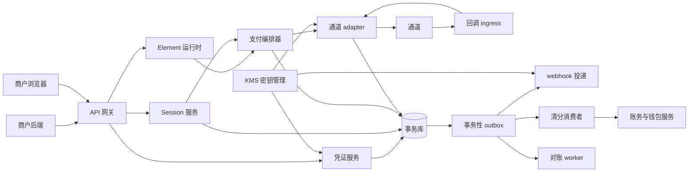
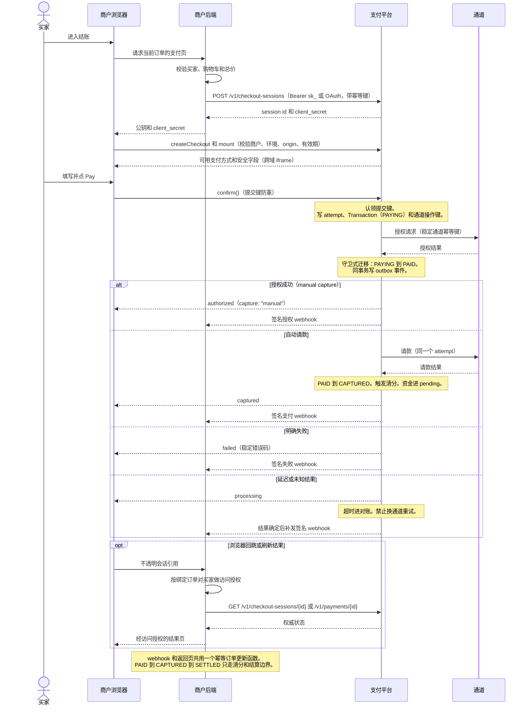
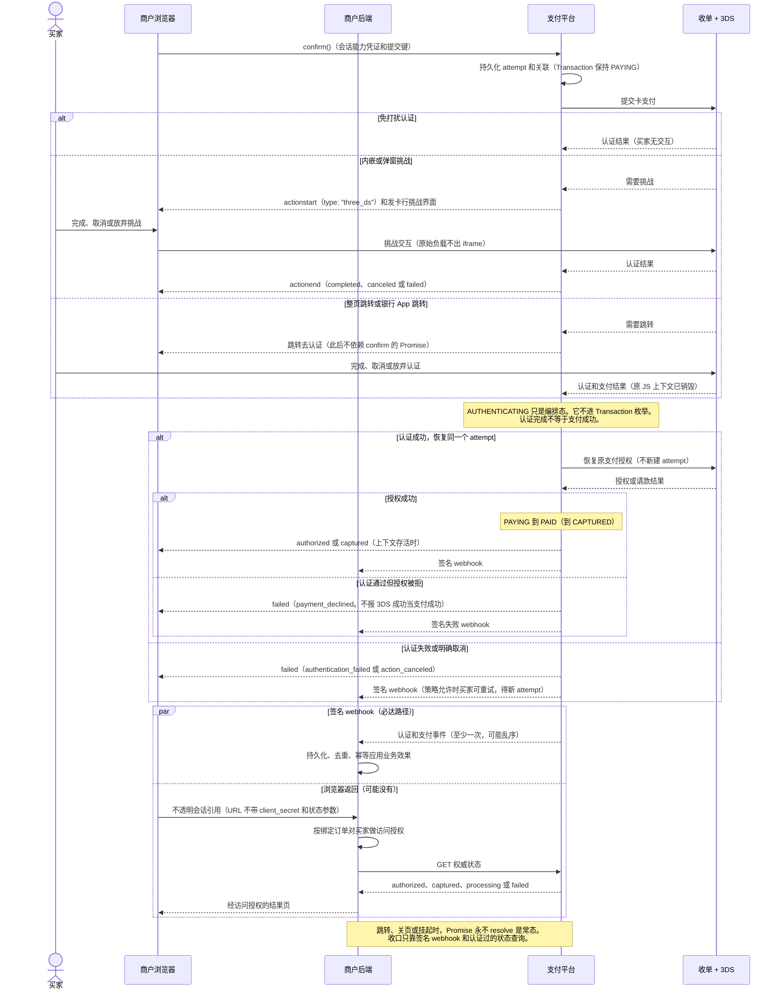

# Payment Element 商户接入与认证设计（中文 STE 风格版）

状态：拟定设计的受控语言改写版。它不是 ADR，也不是已实现的 API。

本文改写 [Payment Element 商户接入与认证技术设计](payment-element-auth-integration-design.md)。原文解释 [Payment Element SDK design](payment-element-design.md) 和 [Payment Element 3DS design](payment-element-3ds-design.md) 的决策。本文只改变写法。本文不改变任何决策。若有冲突，以原文和英文设计文档为准。

## 0. 改写规则

ASD-STE100 是英文受控语言规范（Issue 8/9，53 条规则，9 个章节）。中文不能直接套用它的英文词典。本文借用它的写作规则来写中文。这不是合规的 ASD-STE100 英文文本。

采用的规则见下表。

| ASD-STE100 规则 | 本文的中文做法 |
| --- | --- |
| 一词一义（1.11） | 一个概念只用一个词。全篇不换同义词 |
| 技术名词短而清晰（1.9、2.1） | 名词串不超过三个词。更长的说法改用短语 |
| 动词表动作（3.7） | 不用名词化表达。「进行校验」改为「校验」 |
| 主动语态（3.6） | 每句有明确主语。主语执行动作 |
| 句长上限（5.1 程序句、6.3 描述句） | 每句只讲一个事实。操作句更短 |
| 一段一主题，一段不超过六句（6.5、6.6） | 段落短。每段只讲一件事 |
| 程序用祈使式，一步一动作（5.2、5.3） | 操作步骤用动词开头。一步只做一个动作 |
| 条件前置（5.4） | 先写条件，再写动作 |
| 情态词限定（must / can） | 「必须」表强制。「可以」表允许。「不要」表禁止。不写「应该」「将会」 |
| 禁分号、禁拉丁缩写（8.1、GR-6） | 长句拆成两句。不写 e.g.、i.e.、etc. |
| 指代明确 | 不用模糊代词。需要时重复名词本身 |

术语固定为下表。英文标识符保持原文。金额与账务术语遵守 [CONTEXT.md](../CONTEXT.md)。

| 术语 | 含义 |
| --- | --- |
| 公钥 | `pk_` 开头的公开商户标识 |
| 私密钥 | `sk_` 开头的服务端密钥 |
| 会话能力凭证 | `client_secret`。会话级能力凭证 |
| 通道 | processor 和收单机构 |
| 认证 | 证明身份。含 3DS 持卡人认证 |
| 访问授权 | 对资源的权限判定 |
| 支付授权 | 资金授权。状态为 `authorized`，即 `PAID` |

## 1. 决策总览

| 问题 | 决策 |
| --- | --- |
| 浏览器如何认证 | 浏览器持有两个凭证。公钥只选择配置。会话能力凭证只授权一个会话的 `confirm` |
| 服务端如何认证 | 直连商户用私密钥。多商户应用用 OAuth 令牌。webhook 用 HMAC 签名。服务之间用 mTLS |
| 用什么包接入 | 托管运行时提供支付能力。npm 包提供加载器和类型。React 包是薄封装 |
| 服务端如何协调 | 凭证服务解析身份。状态和 outbox 事件同事务提交。对账处理未知结果 |
| 时序长什么样 | 纯授权是一条链路。认证加授权在同一个 attempt 内完成。两者都靠签名 webhook 收口 |

## 2. 浏览器端认证

### 2.1 决策

浏览器持有两个凭证。两个凭证都不是密钥。

```ts
const walletPay = await loadWalletPay({
  publicKey: "pk_test_merchant",     // ① 公钥
});

const checkout = await walletPay.createCheckout({
  clientSecret,                       // ② 会话能力凭证，由商户后端下发
});
```

公钥是公开值。前端代码可以包含它。公钥只选择公开配置。公开配置有可用支付方式、locale、外观约束和 frame 地址。公钥不授权任何支付操作。

会话能力凭证来自商户后端。商户后端在创建 Checkout Session 时获得它。后端只把它发给一个买家上下文。它授权对一个 Checkout Session 的有限操作。初始只有 `confirm`。

平台做两个校验：

1. 公钥和会话能力凭证必须解析到同一商户。
2. 两者必须解析到同一环境。test 和 live 不可交叉。

浏览器凭证的验证与服务端凭证共用一个服务。两者都用「查找前缀 + verifier」模式。浏览器凭证只解析出一个会话级 capability。

### 2.2 绑定范围

平台在签发会话能力凭证时固定以下内容。验证时逐项检查。

- 商户和环境。
- Checkout Session 和订单版本。订单版本不可变。
- 金额、币种和 capture 模式。浏览器不能修改货币快照。
- 允许的操作。初始只有 `confirm`。
- 允许的浏览器 origin。校验必须精确匹配。
- 过期时间和替换状态。购物车变更会生成新会话。旧凭证随之失效。
- 确认提交策略。它防止重复提交。

### 2.3 禁止事项

会话能力凭证不能做这些事：

- 修改金额。
- 跨商户操作。
- 管理请款和退款。
- 读取任意客户数据。
- 创建新会话。

不要把会话能力凭证放进 URL。不要放进持久化存储。不要放进埋点。不要放进日志和截图。

Origin 校验是纵深防御。它不能替代能力验证。

浏览器事件只报告 UI 状态。它们不是支付事实。本设计没有 `paymentSucceeded` 事件。支付事实只来自两类证据：服务端认证过的状态查询，以及签名 webhook。

### 2.4 返回页鉴权

跳转回到商户页时，URL 只带不透明会话引用：

```text
https://shop.example/payments/return?checkout_session=cs_01J...
```

URL 不带 `success=true`。URL 不带会话能力凭证。

返回页把引用发给商户后端。后端按顺序做四步：

1. 用私密钥向平台查询权威状态。
2. 校验资源归属。
3. 从查询结果推导订单。订单来自会话的固定绑定。浏览器提交的订单号不是权威。
4. 对买家做访问授权。然后返回结果。

查询未授权时，后端不返回任何跨订单数据。即使会话属于同一商户，也不返回。

## 3. 服务端对服务端认证

共有四个方向。四类凭证互不通用。它们不能互换。

### 3.1 商户后端到平台

直连商户用私密钥。test 和 live 分开。示例：

```http
POST /v1/checkout-sessions
Authorization: Bearer sk_test_...
Idempotency-Key: checkout_order_100123_v1
Content-Type: application/json
```

凭证解析出六类信息：商户 ID、环境、允许的操作、账户状态、已开通能力和 submerchant 范围（可选）。

body 里的 `merchant_id` 不是权威。商户身份只从凭证推导。

多商户应用用 OAuth。access token 限定到被连接商户和被授权的操作。若存在委托连接，插件不要向商户索要无限制的平台密钥。

私密钥的管理规则：

- test 和 live 全链路隔离。隔离覆盖密钥、数据库、队列和通道账户。
- 私密钥只在创建时显示一次。
- 存储只保存单向 verifier。只有协议要求可恢复时，才保存 KMS 加密值。
- 轮换支持重叠窗口。吊销立即生效。
- 日志只记凭证 ID。日志不记密钥值。
- 每个操作按四维授权：商户、环境、资源归属、capability。

### 3.2 平台到商户后端（webhook）

平台推送事件时用端点级签名密钥。它不同于私密钥。它也不同于会话能力凭证。信封示例：

```http
WalletPay-Event-Id: evt_...
WalletPay-Timestamp: 178...
WalletPay-Signature: v1=<hmac>
```

HMAC 覆盖时间戳和原始请求体。

商户后端按顺序做四步：

1. 验签。再检查时间戳新鲜度。
2. 持久化事件。
3. 返回应答。
4. 按 `event_id` 去重。业务效果幂等应用。

投递语义是至少一次。投递不保证顺序。商户必须用同一个幂等函数承接重复事件和乱序事件。

端点配置属于商户和环境。不要为单个会话配置回调 URL。这能防开放跳转和 SSRF。

### 3.3 通道到平台

每个 adapter 负责一个通道账户的回调认证。ingress 做四件事：

1. 读原始 body。不修改它。
2. 验签和检查时间戳。或按通道要求做 mTLS。
3. 从配置推导通道账户。不信任 payload 里的商户字段。
4. 持久化回调。然后返回成功。

验签失败的回调一律拒绝。跨环境的回调一律拒绝。不支持的回调一律拒绝。拒绝时产生安全信号。这些回调不改变支付状态。

### 3.4 平台内部服务之间

传输层用 mTLS 或工作负载身份。adapter 和 webhook 投递 worker 只获得自己需要的密钥。密钥由 KMS 下发。

edge 把凭证材料交给凭证服务。凭证服务返回内部身份对象。所有下游调用携带这个对象。资源属主服务必须重复校验归属。

```ts
type RequestPrincipal = {
  subjectType: "merchant_credential" | "oauth_grant" | "browser_capability";
  subjectId: string;
  merchantId: string;
  environment: "test" | "live";
  scopes: string[];
  submerchantId?: string;
  credentialVersion: number;
};
```

下游服务不接受 body 里的 `merchant_id`。下游服务不接受浏览器声明的环境和 scope。

日志只记凭证 ID 和脱敏指纹。授权头、会话能力凭证、支付凭证、设备数据和原始回调体全部脱敏。

## 4. 包 / SDK 与商户接入

### 4.1 决策

核心 SDK 用框架无关的 TypeScript。框架绑定是薄封装。支付行为只实现一次。

分发形态见下表。包名是拟定名。它们尚未实施。

| 包或构件 | 形态 | 职责 |
| --- | --- | --- |
| 托管运行时 | 平台支付域托管脚本 | 实际运行时。敏感采集和 frame 管理的唯一实现 |
| `@walletpay/checkout-js` | npm 细加载器 | `loadWalletPay()`、`createCheckout()`、`createPaymentElement()`、`confirm()`、事件和销毁。提供类型 |
| `@walletpay/react` | npm 薄封装 | `WalletPayProvider`、`CheckoutProvider`、`PaymentElement`。处理 Strict Mode 重放和卸载清理 |
| `@walletpay/node` | npm 薄封装，可选 | 封装 `/v1/*` REST 的签名、幂等键和重试。私密钥只在此层 |
| REST API `/v1/*` | HTTP | 权威契约。不用 SDK 也能接入 |

选这个形态有三个理由：

- JS 是集成层。跨域 iframe 是隔离边界。
- 托管运行时让平台更新支付方式时不需要商户发版。
- npm 加载器提供类型安全。React 绑定避免支付行为分叉。

### 4.2 接入步骤

**第 1 步：服务端。** 服务端是唯一持有密钥的一侧。

1. 创建 Checkout Session。金额用货币最小单位。`1099` 表示 USD 10.99。
2. 若购物车变更，创建新会话。不要修改旧会话的金额。
3. 把会话能力凭证和公钥发给该买家的浏览器。

```http
POST /v1/checkout-sessions
Authorization: Bearer sk_test_...
Idempotency-Key: checkout_order_100123_v1
```

```json
{
  "merchant_order_reference": "ORDER-100123",
  "order_version": 1,
  "amount": { "value": 1099, "currency": "USD" },
  "capture_mode": "automatic",
  "return_url": "https://shop.example/payments/return",
  "locale": "en-US",
  "expires_in_seconds": 1800
}
```

**第 2 步：浏览器。** 浏览器加载 SDK，挂载组件，然后确认支付。

```ts
const walletPay = await loadWalletPay({ publicKey: "pk_test_merchant" });
const checkout = await walletPay.createCheckout({ clientSecret });

const paymentElement = checkout.createPaymentElement({ layout: "accordion" });
paymentElement.mount("#payment-element");

paymentElement.on("change", ({ complete }) => setPayEnabled(complete));

form.addEventListener("submit", async (event) => {
  event.preventDefault();
  const result = await checkout.confirm({
    returnUrl: "https://shop.example/payments/return",
  });
  // 只按 result.status 渲染界面。不做资金判定。
});
```

React 版本用三个组件：`WalletPayProvider`、`CheckoutProvider`、`PaymentElement`。身份类 props 不可变。若要更换商户、环境或会话能力凭证，走显式替换路径。

**第 3 步：返回页。** 见 §2.4。

**第 4 步：webhook 端点。** 见 §3.2。

### 4.3 职责边界

商户拥有这些内容：

- 购物车、权威总价、订单摘要。
- 普通 Pay 按钮。它便于协调条款同意和表单校验。

SDK 拥有这些内容：

- 多支付方式 UI。
- 敏感输入框。它们在受控支付域的跨域 iframe 里。
- 方法专属按钮。钱包和平台规则要求时启用。
- `confirm()` 的编排和防重复提交。

商户不能做这些事：

- 接触原始 PAN 和 CVC。
- 从点击或 UI 回调推断支付成功。
- 修改金额、币种、商户或 capture 策略。
- 依赖 `confirm()` 的 Promise 一定 resolve。跳转会销毁 JS 上下文。

手工请款、取消和退款是服务端 API。它们不是浏览器 SDK 功能。它们同样用私密钥、归属校验和持久化幂等键。

## 5. 服务端与其他服务的协调

### 5.1 服务边界

下图是逻辑划分。它不要求一个组件对应一个部署。



### 5.2 协调原则

1. **凭证集中解析。** 只有凭证服务接触原始凭证材料。下游只认内部身份对象。属主服务重复校验资源归属。
2. **状态和 outbox 同事务。** 每个状态迁移追加一个版本化 outbox 事件。两者在同一事务提交。队列只搬运工作。队列不保存事实。消费者完成幂等效果后才确认。
3. **统一迁移函数。** 同步响应和验证过的通道回调走同一个函数。函数校验当前状态、操作类型、金额和通道证据。乱序事件和重复事件靠去重加版本检查兜底。状态不能回退。
4. **先持久化，再调通道。** 先认领会话级提交键。再写 attempt 和稳定的通道操作键。然后调用 processor。通道超时后，操作进入 unknown。会话锁定。对账 worker 用原引用查询通道。结果未明时禁止换通道重试。换通道可能导致双重授权。
5. **账务只走一条边界。** 授权成功使 Transaction 进 `PAID`。请款成功使它进 `CAPTURED`。清分一次算出余额变动和不可变分录。商户净额进 `pending`。通道注资是上游动账。它不置 `SETTLED`。只有下游商户结算进程置 `SETTLED`。资金从 `pending` 转 `available`。依据是 [ADR 0003](adr/0003-transaction-status-model.md) 和 [ADR 0005](adr/0005-ledger-invariants.md)。
6. **商户侧一个入口。** webhook 和返回页是两条独立信号。它们先后不定。可能只到一条。商户用同一个幂等函数处理它们。每个业务效果恰好应用一次。
7. **test 和 live 全链路隔离。** 限流和 origin 检查只减少滥用。它们不替代能力验证。

## 6. 整体时序图

本章含操作步骤和说明。步骤用祈使式。说明只给信息。时序图内的标注文字同步简化。

### 6.1 纯授权（无 3DS 持卡人认证）

示例用 `capture_mode: "manual"`。此模式只做支付授权。请款走管理 API。若用 `automatic`，平台在同一环节发起请款。结果直接是 `captured`。后续清分路径相同。



浏览器应答和签名 webhook 互相独立。它们谁先到都可以。浏览器可能消失。商户后端必须用同一个幂等路径应用业务效果。

### 6.2 认证 + 授权（3DS 持卡人认证 + 支付授权）

商户代码不变。调用仍是 `checkout.confirm()`。3DS 是 confirm 编排的一个 action。它暂停同一个 attempt。它呈现发卡行控制的认证界面。完成后，SDK 恢复同一个 attempt 继续支付授权。



跳转和回跳的顺序不固定。浏览器可能不回来。两条收口路径都调用商户的同一个幂等订单更新函数。

### 6.3 状态对照

两条链路共用下表。

```text
编排和浏览器: load → mount → ready → confirm → action → 结果
Session:      open → processing → completed / expired
Attempt:      created → processing / action → authorized / captured / failed
Transaction:  PAYING → PAID → CAPTURED → SETTLED        （ADR 0003）
钱包:         pending → available（只在下游 SETTLED 之后）（ADR 0005）
```

- `AUTHENTICATING` 是编排层状态。它不是 `Transaction.status`。认证等待期间，平台交易枚举保持 `PAYING`。
- 这些事件都不映射为支付成功：挑战渲染、挑战完成、浏览器回跳、持卡人认证通过、通道受理请求。
- 支付授权成功（`PAID`）不等于商户可发货。是否以授权为发货依据是商户的显式策略。
- 支付授权成功也不等于入账结算（`SETTLED`）。

## 7. 相关材料

- [Payment Element 商户接入与认证技术设计](payment-element-auth-integration-design.md)（本文的原文）
- [Payment Element SDK design](payment-element-design.md)（英文契约原文）
- [Payment Element 3DS design](payment-element-3ds-design.md)（3DS 扩展原文）
- [Payment web SDK and iframe provider survey](payment-sdk-iframe-provider-survey.md)
- [ADR 0003: transaction status model](adr/0003-transaction-status-model.md)
- [ADR 0005: ledger invariants](adr/0005-ledger-invariants.md)
- [领域术语](../CONTEXT.md)
