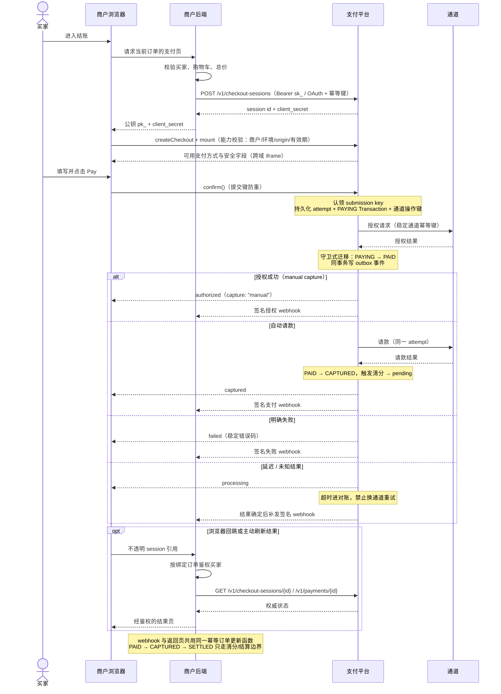
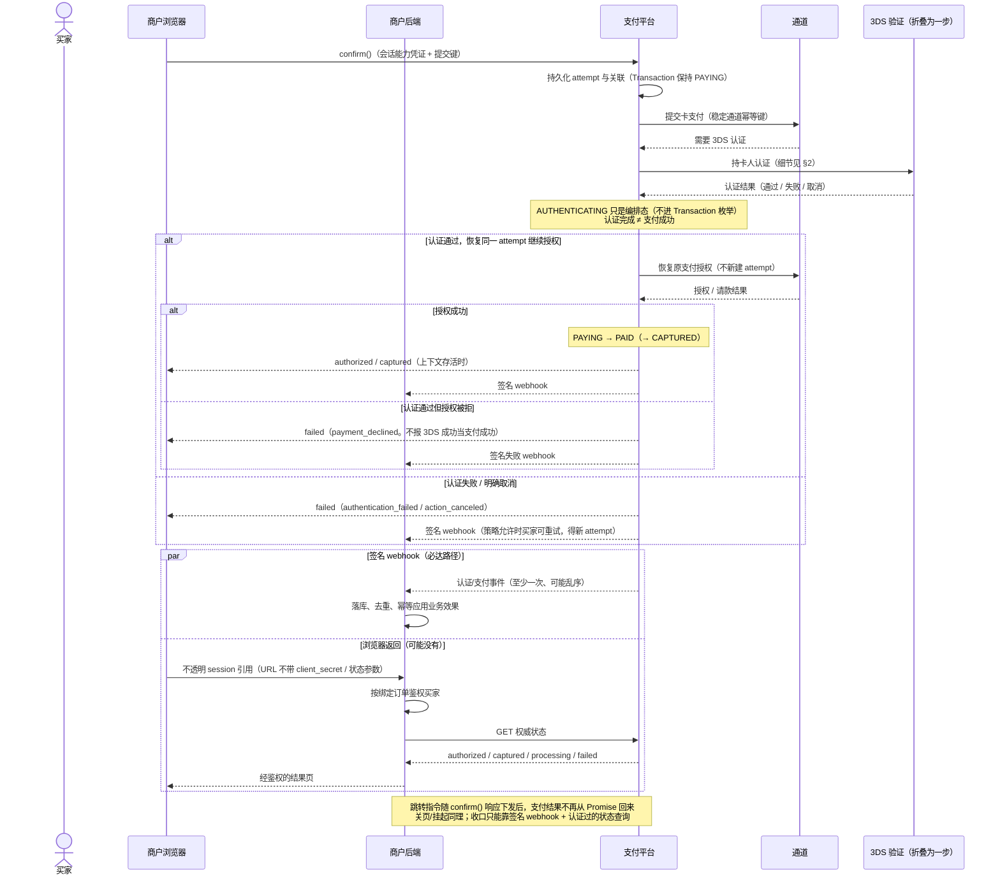
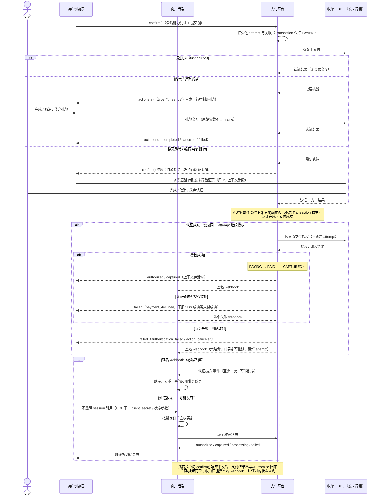
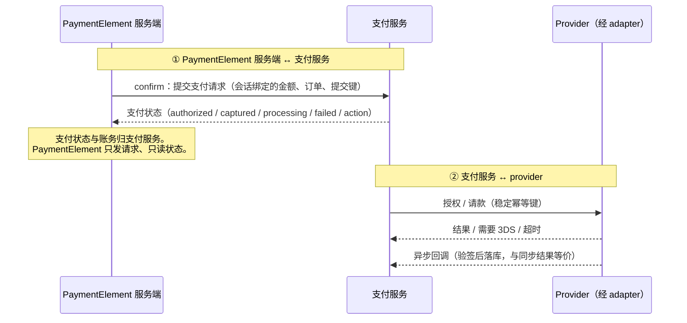
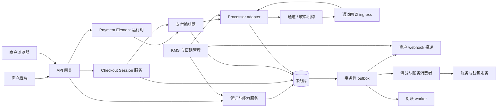
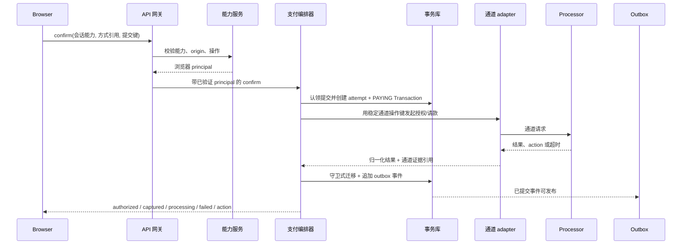

# Payment Element 认证与接入内部设计说明

状态：拟定设计；不是已通过的 ADR，也不是已实施的 API。

## 写给谁看

- 你是**支付平台的工程师或设计评审者**。
- 你已经了解商户侧的接入形状。新手向的商户视角见 [Payment Element 商户接入指南](payment-element-merchant-integration-guide.md)。
- **本文自成一体。** 本文吸收了英文设计文档、3DS 设计与 ADR 0003/0005 的相关内容。读本文不需要翻阅其他文档，文末链接仅是延伸阅读。若与英文契约原文（[Payment Element SDK design](payment-element-design.md)、[Payment Element 3DS design](payment-element-3ds-design.md)）冲突，以英文为准。

本文回答五个设计问题：

| 问题 | 章节 |
| --- | --- |
| 整体时序（纯授权、认证 + 授权） | §1（3DS 流程单独在 §2） |
| 浏览器端如何认证（商户客户端） | §3 |
| 服务端如何做服务间认证 | §4 |
| 提供什么包 / SDK，商户如何接入 | §5 |
| 服务端如何与其他服务协调 | §6 |

约定与决策速查在附录：[附录 A 术语约定](#附录-a-术语约定)、[附录 B 决策总览](#附录-b-决策总览)。服务协调的实现细节备查在[附录 C](#附录-c-服务协调细节备查)。

## 1. 整体时序与状态机

先看两条端到端链路。两图中 3DS 流程**折叠为一步**，只省略图内细节。3DS 由 PaymentElement 自己实现，实现分工与分支见 §2。后面的章节解释图里的其他机制。

### 1.1 纯授权（无 3DS 持卡人认证）

以 `capture_mode: "manual"` 为例（只支付授权）。`automatic` 时平台在授权同一环节发起请款，结果直接 `captured`，后续清分路径相同。



浏览器应答与签名 webhook 互相独立。两者谁先到都可以。浏览器可能消失。商户后端必须用同一个幂等路径应用业务效果。

### 1.2 认证 + 授权（3DS 折叠为一步）

商户代码不变，仍是 `checkout.confirm()`。3DS 是 confirm 编排的一个 **action**：暂停同一 attempt，完成后**恢复同一 attempt** 继续支付授权。下图把 3DS 流程折叠为一步（实现分工见 §2.1，分支见 §2.2）；



### 1.3 状态机对照与账务边界

两条链路共用下表：

```text
编排/浏览器:  load → mount → ready → confirm → action(3DS/redirect) → 结果
Session:      open → processing → completed / expired
Attempt:      created → processing/action → authorized / captured / failed
Transaction:  PAYING → PAID → CAPTURED → SETTLED
钱包:         pending → available（仅在下游 SETTLED 之后）
```

Transaction 与钱包两行的权威语义（吸收自 ADR 0003 / ADR 0005）：

- `PAYING`：等待支付证据。**认证（3DS）等待期间也保持 `PAYING`。** `AUTHENTICATING` 只是编排层状态，不是 `Transaction.status`。
- `PAID`：有服务端授权证据。手工请款模式下停在这里等请款。
- `CAPTURED`：请款成功。清分被幂等触发一次，算出余额变动与不可变分录，商户净额进 `pending`。
- `SETTLED`：**只由下游商户结算进程**把 `CAPTURED` 迁移过来，资金从 `pending` 转 `available`。通道/收单机构注资是上游 `SETTLEMENT` 动账，**不**置 `SETTLED`。
- 取消、void、退款、争议分支沿用 ADR 0003 的定义；退款累计不超过原请款金额。
- 余额只能由账务边界（清分/结算）变动。浏览器结果、webhook 投递、通道标签、对账任务都不能绕过。

以下信号**都不映射**为支付成功：挑战渲染、挑战完成、浏览器回跳、持卡人认证通过、通道受理请求、通道回调里名为 “complete”/“approved”/“settled” 的字符串。

## 2. 3DS 流程（单独呈现）

本章展开 §1.2 折叠掉的持卡人认证流程：谁实现、怎么实现、商户对接什么。3DS 只向发卡行证明持卡人身份。它不认证商户、不证明请款、不授权发货、不决定钱包结算。

### 2.1 谁实现 3DS？商户对接什么？

**Q：3DS 验证流程要在 PaymentElement 里实现吗？**

**要。** 3DS 是 PaymentElement 的内部能力，由平台实现，不需要商户实现。实现分两层：

| 层 | 职责 |
| --- | --- |
| PaymentElement SDK（浏览器） | 呈现发卡行挑战（内嵌 / 弹窗）、执行 confirm 响应里的跳转指令、回传 action 结果、发 `actionstart` / `actionend` |
| 平台后端（支付编排器 + processor adapter） | 判定是否需要 3DS、与 3DS 体系交换认证与挑战报文、保存 action 引用与续接状态、认证后恢复同一 attempt |

EMV 3DS 报文、发卡行/目录服务器数据、认证值（CAVV/AAV）、设备数据只存在于 adapter 与通道之间，**不进**商户 API、商户回调和日志。

**Q：商户如何对接？**

没有 3DS 专属对接。商户只做四件事：

1. 按常规四步接入：服务端建会话、浏览器挂载、`confirm()`（§5，步骤详解见商户指南 §3–§6）。
2. 可选：监听 `actionstart` / `actionend`（§2.4）做 UX 协调：锁导航、显示加载。
3. 必做：跳转回流页（§3.3）与 webhook（§4.2）收口。跳转场景会销毁 JS 上下文。
4. 不要做：不处理挑战数据、不自己拼跳转 URL、不把 3DS 验证通过当支付成功。

### 2.2 详细时序



### 2.3 四种呈现模式

| 模式 | 行为 | 平台义务 |
| --- | --- | --- |
| 免打扰 (frictionless) | 处理器与发卡行完成认证，买家无交互 | `confirm()` 在同一 attempt 上继续；可省略可见 action UI |
| 内嵌 / 弹窗挑战 | SDK 在受支持的 frame 或弹窗里呈现发卡行控制的挑战 | 焦点困在挑战内、加载/错误播报、结束后恢复焦点、阻止组件被重复提交 |
| 弹窗 (popup) | 从买家提交手势打开弹窗 | 检测弹窗拦截，返回可恢复错误或文档化兜底。买家关闭弹窗是取消，不证明付款失败 |
| 整页跳转 / 银行 App | 跳转到发卡行或处理器目的地 | 跳转由 `confirm()` 的响应触发：响应携带发卡行验证 URL，SDK 在浏览器端执行跳转。返回目标是登记过的商户 URL，只带不透明会话引用 |

confirm() 的响应有两种形态：**直接结果**（`authorized` / `captured` / `processing` / `failed`）和**动作指令**。内嵌挑战是指令的一种，由 SDK 自行呈现；跳转指令（`{ type: "redirect", url }`）携带发卡行验证 URL，由 SDK 在浏览器端执行跳转到发卡行。商户代码不接触发卡行 URL，也不接触挑战负载。

### 2.4 action 事件契约

```ts
checkout.on("actionstart", ({ type }) => {
  // type: "three_ds" | "redirect" | "wallet"
  disableCheckoutNavigation();
});

checkout.on("actionend", ({ type, outcome }) => {
  // outcome: "completed" | "canceled" | "failed"
  restoreCheckoutNavigation();
});
```

`actionstart` 表示外部交互开始。`actionend: completed` 只表示交互结束，不表示授权或请款成功。跳转、关页、进程挂起时 `actionend` 可能永不触发；正确性不得依赖它。SDK 不发出发卡行挑战内容、认证值、设备数据或原始处理器结果。

### 2.5 attempt 连续性与幂等

- 认证恢复**同一个逻辑 attempt**。平台在呈现 action 前持久化 attempt ID 与处理器关联。跳转返回、webhook、状态查询都必须解析到该 attempt，不得新建。
- action 有效期间：重复 `confirm()` 返回当前 attempt 或确定性的“进行中”响应；第二个浏览器标签不能创建平行 attempt。
- 会话过期阻止新发起，但不丢弃在途结果。
- 结果不确定时先查询/对账，再决定重试或改路由。
- 明确拒绝/取消后的买家重试获得**新的 attempt ID**，同一订单/会话下合法。

### 2.6 失败与恢复对照

| 情况 | 必须的行为 |
| --- | --- |
| 买家挑战失败 | attempt 以 `authentication_failed` 结束；策略允许时可重试 |
| 买家取消/关闭挑战 | 仅在取消确定时返回 `action_canceled`；否则显示 processing 并对账。不得声称发卡行拒绝或付款撤销 |
| 弹窗被拦截 | 返回可恢复的 `popup_blocked` 指引或使用已测试的兜底 |
| 挑战期间浏览器关闭 | 服务端 attempt 保持未决；等 webhook 或状态对账 |
| 浏览器先于 webhook 返回 | 查询权威状态；未决则显示 processing |
| webhook 先于浏览器返回 | 先持久化并处理；返回页读取已落定状态 |
| 认证成功、授权被拒 | 报 `payment_declined`；不得把 3DS 成功当支付成功 |
| 授权成功、请款失败 | 保留 `PAID`；重试中返回 `authorized` + `capture: "pending"`，确定失败后 `capture: "failed"` + `capture_failed` |
| 认证后网络超时 | 报未知/processing 并对账；禁止盲目改路由 |
| 挑战期间会话过期 | 阻止新 attempt，但继续跟踪已提交的 attempt，接受合法迟到结果 |
| 挑战期间购物车/库存变化 | 不改在途金额。迟到合法付款按商户迟到政策处理（如拦截自动发货），绝不因旧订单版本无法履约而发起第二笔扣款 |

### 2.7 3DS 安全与隐私

- 只从配置的处理器/发卡行路径呈现挑战；永不注入商户提供的挑战 HTML。
- 所有跨 frame 消息按精确 origin、source window、instance/action ID 与 schema 校验。
- action 引用是不透明、单一用途、有限寿命的。
- 设备数据、认证值、发卡行负载不进商户回调与日志。
- 会话创建与确认时校验返回目的地，防开放跳转。
- 按处理器支持的模式套用 clickjacking、CSP、弹窗与导航策略。
- 弹窗/模态结束后恢复焦点与无障碍上下文。
- 真机测试手机浏览器与银行 App 返回；不假设 WebView 保留上下文。

## 3. 浏览器能力模型（客户端认证）

### 3.1 决策与威胁模型

浏览器持有两个凭证。两个都不是密钥：

```ts
const walletPay = await loadWalletPay({
  publicKey: "pk_test_merchant",     // ① 公开商户标识
});

const checkout = await walletPay.createCheckout({
  clientSecret,                       // ② 会话级能力凭证，由商户后端下发
});
```

设计的出发点是三条威胁假设：

1. **商户页面完全不可信。** 页面可以被篡改、被伪造、被中间人。支付字段隔离不能使页面可信。
2. **前端持有的任何值都可能泄露。** 因此前端不持有能做管理操作的凭证。
3. **单点泄露的爆炸半径必须有限。** 因此浏览器凭证的有效范围是“一个会话、一个操作、几分钟”。

由此拆成两层：

- **公钥 `pk_`（publishable merchant identifier）**：公开值，可出现在前端代码。它只选择公开配置（可用支付方式、locale、外观约束、frame 地址）。它**不授权任何支付操作**，泄露无害。
- **`client_secret`（会话能力凭证）**：由商户后端在创建 Checkout Session 时获得，只返回给需要它的那一个买家上下文。它授权**对单个 Checkout Session 的有限操作**（初始只有 `confirm`）。它是 bearer capability，泄露有界但按敏感值对待。

平台校验公钥与 `client_secret` 解析到**同一商户、同一环境**（test/live 不可交叉）。浏览器凭证与服务端凭证共用 credential service 的「查找前缀 + verifier」模式，但只解析出一个会话级 capability。不用 cookie 会话的原因：SDK 要跨站嵌入商户页和 WebView，cookie 语义与 CSRF 面都不合适。

### 3.2 能力凭证的绑定与验证路径

签发时固化以下绑定。验证时逐项检查。每一项对应一个具体威胁：

| 绑定项 | 防什么 |
| --- | --- |
| 商户与环境 | 跨商户冒用、test 泄漏进 live |
| Checkout Session 与不可变订单版本（`order_version`） | 一笔凭证被挪去付另一笔订单 |
| 金额、币种、capture 模式 | 浏览器篡改货币快照 |
| 允许的操作（初始仅 `confirm`） | 能力凭证被用于管理操作 |
| 允许的浏览器 origin（精确匹配） | 凭证被第三方站点盗用（纵深防御，不替代验证） |
| 过期时间与替换状态 | 购物车变更后旧凭证继续可用 |
| 确认提交策略 | 重复提交造成平行授权 |

明确禁止：会话能力凭证**不得**授权金额变更、跨商户操作、capture/refund 管理、任意客户数据读取、创建新会话。它不得进入 URL、持久化存储、埋点、日志。

实现约束：

- `browser_capability` 持久记录 capability ID、session ID、verifier、允许操作、过期与吊销状态。
- 普通会话查询永不返回 `client_secret`。只有幂等重放（文档化的保留窗口内）返回原始响应。
- 限流与 origin 检查减少滥用，但不替代能力验证。
- 浏览器事件（`ready` / `change` / `actionend` 等）只是 UI 状态。不存在 `paymentSucceeded` 事件。支付事实只能来自服务端认证过的查询与签名 webhook。

### 3.3 返回页：平台提供的三条保证

3DS 跳转或钱包跳转后，买家被带回商户的 `return_url`。此时浏览器地址栏里只有一个不透明引用：

```text
https://shop.example/payments/return?checkout_session=cs_01J...
```

**为什么 URL 里只有引用**：URL 是不可信的输入。它能被伪造、被收藏、被转发给别人。如果 URL 里带 `success=true`，任何人都能手工拼出一个“支付成功”页。所以 URL 只当“取件条”：它说明要查哪一笔，不说明结果。真实结果只能来自后端查询。

平台为此提供三条保证：

1. **结果只能由商户后端查。** `GET /v1/checkout-sessions/{id}` 必须带 `Authorization: Bearer sk_...`。浏览器没有私密钥，直接调会被拒绝。
2. **订单以会话的绑定为准。** 创建会话时，订单号和订单版本已经冻结进会话。后端查回会话后，用**会话里的订单号**找订单，绝不使用页面传来的订单号。

   这挡住一类攻击：攻击者把自己的 `checkout_session` 引用塞进别人的结账页。后端按会话查出的是攻击者的订单，与买家正在看的订单对不上，访问授权失败。
3. **越权查询只返回“查无此单”。** 买家 A 拿买家 B 的引用查询（即使同一商户），订单归属校验失败，接口返回 404。响应不区分“不存在”和“无权查看”，不泄露任何信息。

三条保证合起来的效果：**返回页展示的状态，一定是当前买家自己那笔订单的真实状态。**

### 3.4 安全 frame 边界（iframe 的 JS 实现）

敏感字段（卡号、有效期、CVC）运行在平台支付域的跨域 iframe 里。商户页面与 iframe 只通过 `postMessage` 通信。本节按 iframe 的生命周期给出 JS 实现细节：创建 → 握手 → 发送 → 接收 → 取数 → resize → 销毁。代码与仓库原型一致（`prototypes/payment-element/secure-field.js`、`app.js`）；原型是演示实现，不代表合规边界已获证明。

**① 消息协议：信封与消息类型**

```ts
// 所有 frame 消息的公共信封（原型协议名 walletpay.fields.v1）
interface FrameEnvelope {
  protocol: "walletpay.fields.v1"; // 协议版本，不匹配即丢弃
  instanceId: string;              // 本次挂载的实例 ID
  type: "field.ready" | "field.change" | "field.focus" | "field.blur";
  field: "number" | "expiry" | "cvc";
}

// field.ready / field.change 的载荷：只有完整性与校验码
interface FieldState {
  complete: boolean;
  errorCode: string | null; // 例如 "incomplete_number"
}
// 击键值、PAN、CVC、认证密钥永远不在消息里
```

**② 创建：每个敏感字段一个 iframe**

```ts
// 父页（SDK）：一字段一框。实例 ID 从创建起贯穿所有消息
function createSecureField(field: string, instanceId: string): HTMLIFrameElement {
  const frame = document.createElement("iframe");
  frame.src = `https://payments.walletpay.example/field.html?field=${field}&instance=${instanceId}`;
  frame.title = `${field} secure payment field`;
  frame.loading = "eager";
  frame.dataset.field = field;   // 接收消息时按它找对应窗口
  hostEl.appendChild(frame);     // 布局由容器样式负责
  return frame;
}
```

一字段一框便于与商户表单逐项对齐样式和焦点顺序；单框多字段能省连接，但隔离面更大。原型取一字段一框。

**③ 握手：就绪前禁用提交**

```ts
// frame 侧：初始化完成后上报一次状态
emit("field.ready", fieldState());

// 父页侧：全部字段 ready 才允许 Pay；超时按 loaderror 处理
const ready = new Map(fields.map((f) => [f, false]));
const timer = setTimeout(() => {
  if ([...ready.values()].some((v) => !v)) {
    onLoadError({ code: "load_error", requestId: crypto.randomUUID() });
  }
}, 10_000);
```

**④ 发送：精确 targetOrigin + 请求/响应关联**

```ts
const pending = new Map<string, Pending>();

function request(frame: HTMLIFrameElement, msg: object, timeoutMs = 10_000) {
  return new Promise((resolve, reject) => {
    const requestId = crypto.randomUUID();
    const timer = setTimeout(() => {
      pending.delete(requestId);
      reject(new Error("frame timeout"));
    }, timeoutMs);
    pending.set(requestId, { resolve, reject, timer });
    // 精确 targetOrigin，不能用 "*"；信封字段由 SDK 补齐
    frame.contentWindow!.postMessage(
      { protocol: "walletpay.fields.v1", instanceId, requestId, ...msg },
      "https://payments.walletpay.example",
    );
  });
}
```

**⑤ 接收：五层校验（含原型污染防护）**

```ts
function onMessage(messageEvent: MessageEvent) {
  // 1) 精确来源；载荷必须是普通对象（防 __proto__ / constructor 注入）
  if (messageEvent.origin !== "https://payments.walletpay.example") return;
  const data = messageEvent.data;
  if (!data || Object.getPrototypeOf(data) !== Object.prototype) return;
  // 2) 协议、实例、字段名、消息类型白名单
  if (data.protocol !== "walletpay.fields.v1") return;
  if (data.instanceId !== instanceId) return;
  if (!["number", "expiry", "cvc"].includes(data.field)) return;
  if (!["field.ready", "field.change", "field.focus", "field.blur"].includes(data.type)) return;
  // 3) 严格键集校验：不多一个键，也不少一个键
  const isState = data.type === "field.ready" || data.type === "field.change";
  const expected = isState
    ? ["protocol", "instanceId", "type", "field", "complete", "errorCode"]
    : ["protocol", "instanceId", "type", "field"];
  const keys = Object.keys(data);
  if (keys.length !== expected.length || !expected.every((k) => keys.includes(k))) return;
  // 4) 必须来自该字段对应的那个 frame 窗口
  const frame = document.querySelector(`iframe[data-field="${data.field}"]`);
  if (!frame || messageEvent.source !== frame.contentWindow) return;
  // 5) 语义校验
  if (isState) {
    if (typeof data.complete !== "boolean") return;
    if (data.errorCode !== null && data.errorCode !== `incomplete_${data.field}`) return;
    if (data.complete && data.errorCode !== null) return;
  }
  if (destroyed) return; // 销毁后迟到的消息在这里被拒绝
  applyFieldState(data);
}
window.addEventListener("message", onMessage);
```

**⑥ confirm 取数：只回 token，不回卡号**

```ts
// 父页：confirm 时向字段 frame 请求采集结果
const { token } = await request(frame, { type: "collect" });

// frame 内部：读自己的输入框 → 调平台 tokenize → 只回 { token }
// 原始 PAN / CVC 只存在于 frame 的 JS 内存，永不出边界
```

**⑦ resize：有界、单向**

```ts
const MIN_HEIGHT = 40;
const MAX_HEIGHT = 800;

function applyResize(msg: { height: number }) {
  // 高度夹在合法区间；单向设置，不因 frame 的回声再触发调整
  const h = Math.min(Math.max(msg.height, MIN_HEIGHT), MAX_HEIGHT);
  frame.style.height = `${h}px`;
}
```

**⑧ 销毁：陈旧消息与在途请求一并清掉**

```ts
function destroy() {
  destroyed = true;
  window.removeEventListener("message", onMessage);
  clearTimeout(timer);
  frames.forEach((f) => f.remove());
  pending.forEach(({ reject, timer }) => {
    clearTimeout(timer);
    reject(new Error("destroyed"));
  });
  pending.clear();
  // destroy 之后到达的任何消息在 ⑤ 的 destroyed 检查处被拒绝
}
```

**⑨ 同一核心，两种宿主：vanilla JS 与 React**

frame 管理核心只实现一次。两种宿主只是生命周期接线不同，行为完全一致：

```js
// vanilla JS：手动接线生命周期
const fields = createSecureFields({ instanceId, container: "#card" });
fields.on("change", ({ complete }) => setPayEnabled(complete));
// 页面离开时
fields.destroy();
```

```tsx
// React：用 effect 接线，卸载即销毁
function CardFields({ instanceId }: { instanceId: string }) {
  const hostRef = useRef<HTMLDivElement>(null);
  const [complete, setComplete] = useState(false);

  useEffect(() => {
    // Strict Mode 会重复执行 effect：createSecureFields 按 instanceId 幂等，
    // 不会建两套 frame
    const fields = createSecureFields({ instanceId, container: hostRef.current! });
    const off = fields.on("change", ({ complete }) => setComplete(complete));
    return () => {
      off();
      fields.destroy(); // 对应 ⑧：清 frame、监听、在途请求
    };
  }, [instanceId]);

  return <div ref={hostRef} data-complete={complete} />;
}
```

三个要点：React 绑定是薄封装，不重写支付逻辑；`destroy()` 与组件卸载对齐；Strict Mode 的重复 effect 必须幂等（同 `instanceId` 复用同一批 frame，绝不产生两套）。

配套要求：对外发布必需的 `script-src`、`frame-src`、`connect-src`、钱包 Permissions Policy 与返回导航行为；frame 地址由平台配置，不可被商户替换。不在缺乏方法级浏览器测试的情况下规定外层 iframe、sandbox flags 或跨源隔离。

## 4. 服务端认证模型（服务间认证）

四个方向，凭证互不通用、不可互换。

### 4.1 商户后端 → 平台（管理面 API）

直连商户用分环境的 Bearer 私密钥：

```http
POST /v1/checkout-sessions
Authorization: Bearer sk_test_...
Idempotency-Key: checkout_order_100123_v1
Content-Type: application/json
```

决策要点：

- 凭证解析出 `merchant_id`、环境、允许操作、账户状态、已开通能力、可选 submerchant 范围。**body 里的 `merchant_id` 永远不是权威。**
- 多商户应用（电商平台、SaaS 插件）走 OAuth 授权。access token 限定到被连接商户与被授权操作。存在委托连接时，插件不得索要商户的无限制平台密钥。
- 服务端 bearer 秘密含非机密查找前缀 + 高熵秘密材料。存储只存单向 verifier。仅当协议要求可恢复时存 KMS 加密值。
- OAuth token 验证 issuer、audience、过期、吊销、商户绑定与 scope。test/live 的 issuer、密钥、资源全部隔离。
- 轮换支持重叠窗口。吊销在授权层立即生效。
- 审计与请求日志只记**凭证 ID** 与脱敏指纹，不记密钥值。

### 4.2 平台 → 商户后端（业务 webhook）

平台推送给商户的事件用**端点级签名密钥**（与 API 私密钥、浏览器凭证都不通用）。信封：

```http
WalletPay-Event-Id: evt_...
WalletPay-Timestamp: 178...
WalletPay-Signature: v1=<hmac>
```

决策要点：HMAC 覆盖**时间戳 + 原始请求体**。商户处理顺序是硬性要求：验签与新鲜度 → 先持久化再应答 → 按 `event_id` 去重 → 业务效果幂等。投递语义是至少一次、不保证顺序。端点配置归属商户/环境级，**不允许** per-session 回调 URL（防开放跳转与 SSRF）。webhook 投递失败不得回滚或改变支付状态。

### 4.3 通道 → 平台（provider 回调）

每个 processor adapter 负责其通道账户/环境的回调认证。ingress 读取**未修改的原始 body**，验签/时间戳或 mTLS，通道账户从配置推导（不信任 payload 商户字段），**先落库再返回成功**。验签失败、跨环境、不支持的回调一律 fail-closed：产生安全信号，不改变支付状态。

### 4.4 平台内部服务之间

- 传输层：**mTLS 或工作负载身份**。adapter 与 webhook 投递 worker 只获得各自需要的密钥（KMS 按需下发）。
- 语义层：edge 把凭证材料交给 credential service，换回内部 principal。所有下游调用携带它，且**在资源属主服务上重复归属校验**：

```ts
type RequestPrincipal = {
  subjectType: "merchant_credential" | "oauth_grant" | "browser_capability";
  subjectId: string;
  merchantId: string;
  environment: "test" | "live";
  scopes: string[];
  submerchantId?: string;
  credentialVersion: number;
};
```

任何下游服务**不接受**未验证请求体或浏览器声明的 `merchant_id`、environment、scopes。日志与 trace 只记凭证 ID 与脱敏指纹。授权头、client secret、支付凭证、设备数据、原始回调体全部脱敏。

## 5. SDK 与对外契约

### 5.1 分发形态

框架无关的 TypeScript 核心 + 薄框架绑定；支付行为只实现一次。包名为拟定名：

| 包 / 构件 | 形态 | 职责 |
| --- | --- | --- |
| 托管运行时（类似 `js.stripe.com`） | 平台支付域托管脚本 | 实际运行时；敏感采集与 frame 管理的唯一实现 |
| `@walletpay/checkout-js` | npm 细加载器 | `loadWalletPay()`、`createCheckout()`、`createPaymentElement()`、`confirm()`、事件与销毁；类型 |
| `@walletpay/react` | npm | provider 薄包装；Strict Mode 重放、卸载清理；不重复支付逻辑 |
| `@walletpay/node`（可选） | npm | `/v1/*` 的签名、幂等键、重试封装；私密钥只在此层 |
| REST API `/v1/*` | HTTP | 权威契约。不用 SDK 也能接 |

理由：JS 是集成层，跨域 iframe 是隔离边界；托管运行时使支付方式更新不依赖商户发版；细加载器保类型安全；薄绑定避免行为分叉。

### 5.2 对外契约片段

```ts
type ConfirmResult =
  | { status: "authorized"; paymentId: string; capture: "manual" | "pending" | "failed"; error?: PaymentError }
  | { status: "captured"; paymentId: string }
  | { status: "processing"; paymentId?: string; reason: "pending_method" | "unknown_outcome" }
  | { status: "failed"; paymentId?: string; error: PaymentError };

type PaymentError = {
  code:
    | "invalid_configuration" | "session_expired" | "validation_failed"
    | "authentication_failed" | "payment_declined" | "capture_failed"
    | "action_canceled" | "popup_blocked" | "network_error" | "unknown_outcome";
  category: "integration" | "buyer" | "payment" | "network";
  requestId?: string;
  recoverable: boolean;
};
```

约束：错误码稳定且文档化恢复动作；面向买家的文案本地化，不暴露 processor 诊断。提交后的网络超时返回 unknown/processing，**不得**触发对另一 processor 的盲目重试。跳转类动作由 SDK 根据 confirm 响应自动执行（见 §2.3）；跳转会销毁 JS 上下文，`ConfirmResult` 在跳转场景不会回到调用方。React 绑定的 identity 类 props 不可变，替换走显式路径。商户侧完整接入代码（服务端建会话、挂载、返回页、webhook 验签）见 [商户接入指南](payment-element-merchant-integration-guide.md) §3–§6。

### 5.3 Checkout Session 契约

只有认证过的商户后端能创建会话：

```http
POST /v1/checkout-sessions
Authorization: Bearer sk_test_...
Idempotency-Key: checkout_order_100123_v1
```

```json
{
  "merchant_order_reference": "ORDER-100123",
  "order_version": 1,
  "amount": { "value": 1099, "currency": "USD" },
  "capture_mode": "automatic",
  "return_url": "https://shop.example/payments/return",
  "locale": "zh-CN",
  "expires_in_seconds": 1800
}
```

```json
{
  "id": "cs_01J...",
  "client_secret": "cs_01J..._secret_...",
  "expires_at": "2026-09-24T12:30:00Z",
  "session_status": "open",
  "payment_status": "unpaid"
}
```

契约要点：

- 金额用货币最小单位（`1099` USD = 10.99 美元）。
- 返回 URL 按商户配置校验，不接受任意目的地。
- 幂等范围、保留期、payload 不匹配行为、并发语义必须文档化：同键同 payload 在保留窗口内返回原响应与原 secret；同键不同 payload 拒绝。
- 购物车变更产生**新 `order_version` + 替换 session**。浏览器不能 patch 货币快照。旧 session 停止接受新 attempt，但已提交的 attempt 继续走到对账。
- 最小服务端端点：`GET /v1/checkout-sessions/{id}`（状态与关联）、`POST /v1/checkout-sessions/{id}/expire`（停新 attempt）、`GET /v1/payments/{id}`（权威授权/请款状态）。
- 手工请款、取消、退款是相邻的管理 API：同样走商户服务端认证、归属校验、持久化幂等键；退款累计不超过原请款金额。

### 5.4 生命周期与事件

```text
load -> create checkout -> mount -> ready
                          -> confirm -> action / processing / result
                          -> unmount -> destroy
```

| 事件 | 含义 |
| --- | --- |
| `ready` | 组件可接受输入 |
| `change` | 非敏感的完整性、校验、所选方式状态变化 |
| `focus` / `blur` | 焦点进入/离开受支持字段 |
| `loaderror` | 初始化或加载失败（`code` + `requestId`） |
| `actionstart` / `actionend` | action-capable 方法的外部交互生命周期（语义见 §2.4） |

组件必须支持 `unmount()` 与 `destroy()`。destroy 移除 frame、监听、定时器与未完成的 UI 引用；销毁后迟到的异步初始化不得挂载进已离开的路由。刻意没有 `paymentSucceeded` 事件。

## 6. 服务端与其他服务的协调

PaymentElement 服务端只与两个方向交互：**支付服务**和 **provider**。其余组件（webhook 投递、对账、清分）都挂在支付服务之后，PaymentElement 服务端不直接接触它们。实现细节备查见[附录 C](#附录-c-服务协调细节备查)。

三个角色：

| 角色 | 是什么 | 拥有什么 |
| --- | --- | --- |
| PaymentElement 服务端 | Session 服务 + Element 运行时 + 确认入口 | 会话、浏览器能力、可用支付方式 |
| 支付服务 | 平台内部管支付的部分 | 支付 attempt、Transaction 状态、清分触发 |
| provider | 外部通道（收单机构、3DS 服务），经 adapter 访问 | 真正执行授权与请款 |

交互只有两段：



**① 交互规则（PaymentElement 服务端 → 支付服务）**

- confirm 只提交一次支付请求。幂等键由会话 + 提交键派生；重复 confirm 返回同一个 attempt。
- 浏览器展示的一切结果都来自支付服务的状态。PaymentElement 不自己判定成功。
- 支付状态、清分、账务归支付服务。PaymentElement 不碰余额。
- 3DS 等 action 由支付服务下发；PaymentElement 只负责呈现和回传结果。

**② 交互规则（支付服务 ↔ provider）**

- 每次授权 / 请款带稳定幂等键。重试不会重复扣款。
- provider 结果归一为四类：成功、失败、需买家动作、未知。
- 超时是“未知”：进对账查询，禁止改道另一个 provider 重试（可能双重授权）。
- provider 异步回调先验签再落库，与同步结果走同一条状态迁移路径。

## 7. 验收要点

- 商户身份只能从凭证推导。body 自报 `merchant_id` 无效。
- 浏览器只用公钥 + 会话能力凭证即可挂载。两者解析到同一商户与环境。
- 浏览器无法改动金额、币种、商户、capture 策略。
- 原始支付数据不出现在商户可见状态、事件与日志。
- 重复确认不产生平行逻辑 attempt。购物车变更产生替换 session 而非改金额。
- 跳转/页面丢失与异步结果可经状态查询与 webhook 恢复。
- 会话引用替换不能泄露他人订单（含同商户下他人订单）。
- 重复/乱序的 webhook 与返回页处理，业务效果各恰好一次。
- 会话创建、幂等响应与浏览器能力原子提交。确认先持久化 attempt 与通道操作键再调 processor。
- 提交后超时锁定盲目重试并路由对账。同步响应与验证回调共用守卫式迁移函数。
- 支付状态变更与 outbox 同事务；webhook 投递失败不改变支付状态。
- `PAID`、`CAPTURED`、上游注资与下游 `SETTLED` 相互区分；只有账务边界移动余额。
- 3DS 不新增账务分录、不新增 `AUTHENTICATING` 交易枚举值；认证后恢复同一 attempt。
- 未登记的返回地址与伪造的 frame 消息被拒绝。
- 浏览器完成态不能直接记账、不能把资金移到 `available`、不能在无服务端证据时触发发货。

## 附录 A. 术语约定

中文里“认证”和“授权”容易混用。本文严格区分三组词：

| 术语 | 含义 | 出现位置 |
| --- | --- | --- |
| 认证 (authentication) | 证明“你是谁”：密钥、token、HMAC 签名、3DS 持卡人认证 | §1.2、§2、§4 |
| 访问授权 (authorization / 鉴权) | 证明“你能对哪个资源做什么”：scope、资源归属校验、买家会话鉴权 | §3、§4、§6 |
| 支付授权 (funds authorization) | 卡组织意义上的授权请款：`authorized` / `PAID`，与 capture（请款）相对 | §1.1 |

“纯授权”指**不带 3DS 持卡人认证的支付授权**。“认证 + 授权”指 **3DS 持卡人认证完成后继续同一笔支付授权**。金额与账务术语（请款金额、入账金额、结算净额、主币种、MDR 等）遵守 CONTEXT.md 的领域语言。

## 附录 B. 决策总览

| 问题 | 决策 | 关键理由 |
| --- | --- | --- |
| 浏览器如何认证 | 双凭证：公开商户标识 `pk_` + 会话级能力凭证 `client_secret`。两者必须解析到同一商户与环境 | 浏览器完全不可信。公钥只选配置；能力凭证把爆炸半径限制在单会话、单操作 |
| 服务端如何认证 | 直连商户用 Bearer 私密钥 `sk_test_` / `sk_live_`；多商户应用用 OAuth 受限 token | 密钥永不进浏览器；商户身份只能从凭证推导，body 自报 `merchant_id` 一律无效 |
| 用什么包接入 | 托管运行时 + 框架无关 TypeScript SDK（npm 细加载器）+ 薄 React 绑定 + 可选服务端 SDK | 支付行为只实现一次；敏感采集留在受控支付域；补丁更新不依赖商户发版 |
| 服务端如何协调 | 凭证服务解析内部 principal，经 mTLS 在服务间传播；状态与事务性 outbox 同事务；统一守卫式迁移函数 | 浏览器和通道回调都不可信；每个外部可见状态变更恰好产生一次事实事件 |
| 时序 | 见 §1（3DS 详细流程见 §2）：纯授权一条链路；认证 + 授权在同一 payment attempt 内以 action 暂停/恢复；两者都靠签名 webhook + 受认证查询收口 | 3DS 跳转会销毁 JS 上下文；`confirm()` 的 Promise 不可作为正确性依赖 |

## 附录 C. 服务协调细节（备查）

以下是服务协调的实现细节，备查用：服务边界与职责、协调原则、核心记录、会话创建与运行时引导、确认与支付编排约束、通道回调与对账、可靠性与可观测。主干交互见 §6。

### C.1 服务边界（逻辑划分，不要求一服务一部署）



| 组件 | 拥有 | 不得拥有 |
|---|---|---|
| API 网关 | TLS、限流、版本路由、request ID | 从 body 推断商户身份；支付状态迁移 |
| 凭证与能力服务 | API key/OAuth/浏览器能力验证、principal 解析 | 结账金额；processor 决策 |
| Checkout Session 服务 | 不可变订单快照、过期/替换、允许 origin、公开状态投影 | 原始支付凭证；商户履约状态 |
| Payment Element 运行时 | 可用方式引导、frame 配置、浏览器安全确认 API | 商户密钥；权威账务状态 |
| 支付编排器 | 一个逻辑 attempt、action 续接、超时分类、归一化结果 | PAN/CVC 存储；直接改余额 |
| Processor adapter | 通道认证、报文翻译、通道幂等、验签 | 跨通道公共策略；字符串式改核心状态 |
| 通道回调 ingress | 原始体验签、持久收执、去重后应答 | 商户 webhook 投递；同步履约 |
| 商户 webhook 投递 | 签名信封、重试计划、投递证据与重放 | 从投递结果发明新支付状态 |
| 对账 worker | 查询未决操作、导入通道报表、发现不一致 | 对另一通道盲目重发不确定授权 |
| 清分与账务消费者 | ADR 定义的 Transaction 迁移、`CAPTURED` 清分、不可变分录 | 浏览器会话状态；回调字面解释 |

### C.2 协调原则

1. **凭证集中解析，principal 全程传播。** 只有 credential service 接触原始凭证材料。下游只认 `RequestPrincipal`，并在属主服务重复归属校验（§4.4）。
2. **状态与 outbox 同事务提交。** 每个外部可见状态迁移在同一事务追加版本化 `outbox_event`。队列只搬运工作，不是事实源。消费者完成幂等效果后才确认。
3. **统一守卫式迁移函数。** 同步响应与验证过的通道回调走同一函数：校验当前状态、操作类型、金额与通道证据后写入 attempt/Transaction 新状态。乱序与重复由 provider-event 去重 + 聚合版本 CAS 兜底，状态不可回退。
4. **提交前持久化，超时进对账。** 先认领 session 级 submission key、写 attempt 与稳定通道操作键，再调 processor。通道超时后操作进入 unknown，session 锁定禁止盲目重提，对账 worker 用原引用/幂等键查询。**结果未明时禁止换通道重试**（可能双重授权）。
5. **账务只走一条边界。** 见 §1.3 的账务边界定义（ADR 0003 / ADR 0005 语义）。
6. **商户侧一个幂等入口。** webhook 与返回页是两条独立信号，先后不定、可能只到一条；商户用同一幂等函数承接，每个业务效果恰好一次。
7. **test/live 全链路隔离。** 数据库、队列、通道账户、签名密钥、公开域名全部隔离。限流与 origin 检查不替代能力验证。

### C.3 核心记录

| 记录 | 关键字段 | 约束 |
| --- | --- | --- |
| `merchant_credential` | 凭证 ID、商户、环境、verifier/key 引用、scopes、状态、创建/轮换/吊销时间 | 密钥值不进日志；test/live 不可交叉 |
| `oauth_grant` | 授权主体、被连接商户、scopes、issuer、状态、过期 | 商户从 grant 推导，不取 payload |
| `checkout_session` | session ID、商户、订单引用/版本、金额/币种、capture 模式、返回 URL、允许 origin、过期、替换、公开状态 | 货币快照不可变；替换链唯一活跃 |
| `browser_capability` | capability ID、session ID、verifier、允许操作、过期、吊销 | 不得授权管理操作或另一会话 |
| `payment_attempt` | attempt ID、session ID、所选方式、归一状态、通道路由、Transaction ID、action 状态、失败类别、时间戳 | 一个逻辑提交键；终态不可回退 |
| `provider_operation` | attempt ID、操作种类、通道幂等键、请求指纹、通道引用、结果类别、重试/对账时间 | 按（通道, 商户域, 逻辑操作）唯一 |
| `provider_event` | 通道事件 ID/类型、通道账户、验证接收时间、payload 引用、处理状态、关联 attempt | 先持久化再应答；重复事件不重复生效 |
| `outbox_event` | 事件 ID/类型/版本、聚合 ID/版本、payload 引用、创建时间 | 与状态变更同事务插入 |
| `webhook_delivery` | 端点、事件 ID、签名密钥版本、尝试次数、下次尝试、响应类别、终态 | 重试不产生新事件 |
| `idempotency_record` | 商户、环境、操作、键、规范化请求哈希、响应引用、保留期限 | 同键不同 payload 拒绝 |

存储规则：强一致事务库是事实源；队列只搬运工作；缓存可放公开配置、限流计数与短租约，但缓存丢失不得允许重复逻辑 attempt 或丢失结果。敏感通道证据用 KMS 密钥加密、限制操作员访问、有明确保留与删除策略。原始 PAN/CVC 只存在于合规的支付域/token vault 路径。

### C.4 会话创建与运行时引导

`POST /v1/checkout-sessions` 的服务端流程：

1. 解析并授权商户 principal，校验账户与 capability 状态。
2. 规范化请求，认领商户级幂等键。
3. 校验金额、币种、capture 模式、方式约束、返回 URL、配置的 origin。
4. **同一事务**写入：不可变 session、浏览器 capability verifier、短时加密的幂等响应信封。
5. 返回 `client_secret`。保留窗口内的幂等重放返回原响应与原 secret，绝不生成第二个 capability。

运行时引导接受公钥与 `client_secret`，只返回浏览器安全数据：展示金额、可用方式、locale、frame 地址、外观约束、capability 过期、协议版本。可用方式是**确定性评估**：商户配置、环境、金额/币种、capture 模式、安全的买家/浏览器信号、当前通道可用性。测试环境响应可含方式被抑制的原因码；live 不暴露私有风控与路由规则。

### C.5 确认与支付编排



编排约束：

- 编排器在联系 processor 之前认领 session/商户级 submission key。同一逻辑提交的并发 confirm 返回既有 attempt 或冲突，不产生平行授权。
- attempt 与 provider operation 在外部调用**之前**持久化。每个 processor 请求使用从本地操作派生的稳定通道幂等键，绝不取自临时 worker 执行。
- adapter 返回归一化结果：确定成功、确定失败、需要买家动作、pending、unknown。通道原始码与证据保存在受限字段，不得直接写公共或 Transaction 状态。
- 守卫式迁移函数校验当前状态、操作种类、金额与通道证据后，原子写入 attempt/Transaction 新状态与 outbox 记录。
- 3DS 等 action 暂停同一 attempt，只存不透明 action 引用、过期与续接状态。action 完成绝不新建 attempt，除非策略已确定性关闭前一个（细节见 §2）。
- 提交后 processor 超时 → 操作变 unknown，session 锁定禁止盲目重提；对账器用原引用/幂等键查询 processor。只有确定性失败/过期才允许策略开启新 attempt。**结果未明前禁止 processor failover**（两个 processor 可能都授权）。

### C.6 通道回调、对账与商户事件

**通道回调**：见 §4.3 的认证与 fail-closed 规则。后台处理把通道引用关联到一个本地操作，归一化事件，调用与同步响应**相同的守卫式迁移函数**。重复与乱序安全：provider-event 去重防重复处理，聚合版本检查防状态回退。

**对账**：覆盖 unknown 与长期 pending 的操作、漏 webhook 检测、通道报表导入。记录是哪类证据解决了操作，并通过同一 outbox 路径发更正事件。操作员工具可以触发查询或重放既有证据，**不得**直接编辑终态。

**商户事件与下游账务**：每个外部可见状态迁移在同事务追加版本化 outbox 事件。webhook worker 渲染稳定公共事件，用端点当前密钥版本对时间戳 + 原始体签名，按文档化期限退避重试。**事件创建、端点投递、商户业务效果是三个独立身份、三套去重键**；端点故障不回滚也不改变支付。支付事件同时进入既有的 Transaction 与清分边界，规则见 §1.3。

### C.7 可靠性、安全与可观测

- 正确性靠数据库唯一约束与聚合版本 CAS；分布式锁只是优化。
- 状态与 outbox 同事务提交。消费者完成自身幂等效果后再确认。
- 交互调用设总超时。只重试通道契约 + 稳定幂等键保证安全的操作。
- 队列可按聚合分区，但必须在重复与乱序投递下正确。
- 过期、未知结果、漏 webhook、投递与对账 worker 跑在持久化调度上，滞后可见、有死信处理。
- test/live 的数据库、队列、通道账户、签名密钥、公开域名隔离。
- 服务间 mTLS 或工作负载身份；adapter 与投递 worker 最小权限拿密钥。
- 常规日志脱敏：授权头、client secret、支付凭证、设备数据、原始回调体。受限证据存储单独审计访问。
- 关联 `request_id`、凭证 ID、商户、session、attempt、Transaction、provider operation、provider event、outbox event、webhook delivery，不记录秘密值。
- 按阶段度量确认延迟、processor 超时/unknown 率、未决 attempt 年龄、去重命中、回调验签失败、outbox 滞后、webhook 成功率/年龄、对账不一致、清分失败。
- 告警看状态年龄与不变量违反，不只看 HTTP 错误率。提供查询、证据重放、端点重放、凭证吊销的操作手册。

## 延伸阅读（可选）

以下文档与本文重叠或更细。理解本文不需要读它们：

- [Payment Element 商户接入指南](payment-element-merchant-integration-guide.md)（商户视角、新手向、含完整接入代码）
- [Payment Element SDK design](payment-element-design.md)（英文契约原文）
- [Payment Element 3DS design](payment-element-3ds-design.md)（3DS 扩展原文）
- [Stripe Payment Element gap research](stripe-payment-element-gap-research.md)
- [Payment web SDK and iframe provider survey](payment-sdk-iframe-provider-survey.md)
- [ADR 0003: transaction status model](adr/0003-transaction-status-model.md)
- [ADR 0005: ledger invariants](adr/0005-ledger-invariants.md)
- [CONTEXT.md](../CONTEXT.md)
