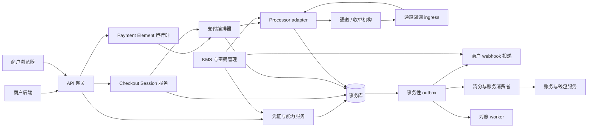
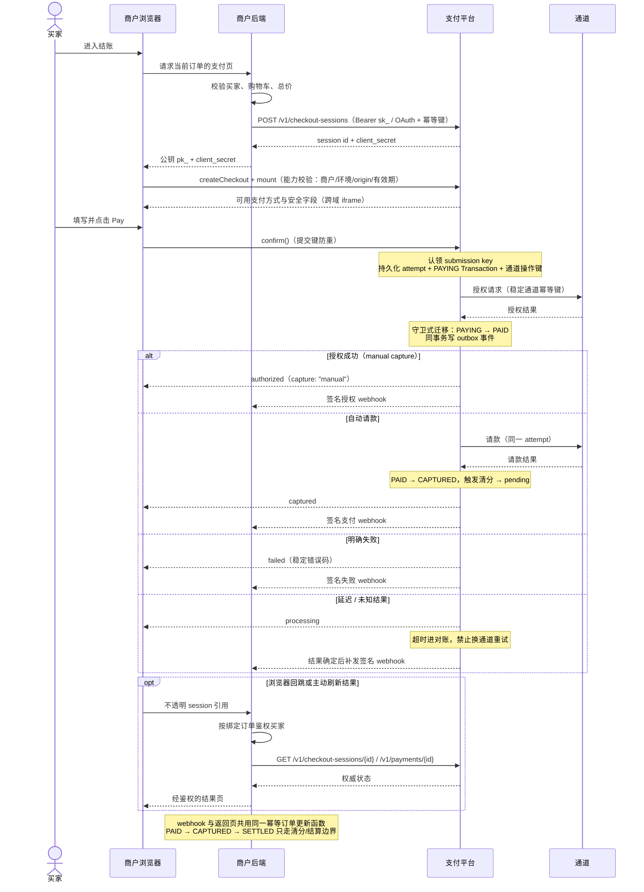
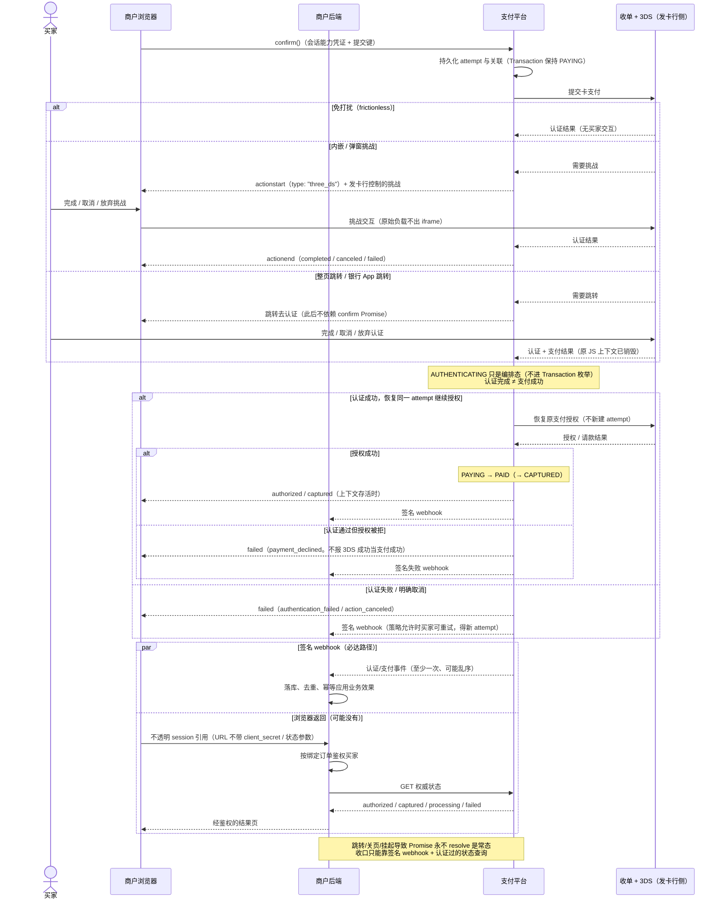

# Payment Element 认证与接入内部设计说明

状态：拟定设计；不是已通过的 ADR，也不是已实施的 API。

## 写给谁看

- 你是**支付平台的工程师或设计评审者**。
- 你已经了解商户侧的接入形状。新手向的商户视角见 [Payment Element 商户接入指南](payment-element-merchant-integration-guide.md)。本文只讲平台侧的决策、约束与理由。
- 英文契约原文是 [Payment Element SDK design](payment-element-design.md) 与 [Payment Element 3DS design](payment-element-3ds-design.md)。本文与之冲突时，以英文设计文档为准。

本文回答五个设计问题：

| 问题 | 章节 |
| --- | --- |
| 浏览器端如何认证（商户客户端） | §2 |
| 服务端如何做服务间认证 | §3 |
| 提供什么包 / SDK，商户如何接入 | §4 |
| 服务端如何与其他服务协调 | §5 |
| 整体时序（纯授权、认证 + 授权） | §6 |

## 0. 术语约定

中文里“认证”和“授权”容易混用。本文严格区分三组词：

| 术语 | 含义 | 出现位置 |
| --- | --- | --- |
| 认证 (authentication) | 证明“你是谁”：密钥、token、HMAC 签名、3DS 持卡人认证 | §2、§3、§6.2 |
| 访问授权 (authorization / 鉴权) | 证明“你能对哪个资源做什么”：scope、资源归属校验、买家会话鉴权 | §2、§3、§5 |
| 支付授权 (funds authorization) | 卡组织意义上的授权请款：`authorized` / `PAID`，与 capture（请款）相对 | §6.1 |

“纯授权”指**不带 3DS 持卡人认证的支付授权**。“认证 + 授权”指 **3DS 持卡人认证完成后继续同一笔支付授权**。

## 1. 决策总览

| 问题 | 决策 | 关键理由 |
| --- | --- | --- |
| 浏览器如何认证 | 双凭证：公开商户标识 `pk_` + 会话级能力凭证 `client_secret`。两者必须解析到同一商户与环境 | 浏览器完全不可信。公钥只选配置；能力凭证把爆炸半径限制在单会话、单操作 |
| 服务端如何认证 | 直连商户用 Bearer 私密钥 `sk_test_` / `sk_live_`；多商户应用用 OAuth 受限 token | 密钥永不进浏览器；商户身份只能从凭证推导，body 自报 `merchant_id` 一律无效 |
| 用什么包接入 | 托管运行时 + 框架无关 TypeScript SDK（npm 细加载器）+ 薄 React 绑定 + 可选服务端 SDK | 支付行为只实现一次；敏感采集留在受控支付域；补丁更新不依赖商户发版 |
| 服务端如何协调 | 凭证服务解析内部 principal，经 mTLS 在服务间传播；状态与事务性 outbox 同事务；统一守卫式迁移函数 | 浏览器和通道回调都不可信；每个外部可见状态变更恰好产生一次事实事件 |
| 时序 | 纯授权一条链路；认证 + 授权在同一 payment attempt 内以 action 暂停/恢复；两者都靠签名 webhook + 受认证查询收口 | 3DS 跳转会销毁 JS 上下文；`confirm()` 的 Promise 不可作为正确性依赖 |

## 2. 浏览器能力模型（客户端认证）

### 2.1 决策与威胁模型

浏览器持有两个凭证。两个都不是密钥：

```ts
const walletPay = await loadWalletPay({
  publicKey: "pk_test_merchant",     // ① 公开商户标识
});

const checkout = await walletPay.createCheckout({
  clientSecret,                       // ② 会话级能力凭证，由商户后端下发
});
```

设计的出发点是三条威胁假设：

1. **商户页面完全不可信。** 页面可以被篡改、被伪造、被中间人。支付字段隔离不能使页面可信。
2. **前端持有的任何值都可能泄露。** 因此前端不持有能做管理操作的凭证。
3. **单点泄露的爆炸半径必须有限。** 因此浏览器凭证的有效范围是“一个会话、一个操作、几分钟”。

由此拆成两层：

- **公钥 `pk_`（publishable merchant identifier）**：公开值，可出现在前端代码。它只选择公开配置（可用支付方式、locale、外观约束、frame 地址）。它**不授权任何支付操作**，泄露无害。
- **`client_secret`（会话能力凭证）**：由商户后端在创建 Checkout Session 时获得，只返回给需要它的那一个买家上下文。它授权**对单个 Checkout Session 的有限操作**（初始只有 `confirm`）。它是 bearer capability，泄露有界但按敏感值对待。

平台校验公钥与 `client_secret` 解析到**同一商户、同一环境**（test/live 不可交叉）。浏览器凭证与服务端凭证共用 credential service 的「查找前缀 + verifier」模式，但只解析出一个会话级 capability。不用 cookie 会话的原因：SDK 要跨站嵌入商户页和 WebView，cookie 语义与 CSRF 面都不合适。

### 2.2 能力凭证的绑定与验证路径

签发时固化以下绑定。验证时逐项检查。每一项对应一个具体威胁：

| 绑定项 | 防什么 |
| --- | --- |
| 商户与环境 | 跨商户冒用、test 泄漏进 live |
| Checkout Session 与不可变订单版本（`order_version`） | 一笔凭证被挪去付另一笔订单 |
| 金额、币种、capture 模式 | 浏览器篡改货币快照 |
| 允许的操作（初始仅 `confirm`） | 能力凭证被用于管理操作 |
| 允许的浏览器 origin（精确匹配） | 凭证被第三方站点盗用（纵深防御，不替代验证） |
| 过期时间与替换状态 | 购物车变更后旧凭证继续可用 |
| 确认提交策略 | 重复提交造成平行授权 |

明确禁止：会话能力凭证**不得**授权金额变更、跨商户操作、capture/refund 管理、任意客户数据读取、创建新会话。它不得进入 URL、持久化存储、埋点、日志。

实现约束：

- `browser_capability` 持久记录 capability ID、session ID、verifier、允许操作、过期与吊销状态。
- 普通会话查询永不返回 `client_secret`。只有幂等重放（文档化的保留窗口内）返回原始响应。
- 限流与 origin 检查减少滥用，但不替代能力验证。
- 浏览器事件（`ready` / `change` / `actionend` 等）只是 UI 状态。不存在 `paymentSucceeded` 事件。支付事实只能来自服务端认证过的查询与签名 webhook。

### 2.3 返回页鉴权的平台语义

跳转返回的 URL 只携带不透明会话引用（`checkout_session=cs_01J...`），不携带 `success=true` 与 `client_secret`。平台侧的资源投影必须满足：

- `GET /v1/checkout-sessions/{id}` 用服务端凭证鉴权，验证商户资源归属；
- 商户后端按 session 的**固定绑定**推导订单，浏览器提交的订单号不是权威；
- 未授权查询不返回任何跨订单状态或买家数据，即使引用属于同一商户。

## 3. 服务端认证模型（服务间认证）

四个方向，凭证互不通用、不可互换。

### 3.1 商户后端 → 平台（管理面 API）

直连商户用分环境的 Bearer 私密钥：

```http
POST /v1/checkout-sessions
Authorization: Bearer sk_test_...
Idempotency-Key: checkout_order_100123_v1
Content-Type: application/json
```

决策要点：

- 凭证解析出 `merchant_id`、环境、允许操作、账户状态、已开通能力、可选 submerchant 范围。**body 里的 `merchant_id` 永远不是权威。**
- 多商户应用（电商平台、SaaS 插件）走 OAuth 授权。access token 限定到被连接商户与被授权操作。存在委托连接时，插件不得索要商户的无限制平台密钥。
- 服务端 bearer 秘密含非机密查找前缀 + 高熵秘密材料。存储只存单向 verifier。仅当协议要求可恢复时存 KMS 加密值。
- OAuth token 验证 issuer、audience、过期、吊销、商户绑定与 scope。test/live 的 issuer、密钥、资源全部隔离。
- 轮换支持重叠窗口。吊销在授权层立即生效。
- 审计与请求日志只记**凭证 ID** 与脱敏指纹，不记密钥值。

### 3.2 平台 → 商户后端（业务 webhook）

平台推送给商户的事件用**端点级签名密钥**（与 API 私密钥、浏览器凭证都不通用）。信封：

```http
WalletPay-Event-Id: evt_...
WalletPay-Timestamp: 178...
WalletPay-Signature: v1=<hmac>
```

决策要点：HMAC 覆盖**时间戳 + 原始请求体**。商户处理顺序是硬性要求：验签与新鲜度 → 先持久化再应答 → 按 `event_id` 去重 → 业务效果幂等。投递语义是至少一次、不保证顺序。端点配置归属商户/环境级，**不允许** per-session 回调 URL（防开放跳转与 SSRF）。webhook 投递失败不得回滚或改变支付状态。

### 3.3 通道 → 平台（provider 回调）

每个 processor adapter 负责其通道账户/环境的回调认证。ingress 读取**未修改的原始 body**，验签/时间戳或 mTLS，通道账户从配置推导（不信任 payload 商户字段），**先落库再返回成功**。验签失败、跨环境、不支持的回调一律 fail-closed：产生安全信号，不改变支付状态。

### 3.4 平台内部服务之间

- 传输层：**mTLS 或工作负载身份**。adapter 与 webhook 投递 worker 只获得各自需要的密钥（KMS 按需下发）。
- 语义层：edge 把凭证材料交给 credential service，换回内部 principal。所有下游调用携带它，且**在资源属主服务上重复归属校验**：

```ts
type RequestPrincipal = {
  subjectType: "merchant_credential" | "oauth_grant" | "browser_capability";
  subjectId: string;
  merchantId: string;
  environment: "test" | "live";
  scopes: string[];
  submerchantId?: string;
  credentialVersion: number;
};
```

任何下游服务**不接受**未验证请求体或浏览器声明的 `merchant_id`、environment、scopes。日志与 trace 只记凭证 ID 与脱敏指纹。授权头、client secret、支付凭证、设备数据、原始回调体全部脱敏。

## 4. SDK 与对外契约

### 4.1 分发形态

框架无关的 TypeScript 核心 + 薄框架绑定；支付行为只实现一次。包名为拟定名：

| 包 / 构件 | 形态 | 职责 |
| --- | --- | --- |
| 托管运行时（类似 `js.stripe.com`） | 平台支付域托管脚本 | 实际运行时；敏感采集与 frame 管理的唯一实现 |
| `@walletpay/checkout-js` | npm 细加载器 | `loadWalletPay()`、`createCheckout()`、`createPaymentElement()`、`confirm()`、事件与销毁；类型 |
| `@walletpay/react` | npm | provider 薄包装；Strict Mode 重放、卸载清理；不重复支付逻辑 |
| `@walletpay/node`（可选） | npm | `/v1/*` 的签名、幂等键、重试封装；私密钥只在此层 |
| REST API `/v1/*` | HTTP | 权威契约。不用 SDK 也能接 |

理由：JS 是集成层，跨域 iframe 是隔离边界（见 [provider survey](payment-sdk-iframe-provider-survey.md)）；托管运行时使支付方式更新不依赖商户发版；细加载器保类型安全；薄绑定避免行为分叉。

### 4.2 对外契约片段

商户侧完整接入代码见 [商户接入指南](payment-element-merchant-integration-guide.md) §3–§6。平台契约的权威形状：

```ts
type ConfirmResult =
  | { status: "authorized"; paymentId: string; capture: "manual" | "pending" | "failed"; error?: PaymentError }
  | { status: "captured"; paymentId: string }
  | { status: "processing"; paymentId?: string; reason: "pending_method" | "unknown_outcome" }
  | { status: "failed"; paymentId?: string; error: PaymentError };

type PaymentError = {
  code:
    | "invalid_configuration" | "session_expired" | "validation_failed"
    | "authentication_failed" | "payment_declined" | "capture_failed"
    | "action_canceled" | "popup_blocked" | "network_error" | "unknown_outcome";
  category: "integration" | "buyer" | "payment" | "network";
  requestId?: string;
  recoverable: boolean;
};
```

约束：错误码稳定且文档化恢复动作；面向买家的文案本地化，不暴露 processor 诊断。提交后的网络超时返回 unknown/processing，**不得**触发对另一 processor 的盲目重试。React 绑定的 identity 类 props 不可变，替换走显式路径。

## 5. 服务端与其他服务的协调

### 5.1 服务边界（逻辑划分，不要求一服务一部署）



| 组件 | 拥有 | 不得拥有 |
|---|---|---|
| API 网关 | TLS、限流、版本路由、request ID | 从 body 推断商户身份；支付状态迁移 |
| 凭证与能力服务 | API key/OAuth/浏览器能力验证、principal 解析 | 结账金额；processor 决策 |
| Checkout Session 服务 | 不可变订单快照、过期/替换、允许 origin、公开状态投影 | 原始支付凭证；商户履约状态 |
| Payment Element 运行时 | 可用方式引导、frame 配置、浏览器安全确认 API | 商户密钥；权威账务状态 |
| 支付编排器 | 一个逻辑 attempt、action 续接、超时分类、归一化结果 | PAN/CVC 存储；直接改余额 |
| Processor adapter | 通道认证、报文翻译、通道幂等、验签 | 跨通道公共策略；字符串式改核心状态 |
| 通道回调 ingress | 原始体验签、持久收执、去重后应答 | 商户 webhook 投递；同步履约 |
| 商户 webhook 投递 | 签名信封、重试计划、投递证据与重放 | 从投递结果发明新支付状态 |
| 对账 worker | 查询未决操作、导入通道报表、发现不一致 | 对另一通道盲目重发不确定授权 |
| 清分与账务消费者 | ADR 定义的 Transaction 迁移、`CAPTURED` 清分、不可变分录 | 浏览器会话状态；回调字面解释 |

### 5.2 协调原则

1. **凭证集中解析，principal 全程传播。** 只有 credential service 接触原始凭证材料。下游只认 `RequestPrincipal`，并在属主服务重复归属校验（§3.4）。
2. **状态与 outbox 同事务提交。** 每个外部可见状态迁移在同一事务追加版本化 `outbox_event`。队列只搬运工作，不是事实源。消费者完成幂等效果后才确认。
3. **统一守卫式迁移函数。** 同步响应与验证过的通道回调走同一函数：校验当前状态、操作类型、金额与通道证据后写入 attempt/Transaction 新状态。乱序与重复由 provider-event 去重 + 聚合版本 CAS 兜底，状态不可回退。
4. **提交前持久化，超时进对账。** 先认领 session 级 submission key、写 attempt 与稳定通道操作键，再调 processor。通道超时后操作进入 unknown，session 锁定禁止盲目重提，对账 worker 用原引用/幂等键查询。**结果未明时禁止换通道重试**（可能双重授权）。
5. **账务只走一条边界。** 授权证据使 Transaction 进 `PAID`；请款成功进 `CAPTURED` 并发幂等清分命令；清分一次算出余额变动与不可变分录，商户净额进 `pending`；通道注资是上游 `SETTLEMENT` 动账，**不**置 `SETTLED`；只有下游商户结算进程把 `CAPTURED` 置 `SETTLED`、资金 `pending` → `available`（[ADR 0003](adr/0003-transaction-status-model.md)、[ADR 0005](adr/0005-ledger-invariants.md)）。
6. **商户侧一个幂等入口。** webhook 与返回页是两条独立信号，先后不定、可能只到一条；商户用同一幂等函数承接，每个业务效果恰好一次。
7. **test/live 全链路隔离。** 数据库、队列、通道账户、签名密钥、公开域名全部隔离。限流与 origin 检查不替代能力验证。

## 6. 整体时序图

### 6.1 纯授权（无 3DS 持卡人认证）

以 `capture_mode: "manual"` 为例（只支付授权）。`automatic` 时平台在授权同一环节发起请款，结果直接 `captured`，后续清分路径相同。



浏览器应答与签名 webhook 互相独立。两者谁先到都可以。浏览器可能消失。商户后端必须用同一个幂等路径应用业务效果。

### 6.2 认证 + 授权（3DS 持卡人认证 + 支付授权）

商户代码不变，仍是 `checkout.confirm()`。3DS 是 confirm 编排的一个 **action**：暂停同一 attempt，呈现发卡行控制的认证体验，完成后**恢复同一 attempt** 继续支付授权。



### 6.3 状态机对照（两条链路共用）

```text
编排/浏览器:  load → mount → ready → confirm → action(3DS/redirect) → 结果
Session:      open → processing → completed / expired
Attempt:      created → processing/action → authorized / captured / failed
Transaction:  PAYING → PAID → CAPTURED → SETTLED        （ADR 0003）
钱包:         pending → available（仅在下游 SETTLED 之后）（ADR 0005）
```

- `AUTHENTICATING` 是编排层状态，**不是**新增的 `Transaction.status`。认证等待期间交易枚举保持 `PAYING`。
- 这些都**不映射**为支付成功：挑战渲染、挑战完成、浏览器回跳、持卡人认证通过、通道受理请求。
- 支付授权成功（`PAID`）是否足够发货是商户的显式策略。更不等于入账结算（`SETTLED`）。

## 7. 验收要点

- 商户身份只能从凭证推导。body 自报 `merchant_id` 无效。
- 浏览器只用公钥 + 会话能力凭证即可挂载。两者解析到同一商户与环境。
- 浏览器无法改动金额、币种、商户、capture 策略。
- 原始支付数据不出现在商户可见状态、事件与日志。
- 重复确认不产生平行逻辑 attempt。购物车变更产生替换 session 而非改金额。
- 跳转/页面丢失与异步结果可经状态查询与 webhook 恢复。
- 会话引用替换不能泄露他人订单（含同商户下他人订单）。
- 重复/乱序的 webhook 与返回页处理，业务效果各恰好一次。
- 会话创建、幂等响应与浏览器能力原子提交。确认先持久化 attempt 与通道操作键再调 processor。
- 提交后超时锁定盲目重试并路由对账。同步响应与验证回调共用守卫式迁移函数。
- 支付状态变更与 outbox 同事务；webhook 投递失败不改变支付状态。
- `PAID`、`CAPTURED`、上游注资与下游 `SETTLED` 相互区分；只有账务边界移动余额。
- 未登记的返回地址与伪造的 frame 消息被拒绝。
- 浏览器完成态不能直接记账、不能把资金移到 `available`、不能在无服务端证据时触发发货。

## 8. 相关材料

- [Payment Element 商户接入指南](payment-element-merchant-integration-guide.md)（商户视角、新手向）
- [Payment Element SDK design](payment-element-design.md)（英文契约原文）
- [Payment Element 3DS design](payment-element-3ds-design.md)（3DS 扩展原文）
- [Stripe Payment Element gap research](stripe-payment-element-gap-research.md)
- [Payment web SDK and iframe provider survey](payment-sdk-iframe-provider-survey.md)
- [ADR 0003: transaction status model](adr/0003-transaction-status-model.md)
- [ADR 0005: ledger invariants](adr/0005-ledger-invariants.md)
- [领域术语](../CONTEXT.md)
