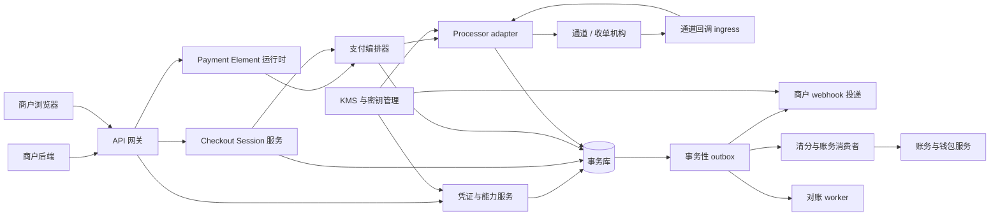

# Payment Element 商户接入与认证技术设计

状态：拟定设计的中文决策说明；不是已通过的 ADR，也不是已实现的 API。本文解释并细化 [Payment Element SDK design](payment-element-design.md) 与 [Payment Element 3DS design](payment-element-3ds-design.md) 中已经做出的决策，覆盖五个问题：浏览器端如何认证、服务端如何做服务间认证、商户用什么包接入、服务端如何与其他服务协调、整体时序是什么样。契约细节以英文设计文档为准；本文与之冲突时以英文设计文档为准。

## 0. 术语约定

中文里“认证”和“授权”容易混用，本文严格区分三组词：

| 术语 | 含义 | 本文出现位置 |
| --- | --- | --- |
| 认证 (authentication) | 证明“你是谁”：密钥、token、HMAC 签名、3DS 持卡人认证 | §2、§3、§6.2 |
| 访问授权 (authorization / 鉴权) | 证明“你能对哪个资源做什么”：scope、资源归属校验、买家会话鉴权 | §2、§3、§5 |
| 支付授权 (funds authorization) | 卡组织意义上的授权请款：`authorized` / `PAID`，与 capture（请款）相对 | §6.1 |

“纯授权”指**不带 3DS 持卡人认证的支付授权**；“认证 + 授权”指**3DS 持卡人认证完成后继续同一笔支付授权**。

## 1. 决策总览

| 问题 | 决策 | 关键依据 |
| --- | --- | --- |
| 浏览器如何认证 | 双凭证：公开商户标识 `pk_` + 会话级能力凭证 `client_secret`；两者必须解析到同一商户与环境 | 浏览器不可持有任何服务端密钥；`pk_` 只选配置，不授权支付 |
| 服务端如何认证 | 直连商户用 Bearer 私密钥 `sk_test_` / `sk_live_`；平台/多商户应用用 OAuth 授权码获得的受限 access token | 密钥永不进入浏览器；商户身份从凭证推导，不允许 body 里自报 `merchant_id` |
| 用什么包接入 | 托管运行时 + 框架无关 TypeScript SDK（npm 细加载器）+ 薄 React 绑定 + 服务端 SDK | 支付行为只实现一次；vanilla 与 React 共享同一核心；敏感采集永远在受控支付域 |
| 服务端如何协调 | 凭证服务解析内部 principal 后经 mTLS/工作负载身份在服务间传播；状态变更与事务性 outbox 同事务提交；统一的守卫式状态迁移函数 | 浏览器和通道回调都不可信；每个外部可见状态变更恰好产生一次事实事件 |
| 时序 | 纯授权一条链路；认证 + 授权在同一个 payment attempt 内以 action 暂停/恢复；两者都靠签名 webhook + 受认证的状态查询收口 | 3DS 跳转可能销毁 JS 上下文，`confirm()` 的 Promise 不可依赖 |

## 2. 浏览器端认证（商户客户端）

### 决策

浏览器持有两样凭证，缺一不可，且都不是密钥：

```ts
const walletPay = await loadWalletPay({
  publicKey: "pk_test_merchant",     // ① 公开商户标识
});

const checkout = await walletPay.createCheckout({
  clientSecret,                       // ② 会话级能力凭证，由商户后端下发
});
```

- **公钥 `pk_`（publishable merchant identifier）**：公开值，可出现在前端代码与页面。它只用于选择公开配置（可用支付方式、locale、外观约束、frame 地址等），**不授权任何支付操作**。
- **`client_secret`（Checkout Session 能力凭证）**：由商户后端在服务端创建 Checkout Session 时获得，只返回给需要它的那一个买家上下文。它授权的是**对单个 Checkout Session 的有限操作**（初始只有 `confirm`）。

平台侧校验：公钥与 `client_secret` 必须解析到**同一商户、同一环境**（test/live 不可交叉）。校验逻辑与服务端凭证同源（见 §3.4 的 credential service），浏览器凭证走 lookup 前缀 + verifier 的同一模式，但只解析出一个会话级 capability。

### `client_secret` 的绑定范围

签发时固化，验证时逐项检查：

- 商户与环境；
- Checkout Session 与不可变的订单版本（`order_version`）；
- 金额、币种、capture 模式（货币快照不可被浏览器 patch）；
- 允许的浏览器操作（初始仅 `confirm`）；
- 允许的浏览器 origin（精确匹配，纵深防御项）；
- 过期时间与替换状态（购物车变更产生新 session，旧 capability 失效）；
- 确认提交策略（重复提交防护）。

### 明确禁止

`client_secret` **不得**用于：修改金额、跨商户操作、capture/refund 管理、读取任意客户数据、创建新 session。它不得出现在 URL、持久化存储、埋点/分析、客服截图和日志中。Origin 校验只是纵深防御，**不能替代能力凭证验证**。

浏览器事件（`ready` / `change` / `actionend` 等）只是 UI 状态信号，不是支付事实；不存在名为 `paymentSucceeded` 的浏览器事件。支付事实只能来自服务端认证过的状态查询与签名 webhook。

### 返回页（return page）的鉴权

3DS 跳转、钱包跳转后回到商户页时，URL 只携带**不透明会话引用**：

```text
https://shop.example/payments/return?checkout_session=cs_01J...
```

不携带 `success=true` 之类的可信参数，更不携带 `client_secret`。返回页把引用交给商户后端；后端用服务端凭证向平台查权威状态，验证资源归属，再**按 session 内嵌绑定的订单**对买家（或游客）会话做访问授权。浏览器提交的订单号不是权威：订单必须从查询回来的 session 绑定里推导。未授权的查询不返回任何跨订单的状态或买家数据，即使引用的 session 属于同一商户。

## 3. 服务端对服务端认证

一共四个方向，凭证互不通用、不可互换。

### 3.1 商户后端 → 平台（管理面 API）

直连商户使用**分环境的 Bearer 私密钥**：

```http
POST /v1/checkout-sessions
Authorization: Bearer sk_test_...
Idempotency-Key: checkout_order_100123_v1
Content-Type: application/json
```

凭证解析出 `merchant_id`、环境（test/live）、允许的操作、账户状态、已开通能力、可选的 submerchant 范围。**请求 body 里的 `merchant_id` 永远不是权威**——商户身份只能从凭证推导。

电商平台、SaaS 插件等多商户应用走 **OAuth 授权**：access token 限定到被连接商户与被授权操作。插件**不得**在存在委托连接时索要商户的无限制平台密钥。

密钥生命周期要求：

- test / live 凭证严格分离（签发者、密钥、资源、数据库、队列全部隔离）；
- 私密钥只在创建时展示一次；存储只存单向 verifier（或协议要求可恢复时存 KMS 加密值）；支持重叠轮换窗口，吊销立即生效；
- 审计与请求日志只记**凭证 ID**，不记密钥值；
- 支持即时吊销，并暴露最后使用时间；
- 每个操作按商户、环境、资源归属、capability 四维授权。

### 3.2 平台 → 商户后端（业务 webhook）

平台推送给商户的事件使用**独立的端点级签名密钥**（与 API 私密钥、浏览器凭证都不通用）。建议信封：

```http
WalletPay-Event-Id: evt_...
WalletPay-Timestamp: 178...
WalletPay-Signature: v1=<hmac>
```

HMAC 覆盖 **时间戳 + 原始请求体**。商户侧处理顺序是硬性要求：验签与新鲜度 → **先持久化事件再应答** → 按 `event_id` 去重 → 业务效果幂等应用。投递语义是至少一次、不保证顺序；因此商户必须用同一个幂等的订单更新/履约函数承接乱序和重复。端点配置归属商户/环境级，**不允许**每个 session 自带任意回调 URL（防开放跳转与 SSRF）。

### 3.3 通道 → 平台（provider 回调）

每个 processor adapter 自己负责其通道账户/环境的回调认证。Ingress 读取**未修改的原始 body**，按通道要求验签/时间戳或 mTLS，通道账户从配置推导（不信任 payload 里的商户字段），**先落库再返回成功**。验签失败、跨环境、不支持的回调一律 fail-closed，产生安全信号但不改变支付状态。

### 3.4 平台内部服务之间

- 传输层：服务间 **mTLS 或工作负载身份**；adapter 与 webhook 投递 worker 只拿到各自需要的密钥（KMS/密钥管理器按需下发）。
- 语义层：edge 把凭证材料交给 credential service，换回内部 principal，之后所有下游调用携带它，且**在资源属主服务上重复归属校验**：

```ts
type RequestPrincipal = {
  subjectType: "merchant_credential" | "oauth_grant" | "browser_capability";
  subjectId: string;
  merchantId: string;
  environment: "test" | "live";
  scopes: string[];
  submerchantId?: string;
  credentialVersion: number;
};
```

任何下游服务**不接受**来自未验证请求体或浏览器声明的 `merchant_id`、environment、scopes。日志与 trace 只记录凭证 ID 与脱敏指纹；授权头、client secret、支付凭证、设备数据、原始回调体全部脱敏。

## 4. 包 / SDK 与商户接入方式

### 决策

框架无关的 TypeScript 核心 + 薄框架绑定；支付行为只实现一次。拟定的分发形态（包名为拟定，尚未实施）：

| 包 / 构件 | 形态 | 职责 |
| --- | --- | --- |
| 托管运行时（类似 `js.stripe.com`） | 平台支付域托管脚本 | 实际运行时；敏感采集与 frame 管理的唯一实现；npm 侧只做加载与类型定义 |
| `@walletpay/checkout-js` | npm（细加载器） | `loadWalletPay()`、`createCheckout()`、`createPaymentElement()`、`confirm()`、事件与销毁；TypeScript 类型 |
| `@walletpay/react` | npm | `WalletPayProvider` / `CheckoutProvider` / `PaymentElement` 薄包装；处理 Strict Mode 重放、卸载清理；不重复实现支付逻辑 |
| `@walletpay/node`（服务端 SDK，可选薄封装） | npm | 对 `/v1/*` REST 的签名、幂等键、重试封装；**私密钥只在此层** |
| REST API `/v1/*` | HTTP | 权威契约；不用 SDK 也能接 |

选型理由：与 [Payment web SDK and iframe provider survey](payment-sdk-iframe-provider-survey.md) 的结论一致——JS 是集成/运行层，跨域 iframe 是隔离边界；托管运行时保证补丁与支付方式更新无需商户发版，npm 细加载器保证类型安全与 tree-shaking，薄 React 绑定避免行为分叉。

### 商户接入四步

**① 服务端（唯一持有密钥的一侧）**：创建 Checkout Session，金额用货币最小单位（`1099` = USD 10.99），购物车变更 → 新 `order_version` + 替换 session（绝不原地改金额）：

```http
POST /v1/checkout-sessions
Authorization: Bearer sk_test_...
Idempotency-Key: checkout_order_100123_v1
```

```json
{
  "merchant_order_reference": "ORDER-100123",
  "order_version": 1,
  "amount": { "value": 1099, "currency": "USD" },
  "capture_mode": "automatic",
  "return_url": "https://shop.example/payments/return",
  "locale": "en-US",
  "expires_in_seconds": 1800
}
```

把返回的 `client_secret` 连同公钥下发给该买家的浏览器上下文。

**② 浏览器**：加载 → 建 checkout → 挂载 → 确认：

```ts
const walletPay = await loadWalletPay({ publicKey: "pk_test_merchant" });
const checkout = await walletPay.createCheckout({ clientSecret });

const paymentElement = checkout.createPaymentElement({ layout: "accordion" });
paymentElement.mount("#payment-element");

paymentElement.on("change", ({ complete }) => setPayEnabled(complete));

form.addEventListener("submit", async (event) => {
  event.preventDefault();
  const result = await checkout.confirm({
    returnUrl: "https://shop.example/payments/return",
  });
  // 按 result.status 渲染 UX，不做资金判定
});
```

React 版把同样的对象放进 `WalletPayProvider publicKey` + `CheckoutProvider clientSecret` + `<PaymentElement />`。身份类 provider props 不可变；更换商户/环境/client secret 走显式替换路径。

**③ 返回页**：只收不透明 session 引用 → 转后端查权威状态（见 §2）。

**④ Webhook 端点**：验签 + 先落库 + `event_id` 去重 + 幂等业务效果（见 §3.2）。

### 商户侧职责边界

- 商户拥有：购物车、权威总价、订单摘要、普通 Pay 按钮（便于协调同意条款与表单校验）。
- SDK 拥有：多支付方式 UI、敏感输入框（受控支付域跨域 iframe）、方法专属按钮（钱包/平台规则要求时）、`confirm()` 编排与重复提交防护。
- 商户**不能**：接触原始 PAN/CVC；从点击或 UI 回调推断成功；改动金额/币种/商户/capture 策略；依赖每次 `confirm()` 的 Promise 都会 resolve（跳转会销毁 JS 上下文）。
- 手工请款、取消、退款是相邻的服务端 API（同样走服务端认证 + 归属校验 + 持久化幂等键），**不是**浏览器 SDK 功能。

## 5. 服务端如何与其他服务协调

### 服务边界（逻辑划分，不要求一服务一部署）



### 协调原则（决策）

1. **凭证集中解析，principal 全程传播**。只有 credential service 碰原始凭证材料；下游只认 `RequestPrincipal`，并在属主服务上重复资源归属校验（§3.4）。
2. **状态与 outbox 同事务提交**。每个外部可见的状态迁移在同一事务里追加版本化 `outbox_event`；队列只搬运工作，不是事实源。消费者在自己完成幂等效果后才确认。
3. **统一守卫式状态迁移函数**。同步响应与验证过的通道回调走同一个迁移函数：校验当前状态、操作类型、金额与通道证据后才写入 attempt/Transaction 新状态；乱序、重复的通道事件由 provider-event 去重 + 聚合版本 CAS 兜底，状态不可回退。
4. **提交前持久化，超时进对账**。先认领 session 级 submission key、写入 attempt 与稳定的通道操作键，再调用 processor；通道超时后操作进入 unknown，session 锁定禁止盲目重提，由对账 worker 用原引用/幂等键向通道查询。**禁止**在结果未明时切换通道重试（可能双重授权）。
5. **与账务的衔接只走一条边界**。支付证据 → Transaction 状态（[ADR 0003](adr/0003-transaction-status-model.md)）：授权成功进 `PAID`；请款成功进 `CAPTURED` 并发幂等清分命令；清分一次算出余额变动与不可变分录，商户净额进 `pending`；通道注资是上游 `SETTLEMENT` 动账，**不**置 `SETTLED`；只有下游商户结算进程把 `CAPTURED` 置 `SETTLED`、资金从 `pending` 转 `available`（[ADR 0005](adr/0005-ledger-invariants.md)）。浏览器结果、webhook 投递结果、通道的 “complete/approved/settled” 字样一律不能绕过这条边界。
6. **商户侧协调 = 一个幂等入口**。签名 webhook 与返回页查询是两条独立信号，先后不定、可能只到一条；商户后端用同一个幂等订单更新/履约函数承接，每个业务效果按 `event_id` / 业务键恰好应用一次。
7. **test/live 全链路隔离**，限流与 origin 检查只是减滥用手段，不替代能力验证。

## 6. 整体时序图

### 6.1 纯授权（无 3DS 持卡人认证）

以 `capture_mode: "manual"` 为例（只授权、请款另走管理 API）。`automatic` 时平台在授权同一环节发起请款，结果直接是 `captured`，后续清分入账路径相同。


### 6.2 认证 + 授权（3DS 持卡人认证 + 支付授权）

商户代码不变，仍是同一个 `checkout.confirm()`。3DS 是 confirm 编排的一个 **action**：暂停同一 attempt、呈现发卡行控制的认证体验、完成后**恢复同一笔 attempt** 继续授权。


### 状态机对照（两条链路共用）

```text
编排/浏览器:  load → mount → ready → confirm → action(3DS/redirect) → 结果
Session:      open → processing → completed / expired
Attempt:      created → processing/action → authorized / captured / failed
Transaction:  PAYING → PAID → CAPTURED → SETTLED        （ADR 0003）
钱包:         pending → available（仅在下游 SETTLED 之后）（ADR 0005）
```

- `AUTHENTICATING` 是编排层状态，**不是**新增的 `Transaction.status`；认证等待期间平台交易枚举仍是 `PAYING`。
- 挑战渲染、挑战完成、浏览器回跳、持卡人认证通过、通道受理请求——这些都**不映射**为支付成功。
- 支付授权成功（`PAID`）也不等于商户可发货：是否以授权为发货依据是商户的显式策略；更不等于入账结算（`SETTLED`）。

## 7. 相关材料

- [Payment Element SDK design](payment-element-design.md)（英文契约原文）
- [Payment Element 3DS design](payment-element-3ds-design.md)（3DS 扩展原文）
- [Stripe Payment Element gap research](stripe-payment-element-gap-research.md)
- [Payment web SDK and iframe provider survey](payment-sdk-iframe-provider-survey.md)
- [ADR 0003: transaction status model](adr/0003-transaction-status-model.md)
- [ADR 0005: ledger invariants](adr/0005-ledger-invariants.md)
- [领域术语](../CONTEXT.md)
