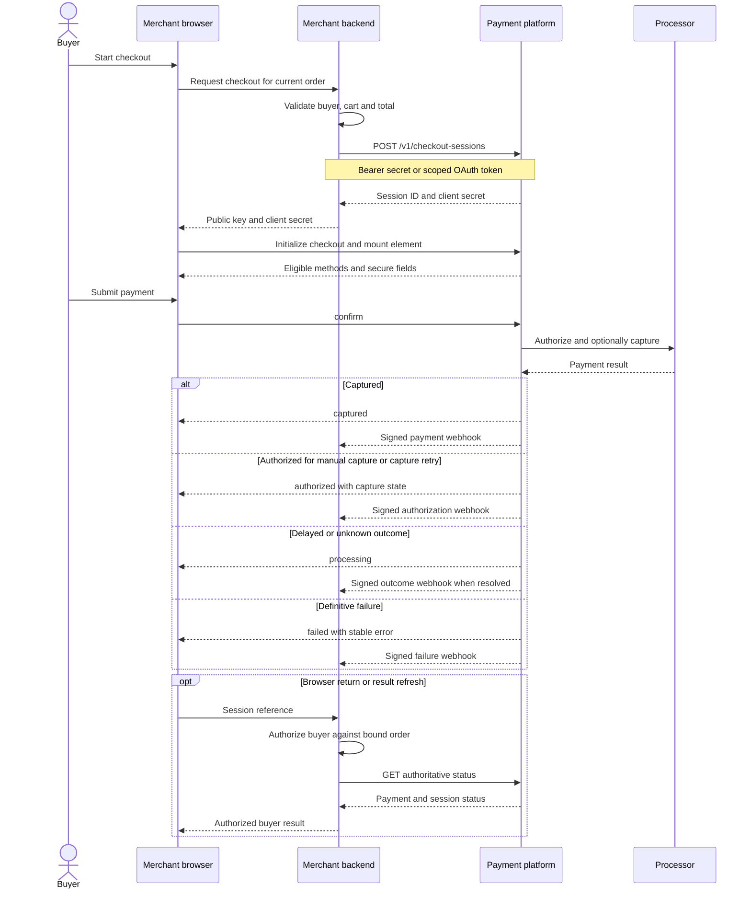
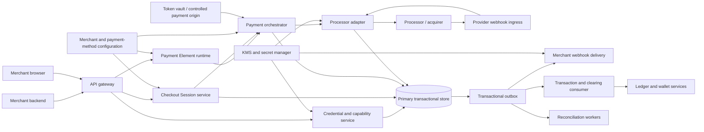
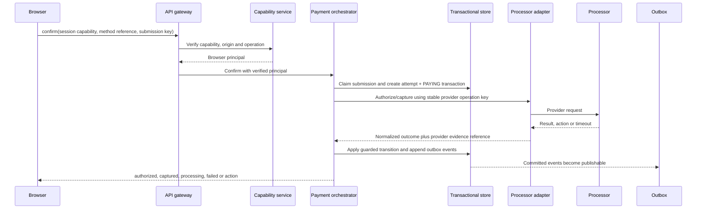

# Payment Element SDK design

Status: proposed design; not an adopted ADR or implemented API.

This document defines the browser and merchant-server contract for an embedded, multi-method Payment Element. It builds on the recommendations in [Payment SDK, iframe and plugin design survey](payment-integration-design-survey.md). [Payment Element 3DS design](payment-element-3ds-design.md) adds cardholder authentication on top of the lifecycle defined here.

## Decision summary

Build a framework-neutral TypeScript SDK with thin framework bindings. The SDK is initialized with a public merchant identifier and a short-lived Checkout Session client secret. A checkout object owns session-scoped orchestration; a Payment Element owns the embedded payment-method UI. The merchant owns the surrounding checkout, authoritative cart, order summary and standard Pay button.

The Payment Element is a prebuilt multi-method surface, not only a card form. It may use several provider-origin iframes, popups or redirects internally. Sensitive payment data must not enter the merchant DOM, JavaScript callbacks, backend requests, analytics or logs.

Browser events report UI state. They are not trusted payment or accounting events. A server-created session fixes the merchant, order version, amount, currency, capture policy and return destinations. Verified server responses and signed webhooks drive payment and order transitions.

## Goals

- Give a custom-site merchant one coherent embedded integration for cards, wallets and eligible local methods.
- Keep secret credentials and authoritative order data on the merchant server.
- Make loading, readiness, validation, confirmation, asynchronous processing and unknown outcomes explicit.
- Support vanilla TypeScript and React without implementing payment behavior twice.
- Survive duplicate submission, redirects, page loss, cart changes and delayed or reordered webhooks.
- Keep browser, payment and wallet-settlement states separate.

## Non-goals

- This design does not define processor adapter internals, a native mobile SDK or commerce plugins.
- It does not permit raw PAN or CVC collection by the merchant.
- It does not define refunds, capture administration, disputes or ledger posting APIs.
- It does not certify PCI scope. The final collection architecture and operating controls require compliance review.
- It does not make 3DS part of the base UI contract. The base contract provides action hooks used by the separate [3DS extension](payment-element-3ds-design.md).

## Ownership and trust boundaries

| Concern | Merchant browser | Merchant backend | Payment platform |
| --- | --- | --- | --- |
| Cart and order summary | Displays | Calculates and validates | Receives an immutable snapshot/reference |
| Amount and currency | Cannot authoritatively set | Sets through authenticated API | Binds to Checkout Session |
| Merchant identity | Supplies public key and client secret | Authenticates with secret or OAuth token | Derives merchant from credential |
| Payment-method UI | Mounts a container | None | Renders eligible methods and sensitive fields |
| Payment details | Never receives raw values | Never receives raw values | Collects in controlled payment origin |
| Confirmation | Invokes `confirm()` | May query status | Orchestrates payment attempt and actions |
| Order update and fulfillment | Displays result | Applies idempotent business effects | Sends signed events and exposes status |
| Wallet accounting | No authority | No direct posting | Applies existing transaction and ledger rules |

The merchant page is not trusted merely because payment fields are isolated. It can still display a false total or replace the SDK UI. The platform must enforce the server-created session on every monetary operation.

## Authentication model

Authentication is separated into merchant server authentication, browser session capability and webhook authentication. These credentials are not interchangeable.

### Merchant server authentication

Direct integrations use separate test and live bearer secrets:

```http
Authorization: Bearer sk_test_...
Idempotency-Key: checkout_order_100123_v1
```

The credential resolves to the `merchant_id`, environment, allowed operations, account state, enabled capabilities and optional submerchant scope. An API request must not choose its authoritative merchant by sending a `merchant_id` in the body.

Commerce platforms and multi-merchant applications should use OAuth authorization. The resulting access token is scoped to the connected merchant and permitted operations. A plugin must not ask a merchant to expose an unrestricted platform secret when a delegated connection is available.

Secret lifecycle requirements:

- Separate test and live credentials.
- Show a secret only at creation, store only a verifier or encrypted value and support overlapping rotation.
- Record credential ID, not secret value, in audit and request logs.
- Support immediate revocation and surface the last-used time.
- Authorize every operation by merchant, environment, resource ownership and capability.

### Browser authentication

The merchant server creates a Checkout Session and returns its `client_secret` only to the buyer context that needs it. The browser initializes the SDK with both a publishable merchant identifier and this capability:

```ts
const walletPay = await loadWalletPay({
  publicKey: "pk_test_merchant",
});

const checkout = await walletPay.createCheckout({
  clientSecret,
});
```

The platform verifies that the public key and client secret resolve to the same merchant and environment. The public key selects public configuration; it does not authorize payment. The client secret authorizes a limited operation against one Checkout Session.

Bind the client secret to:

- merchant and environment;
- Checkout Session and immutable order version;
- amount, currency and capture mode;
- permitted browser operation, initially `confirm`;
- allowed browser origins;
- expiration and replacement state;
- confirmation-attempt policy.

It must not authorize amount changes, another merchant, capture/refund administration, arbitrary customer data access or creation of another session. Keep it out of URLs, persistent storage, analytics, support screenshots and logs. Origin checks are defense in depth, not a replacement for the capability.

### Webhook authentication

Platform-to-merchant events use a separate per-endpoint signing secret. A proposed envelope is:

```http
WalletPay-Event-Id: evt_...
WalletPay-Timestamp: 178...
WalletPay-Signature: v1=<hmac>
```

Sign the timestamp and raw request body. The merchant verifies the signature and freshness, persists the event before acknowledgement, deduplicates `event_id` and applies business effects idempotently. Delivery is at least once; event ordering is not guaranteed. Endpoint configuration belongs to the merchant/environment, not an arbitrary per-session callback URL.

## Checkout Session contract

Only an authenticated merchant backend creates a Checkout Session:

```http
POST /v1/checkout-sessions
Authorization: Bearer sk_test_...
Idempotency-Key: checkout_order_100123_v1
Content-Type: application/json
```

```json
{
  "merchant_order_reference": "ORDER-100123",
  "order_version": 1,
  "amount": { "value": 1099, "currency": "USD" },
  "capture_mode": "automatic",
  "return_url": "https://shop.example/payments/return",
  "locale": "en-US",
  "expires_in_seconds": 1800
}
```

The amount uses currency minor units; `1099` USD means USD 10.99. The platform validates the return URL against merchant configuration rather than accepting unrestricted destinations.

```json
{
  "id": "cs_01J...",
  "client_secret": "cs_01J..._secret_...",
  "expires_at": "2026-09-24T12:30:00Z",
  "session_status": "open",
  "payment_status": "unpaid"
}
```

Document idempotency scope, retention, payload-mismatch behavior and concurrent requests. A changed cart produces a new order version and replacement session. The browser cannot patch the monetary snapshot. The old session must stop accepting new attempts while any already-submitted attempt continues to reconciliation.

Minimum supporting server endpoints are:

- `GET /v1/checkout-sessions/{id}` for merchant-authenticated status and correlation data;
- `POST /v1/checkout-sessions/{id}/expire` to stop new attempts;
- `GET /v1/payments/{id}` for authoritative authorization/capture status.

Manual capture, cancellation and refund APIs are adjacent payment operations rather than browser SDK features. Their detailed contracts are outside this document, but they use merchant server authentication, ownership checks and persistent idempotency keys.

## End-to-end sequence



The browser response and signed webhook are independent. Either may arrive first, and the browser may disappear. The merchant backend applies order effects through one idempotent path regardless of which trusted signal triggers it.

## Browser SDK

### Vanilla TypeScript

```ts
const walletPay = await loadWalletPay({
  publicKey: "pk_test_merchant",
});

const checkout = await walletPay.createCheckout({
  clientSecret: checkoutSession.clientSecret,
});

const paymentElement = checkout.createPaymentElement({
  layout: "accordion",
});

paymentElement.mount("#payment-element");

paymentElement.on("ready", () => {
  setFormEnabled(true);
});

paymentElement.on("change", ({ complete, paymentMethod }) => {
  setPayEnabled(complete);
  recordSelectedMethod(paymentMethod);
});

paymentElement.on("loaderror", ({ code, requestId }) => {
  showIntegrationError(code, requestId);
});

form.addEventListener("submit", async (event) => {
  event.preventDefault();

  const result = await checkout.confirm({
    returnUrl: "https://shop.example/payments/return",
  });

  if (result.status === "authorized") {
    showAuthorizedState(result.capture, result.error);
  }
  if (result.status === "processing") showProcessingState();
  if (result.status === "captured") showPaymentReceived();
  if (result.status === "failed") showPaymentError(result.error);
});
```

`loadWalletPay()` loads or connects to the hosted runtime. `createCheckout()` creates one session-scoped orchestration object. `createPaymentElement()` creates the UI. `confirm()` validates the element, prevents accidental parallel confirmation and orchestrates method-specific actions.

### React binding

```tsx
<WalletPayProvider publicKey="pk_test_merchant">
  <CheckoutProvider clientSecret={clientSecret}>
    <PaymentElement
      options={{ layout: "accordion" }}
      onReady={handleReady}
      onChange={handleChange}
      onLoadError={handleLoadError}
    />
    <button type="submit">Pay</button>
  </CheckoutProvider>
</WalletPayProvider>
```

The React package wraps the same framework-neutral SDK. It initializes only in the browser, tolerates React Strict Mode effect replay, does not duplicate sessions or attempts and destroys listeners/frames on unmount. Identity-bearing provider props are immutable; changing merchant, environment or client secret uses an explicit replacement path.

### Merchant-owned Pay button

The merchant owns the ordinary Pay button so it can coordinate terms acceptance, cart validation and the surrounding form. The SDK owns method-specific buttons when wallet or platform rules require it. In either case, the merchant cannot infer success from a click or UI callback.

## Lifecycle and events

```text
load -> create checkout -> mount -> ready
                              -> confirm -> action / processing / result
                              -> unmount -> destroy
```

The Payment Element exposes UI events:

| Event | Meaning |
| --- | --- |
| `ready` | The component can accept input |
| `change` | Non-sensitive completeness, validation and selected-method state changed |
| `focus` / `blur` | Focus moved into or out of a supported field |
| `loaderror` | The component failed to initialize or load |

Action-capable methods may additionally emit `actionstart` and `actionend`; their semantics are defined by extensions such as [3DS](payment-element-3ds-design.md). There is deliberately no browser event called `paymentSucceeded`. A browser result is a UX signal; authenticated backend status and webhooks remain authoritative.

The component must support `unmount()` and `destroy()`. Destroy removes frames, listeners, timers and outstanding UI references. Late asynchronous initialization must not mount into a destroyed route.

## Confirmation results and errors

The base confirmation result is:

```ts
type ConfirmResult =
  | {
      status: "authorized";
      paymentId: string;
      capture: "manual" | "pending" | "failed";
      error?: PaymentError;
    }
  | { status: "captured"; paymentId: string }
  | {
      status: "processing";
      paymentId?: string;
      reason: "pending_method" | "unknown_outcome";
    }
  | { status: "failed"; paymentId?: string; error: PaymentError };
```

`authorized` means the platform has server-side authorization evidence and the transaction remains `PAID`. In manual mode, `capture` is `manual`. If automatic capture is queued for retry, it is `pending`; after a definitive failed capture call, it is `failed` with a `capture_failed` error. Neither authorization nor capture means merchant-wallet settlement. `processing` covers delayed methods and unknown outcomes where the platform cannot yet assert authorization or capture. A redirect can destroy the current JavaScript context, so merchants must not depend on every `confirm()` call resolving.

```ts
type PaymentError = {
  code:
    | "invalid_configuration"
    | "session_expired"
    | "validation_failed"
    | "authentication_failed"
    | "payment_declined"
    | "capture_failed"
    | "action_canceled"
    | "popup_blocked"
    | "network_error"
    | "unknown_outcome";
  category: "integration" | "buyer" | "payment" | "network";
  requestId?: string;
  recoverable: boolean;
};
```

Error codes are stable and documented with a recovery action. Customer-facing copy is localized and does not expose processor diagnostics. A network timeout after submission returns or displays an unknown/processing state; it must not trigger a blind attempt against another processor.

## Browser and platform state

Keep these state layers separate:

```text
Element:  loading -> ready -> submitting -> action -> complete/error
Session:  open -> processing -> completed/expired
Attempt:  created -> processing/action -> authorized/captured/failed
Transaction: PAYING -> PAID -> CAPTURED -> SETTLED
Wallet:   pending -> available only after downstream SETTLED
```

The final two lines follow [ADR 0003](adr/0003-transaction-status-model.md): authorization enters `PAID`; capture enters `CAPTURED` and places net funds in `pending`; the platform's downstream merchant settlement later enters `SETTLED` and moves funds to `available`. Cancellation, void, refund and dispute branches remain those defined by the ADR. A provider callback named “complete,” “approved” or “settled” is not mapped by string equality.

## Return page and status recovery

The registered return URL may receive an opaque session reference:

```text
https://shop.example/payments/return?checkout_session=cs_01J...
```

It must not receive a trusted `success=true` parameter or the client secret. The return page sends the reference to its backend; the backend authenticates with its server credential, verifies merchant resource ownership and authorizes the buyer or guest context to view the session's bound order. A browser-supplied order ID is not authority: the backend derives the order from the retrieved session's immutable binding. An unauthorized lookup returns no cross-order status or buyer data, even when the referenced session belongs to the same merchant.

The browser renders `authorized`, `captured`, `processing` or `failed` from that trusted result. The same idempotent order-update or fulfillment function can be driven by webhook processing and verified return-page retrieval. Whether authorization is sufficient for fulfillment is an explicit merchant policy; the SDK does not decide it.

## Secure frame boundary

Sensitive fields run on a dedicated payment origin in cross-origin frames. The SDK's frame protocol includes protocol version, instance ID, message type and request/correlation ID. It uses exact `targetOrigin` and validates `event.origin`, `event.source`, instance state and payload schema. Stale messages after destruction or remount are rejected.

Only necessary non-sensitive state crosses to the merchant page: completeness, supported validation codes, selected method, focus state and opaque payment references. The protocol must not expose keystrokes, PAN, CVC or authentication secrets. Frame resizing is bounded to prevent loops or abusive dimensions.

Publish required `script-src`, `frame-src`, `connect-src`, wallet Permissions Policy and return-navigation behavior. Do not prescribe an outer iframe, sandbox flags or cross-origin isolation without method-specific browser testing.

## PSP backend architecture

The PSP backend is the authoritative control plane and payment orchestration layer behind the public merchant API and browser runtime. It authenticates every caller, owns Checkout Session and payment-attempt state, translates processor-specific behavior into the public contract, and emits durable facts to merchant webhooks and downstream clearing. It does not trust the browser, calculate the merchant's cart, or write wallet balances directly.

### Service boundaries



| Component | Owns | Must not own |
|---|---|---|
| API gateway | TLS termination, request limits, API version routing, request IDs and coarse abuse controls | Merchant identity inferred from body fields; payment state transitions |
| Credential and capability service | API-key verification, OAuth validation, browser capability verification, principal and scope resolution | Checkout totals or processor decisions |
| Checkout Session service | Immutable order snapshot, expiry/replacement, allowed origins and public status projection | Raw payment credentials; merchant fulfillment state |
| Payment Element runtime | Eligible-method bootstrap, frame configuration and browser-safe confirmation API | Merchant secret credentials; authoritative ledger state |
| Payment orchestrator | One logical attempt, action continuation, timeout classification and normalized payment result | PAN/CVC storage; direct balance mutation |
| Processor adapters | Provider authentication, request/response translation, provider idempotency and signature verification | Public cross-provider policy; string-based mutation of core state |
| Provider webhook ingress | Raw-body verification, durable receipt and duplicate suppression before acknowledgement | Merchant webhook delivery or synchronous fulfillment |
| Merchant webhook delivery | Signed event envelopes, retry schedule, delivery evidence and replay tooling | Inventing new payment state from delivery outcomes |
| Reconciliation workers | Querying unresolved attempts, importing provider reports and detecting mismatches | Blindly repeating an uncertain authorization against another processor |
| Transaction, clearing and ledger consumers | ADR-defined transaction transitions, clearing at `CAPTURED`, immutable balance movements and ledger entries | Browser session state or provider callback interpretation |

These are logical ownership boundaries, not a requirement for one deployable per row. A first implementation may combine the Session service, runtime and orchestrator in one application if their persistence and authorization boundaries remain explicit. Provider webhook ingress and background delivery should still be independently scalable because they have different availability and latency profiles from interactive confirmation.

### Authentication and authorization path

The edge passes the credential material and request context to the credential service. The credential service returns an internal principal such as:

```ts
type RequestPrincipal = {
  subjectType: "merchant_credential" | "oauth_grant" | "browser_capability";
  subjectId: string;
  merchantId: string;
  environment: "test" | "live";
  scopes: string[];
  submerchantId?: string;
  credentialVersion: number;
};
```

No downstream service accepts `merchant_id`, environment or scopes from an unverified request body or browser claim. Internal calls carry the resolved principal over authenticated service-to-service transport and repeat resource-ownership checks at the owning service.

Server bearer secrets contain a non-secret lookup prefix and high-entropy secret material. Store a one-way verifier, or an encrypted value only when protocol requirements make recovery necessary. OAuth access tokens are validated for issuer, audience, expiry, grant revocation, merchant binding and scopes. Test and live issuers, keys and resources remain isolated. Rotation supports an overlap window, while revocation takes effect immediately at the authorization layer.

The browser `client_secret` follows the same lookup-plus-verifier pattern but resolves only to one Checkout Session capability. Verification checks public key, merchant, environment, operation, expiry, replacement state and exact configured origin before the runtime returns session configuration or accepts confirmation. Rate limiting and origin checks reduce abuse but do not replace capability verification. Logs and traces record only credential IDs and redacted token fingerprints.

### Core records

| Record | Required durable fields | Key constraints |
|---|---|---|
| `merchant_credential` | credential ID, merchant, environment, verifier/key reference, scopes, status, created/rotated/revoked timestamps | Secret value never appears in logs; test/live cannot cross |
| `oauth_grant` | grant subject, connected merchant, scopes, issuer, status and expiry | Merchant is derived from the grant, not request payload |
| `checkout_session` | session ID, merchant, order reference/version, amount/currency, capture mode, return URL, allowed origins, expiry, replacement and public statuses | Immutable monetary snapshot; one active replacement chain |
| `browser_capability` | capability ID, session ID, verifier, permitted operations, expiry and revocation | Cannot authorize administration or another session |
| `payment_attempt` | attempt ID, session ID, selected method, normalized state, processor route, transaction ID, action state, failure category and timestamps | One logical submission key; terminal state cannot regress |
| `provider_operation` | attempt ID, operation kind, provider idempotency key, request fingerprint, provider reference, outcome class and retry/reconciliation timestamps | Unique by provider, merchant scope and logical operation |
| `provider_event` | provider event ID/type, provider account, verified receipt time, payload reference, processing state and linked attempt | Persist before acknowledgement; duplicate event IDs do not reapply effects |
| `outbox_event` | event ID/type/version, aggregate ID/version, payload reference and creation time | Inserted in the same transaction as the state change |
| `webhook_delivery` | endpoint, event ID, signing-key version, attempt count, next attempt, response class and terminal delivery state | Delivery retries never create a new event |
| `idempotency_record` | merchant, environment, operation, key, canonical request hash, response reference and retention deadline | Same key plus different payload is rejected |

Store these records in a strongly consistent transactional database. A queue transports work but is not the source of truth. A cache may hold public configuration, rate-limit counters and short leases, but loss of the cache must not permit a duplicate logical attempt or erase an outcome. Encrypt sensitive provider evidence with KMS-managed keys, restrict operator access, and apply explicit retention and deletion policy. Raw PAN and CVC belong only in the compliant payment-origin/token-vault path and never in these records.

### Session creation and runtime bootstrap

For `POST /v1/checkout-sessions`, the Session service:

1. Resolves and authorizes the merchant principal and validates account/capability status.
2. Canonicalizes the request and claims the merchant-scoped idempotency key.
3. Validates amount, currency, capture mode, method constraints, return URL and configured origins.
4. Writes the immutable session, browser-capability verifier and a short-lived encrypted idempotent response envelope in one database transaction.
5. Returns the client secret. An exact idempotent replay within the documented retention window returns the original response and secret; it never generates a second capability. Normal session retrieval never returns the secret.

Runtime bootstrap accepts the public key and client secret, then returns only browser-safe data: session display amounts, eligible methods, locale, frame URLs, appearance constraints, capability expiry and protocol versions. Method eligibility is a deterministic evaluation over merchant configuration, environment, amount/currency, capture mode, buyer/browser signals that are safe to use, and current provider availability. The response includes a reason code for method suppression in test diagnostics but does not expose private risk or routing rules to live browsers.

### Confirmation and payment orchestration



The orchestrator claims a merchant/session-scoped submission key before contacting a processor. Concurrent confirms for the same logical submission return the existing attempt or a conflict; they do not create parallel authorizations. The attempt and provider operation are persisted before the external call. Each processor request uses a stable provider idempotency key derived from the local operation, never from a transient worker execution.

Adapters return normalized outcomes: definitive success, definitive failure, buyer action required, pending, or unknown. They preserve provider codes and evidence in restricted fields but cannot directly set arbitrary public or transaction states. A guarded transition function validates current state, operation kind, amount and provider evidence before writing the next attempt/Transaction state and its outbox records atomically.

An action such as 3DS pauses the same attempt and stores only opaque action references, expiry and continuation state. The separate [Payment Element 3DS design](payment-element-3ds-design.md) defines challenge behavior. Action completion never creates a fresh payment attempt unless policy has definitively closed the prior attempt.

If the processor times out after submission, the operation becomes unknown and the session remains locked against blind resubmission. The reconciler queries the processor with the original reference/idempotency key. Only a definitive failed or expired outcome allows policy to open a new attempt. Provider failover before resolution is prohibited because two processors could both authorize.

### Provider callbacks and reconciliation

Each provider adapter owns callback authentication for its provider account and environment. Ingress reads the unmodified body, verifies signature/timestamp or mTLS as required, derives the configured provider account rather than trusting a payload merchant field, and writes the receipt before returning success. Unsupported, invalid or cross-environment callbacks fail closed and create a security signal without changing payment state.

Background processing links the provider reference to one local operation, normalizes the event, and invokes the same guarded transition function used by synchronous responses. Duplicate and reordered events are safe: provider-event deduplication prevents repeated processing, aggregate version checks prevent state regression, and downstream consumers independently deduplicate `outbox_event.event_id` and business-effect keys.

Reconciliation runs for unknown and long-pending operations, missed-webhook detection, and provider report imports. It records what evidence resolved the operation and emits a correction event through the same outbox path. Operator tools may trigger a query or replay existing evidence; they must not edit terminal state directly.

### Merchant events and downstream accounting

Every externally visible state transition appends a versioned outbox event in the same commit. Merchant webhook workers render a stable public event, sign the timestamp and raw body with the endpoint's active key version, and retry with backoff until the documented horizon. Event creation, endpoint delivery and merchant business effects have separate identities and deduplication keys. Endpoint failure does not roll back or alter a payment.

Payment events also feed the existing Transaction and clearing boundary:

- authorization evidence transitions the Transaction to `PAID`;
- successful capture transitions it to `CAPTURED` and emits the idempotent clearing command;
- clearing computes balance movements and immutable ledger entries once, placing merchant net funds in `pending`;
- processor/acquirer funding evidence is an upstream `SETTLEMENT` movement and does not set Transaction `SETTLED`;
- the downstream merchant settlement process alone transitions `CAPTURED` to `SETTLED` and moves funds from `pending` to `available`.

These rules follow [ADR 0003](adr/0003-transaction-status-model.md) and [ADR 0005](adr/0005-ledger-invariants.md). Browser results, merchant webhook delivery, provider labels and reconciliation jobs cannot bypass them.

### Reliability, security and observability

- Use database uniqueness and compare-and-set aggregate versions for correctness; distributed locks are only an optimization.
- Commit state and outbox rows together. Consumers acknowledge only after their own durable idempotent effect.
- Put total deadlines on interactive calls. Retry only operations whose provider contract and stable idempotency key make retry safe.
- Partition queues by aggregate where useful, but remain correct under duplicate and out-of-order delivery.
- Run expiry, unknown-outcome, missing-webhook, delivery and reconciliation workers from durable schedules with visible lag and dead-letter handling.
- Keep test/live databases, queues, provider accounts, signing keys and public hosts isolated.
- Use mTLS or workload identity between services; grant adapters and delivery workers only the secrets they require.
- Redact authorization headers, client secrets, payment credentials, device data and raw callback payloads from ordinary logs. Restricted evidence storage has separate access auditing.
- Correlate `request_id`, credential ID, merchant, session, attempt, Transaction, provider operation, provider event, outbox event and webhook delivery without logging secret values.
- Measure confirmation latency by phase, processor timeout/unknown rate, unresolved-attempt age, duplicate suppression, callback verification failures, outbox lag, webhook success/age, reconciliation mismatches and clearing failures.
- Alert on state-age and invariant violations, not only HTTP error rate. Provide operator runbooks for query, evidence replay, endpoint replay and credential revocation.

## Prototype scope

The first prototype evaluates SDK developer experience inside a realistic merchant checkout. It uses mock fields and an in-memory scenario engine; it does not claim real iframe isolation, processor behavior or PCI compliance.

The screen includes:

- merchant cart, authoritative total and standard Pay button;
- embedded multi-method Payment Element;
- buyer-facing result area;
- developer event log separating browser, backend and webhook events;
- vanilla TypeScript and React integration examples;
- a scenario selector that exposes full relevant state after each action.

Base scenarios:

- successful synchronous capture;
- field validation failure;
- issuer decline followed by retry;
- asynchronous processing;
- unknown outcome after a network timeout;
- expired session;
- cart change and explicit session replacement;
- duplicate Pay clicks;
- React Strict Mode mount/unmount/remount;
- route navigation during initialization.

3DS scenarios are specified separately in [Payment Element 3DS design](payment-element-3ds-design.md).

## Acceptance criteria

- A merchant backend can create a session with a secret or scoped OAuth token; merchant identity cannot be selected by request body.
- A browser can mount the element with only a public key and session client secret.
- Browser code cannot change amount, currency, merchant or capture policy.
- Raw payment data never appears in merchant-visible state, events or logs.
- Duplicate confirmation does not create parallel logical attempts.
- A cart change replaces rather than mutates the monetary session snapshot.
- Redirect/page loss and asynchronous outcomes are recoverable through status retrieval and webhooks.
- A substituted session reference cannot reveal another buyer's order or trigger effects for a browser-supplied order ID.
- Duplicate or reordered webhook and return processing applies each business effect once.
- Server and browser credentials resolve to an internal merchant/environment principal; downstream services do not trust body-supplied ownership fields.
- Session creation, idempotent response and browser capability are committed atomically.
- Confirmation persists a logical attempt and stable provider operation key before contacting a processor.
- A timeout after processor submission locks blind retry and routes the same operation to reconciliation.
- Synchronous responses and verified provider callbacks use the same guarded transition function.
- Payment state changes and outbox events commit atomically; webhook delivery failure cannot change payment state.
- `PAID`, `CAPTURED`, upstream funding and downstream `SETTLED` remain distinct, and only the ledger boundary moves balances.
- Disallowed return destinations and stale or forged frame messages are rejected.
- React Strict Mode and route unmount do not duplicate initialization or leave live frames/listeners.
- Browser completion cannot post ledger entries, move funds to `available` or trigger fulfillment without trusted server evidence.

## Related material

- [Payment Element 3DS design](payment-element-3ds-design.md)
- [Payment SDK, iframe and plugin design survey](payment-integration-design-survey.md)
- [Payment web SDK and iframe provider survey](payment-sdk-iframe-provider-survey.md)
- [Hosted payment page design](hosted-payment-page-research.md)
- [ADR 0003: transaction status model](adr/0003-transaction-status-model.md)
- [Domain terminology](../CONTEXT.md)