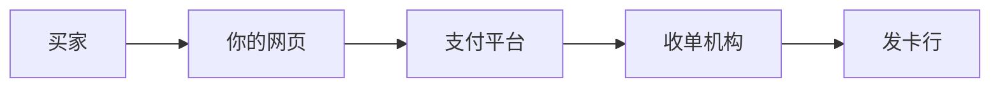
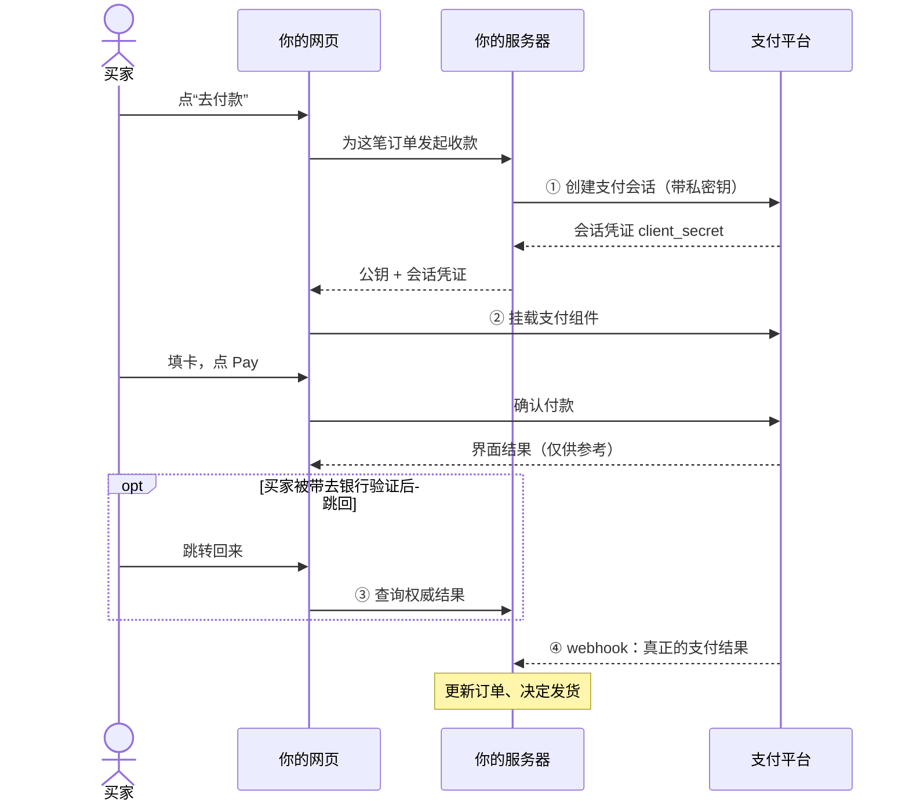
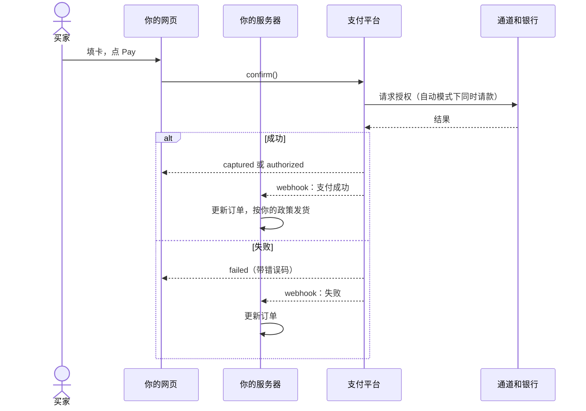
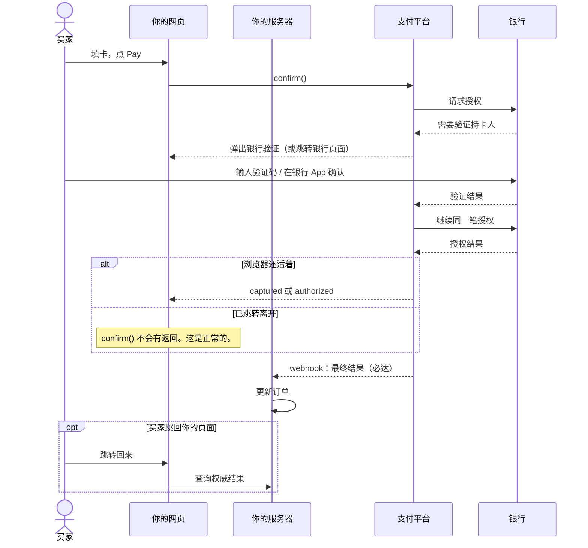

# Payment Element 商户接入指南

状态：拟定设计的配套接入指南。接口尚未实施，细节以契约为准。

## 写给谁看

- 你是商户的开发工程师。你要在自家网站上收款。
- 本文**假设你没有支付对接经验**。所有支付概念在第一次使用前都有解释。
- 你需要的预备知识只有：TypeScript、HTTP、基本的前后端分工。
- 平台内部的设计决策不在本文。见 [Payment Element 认证与接入内部设计说明](payment-element-auth-integration-design.md)。接入时不需要读它。

## 1. 背景：一次在线支付都发生了什么

### 1.1 五个参与方

一次卡支付涉及五方。你只需要记住自己的位置。

| 参与方 | 做什么 | 对你的意义 |
| --- | --- | --- |
| 买家 | 付钱的人 | 在你的网页里填卡或用钱包 |
| 商户（你） | 卖东西收钱 | 接入本 SDK |
| 支付平台 | 处理支付流程 | 本文所说的“平台” |
| 收单机构（通道） | 平台对接的支付渠道 | 平台替你对接，你不直接接触 |
| 发卡行 | 买家的银行 | 它决定这笔钱批不批 |

卡组织（Visa、Mastercard 等）连接收单和发卡。你不直接接触它。



### 1.2 三个动作：授权、请款、结算

用酒店押金类比。记住这三个词，后文一直用。

- **支付授权 (authorization)**：银行批准并冻结这笔钱。就像入住时酒店刷押金。钱还在买家账户里，但不能再花。
- **请款 (capture)**：真正把钱划走。就像退房结账。
- **结算 (settlement)**：钱经过清算，最终进入你的可提现余额。它晚于请款。

创建支付会话时你选一种请款模式：

- `automatic`（自动请款）：授权和请款一步完成。大多数电商用这个。
- `manual`（手动请款）：先授权，发货前再请款。适合预售、酒店、租车这类延迟交付。

### 1.3 为什么要用支付组件，而不是自己做表单

不要自己收集卡号。直接收卡号会让你承担卡组织的合规义务（PCI DSS），风险极高。

所以支付组件的输入框运行在**平台的域名**里（跨域 iframe）。你的网页碰不到卡号。你只拿到“这张卡能不能付”的结果。这是刻意设计，不是技术限制。

### 1.4 什么是 3DS（银行验证）

银行有时要求买家证明“是本人”。例如短信验证码，或在银行 App 里点确认。这一步叫 **3-D Secure（3DS）**。

它可能出现在付款过程中。买家验证完成后，付款继续。对你的代码来说，有验证和没验证是**同一个函数调用**。你不需要为此写分支代码。

### 1.5 为什么“付没付成”要以后端为准

网页可能被买家关掉。网络可能断。银行页面跳转后可能不回来。所以：

- 浏览器显示的结果只是**界面状态**。它可以参考，不能作为发货依据。
- 真正的支付结果由两条可靠途径到达：平台主动发给你的 **webhook**（第 4 步），和你的后端**主动查询**（第 3 步的一部分）。
- 两条路都会到。它们先后不定。你的处理函数必须能承接两条路。

## 2. 你要做的四件事（总览）

| 步骤 | 在哪里做 | 做什么 | 详见 |
| --- | --- | --- | --- |
| 1 | 你的服务端 | 创建支付会话，拿到会话凭证 | §3 |
| 2 | 你的网页 | 挂载支付组件，让买家付款 | §4 |
| 3 | 你的网页 + 服务端 | 处理跳转回来的买家，查权威结果 | §5 |
| 4 | 你的服务端 | 接收 webhook，更新订单 | §6 |

全景流程是这样：



下面按步骤讲。每步都有可直接参考的代码。

## 3. 第 1 步：服务端创建支付会话

### 3.1 为什么金额必须由服务端说了算

网页里的价格可以被买家篡改（改浏览器里的数字很容易）。所以付款金额不能由网页提交。正确做法：在服务端创建**支付会话**，把金额、币种、订单号冻结进这个会话。之后网页只能用这个会话付款，改不了金额。

### 3.2 你的“私密钥”

- 在平台后台创建得到。它以 `sk_` 开头（测试环境 `sk_test_...`，正式环境 `sk_live_...`）。
- 它代表你的商户身份。**谁拿到它，谁就能以你的名义收退款。**
- 只放在服务端的环境变量里。不要进前端代码。不要提交进 Git。不要出现在聊天记录里。
- 测试和正式是两套密钥、两套数据。测试环境的数据不会跑到正式环境。

### 3.3 代码

用服务端 SDK（`@walletpay/node`）。不用 SDK、直接调 REST 也可以，两者等价。

```ts
// server/checkout.ts
import { WalletPay } from "@walletpay/node";

// sk_test_... / sk_live_...；绝不出现在前端代码或响应里
const walletpay = new WalletPay(process.env.WALLETPAY_SECRET_KEY!);

app.post("/api/checkout", async (req, res) => {
  const order = await loadOrder(req); // 你自己的权威订单与总价

  const session = await walletpay.checkoutSessions.create(
    {
      merchant_order_reference: order.reference,
      order_version: order.version,
      amount: { value: order.totalMinor, currency: order.currency },
      capture_mode: "automatic", // 或 "manual"
      return_url: "https://shop.example/payments/return",
      locale: "zh-CN",
      expires_in_seconds: 1800,
    },
    // 幂等键：防止“点了两次/网络重试”创建两个会话
    { idempotencyKey: `checkout_${order.reference}_v${order.version}` },
  );

  // 只把 client_secret 发给该买家的浏览器页面
  res.json({
    clientSecret: session.client_secret,
    publicKey: "pk_test_merchant",
  });
});
```

等价的 REST 请求（不用 SDK 时）：

```http
POST /v1/checkout-sessions
Authorization: Bearer sk_test_...
Idempotency-Key: checkout_ORDER-100123_v1
Content-Type: application/json
```

```json
{
  "merchant_order_reference": "ORDER-100123",
  "order_version": 1,
  "amount": { "value": 1099, "currency": "USD" },
  "capture_mode": "automatic",
  "return_url": "https://shop.example/payments/return",
  "locale": "zh-CN",
  "expires_in_seconds": 1800
}
```

三个要点：

1. 金额用**货币最小单位**。`1099` + `USD` 表示 10.99 美元。日元没有小数位，`100` + `JPY` 就是 100 日元。
2. **幂等键**用“订单号 + 订单版本”组成，保持稳定。同一个请求重试一百次，也只创建一个会话。
3. **购物车变了就创建新会话**（`order_version` 加一），不要修改旧会话的金额。买家已经在付的旧会话会被平台停用。

## 4. 第 2 步：浏览器挂载支付组件

### 4.1 页面会拿到两个值

第 1 步的接口返回两个字符串。它们用途不同：

| 值 | 样子 | 能公开吗 | 作用 |
| --- | --- | --- | --- |
| 公钥 | `pk_test_merchant` | 能。前端代码可以写死 | 告诉组件你是哪家商户、用哪个环境 |
| 会话能力凭证 | `cs_01J..._secret_...` | **不能公开**。只能发给正在付款的那个买家 | “一次性门票”，只对这一笔订单有效 |

为什么这样分：公钥泄露没有风险（它不授权任何付款操作）。会话能力凭证泄露的风险也有限（只能用于这一笔会话、几分钟后过期），但仍要按敏感值对待：不要放进 URL、日志、埋点和截图。

### 4.2 代码（vanilla TypeScript）

```ts
// checkout-page.ts
import { loadWalletPay } from "@walletpay/checkout-js";

// publicKey 与 clientSecret 来自第 1 步的后端接口
const walletPay = await loadWalletPay({ publicKey });
const checkout = await walletPay.createCheckout({ clientSecret });

const paymentElement = checkout.createPaymentElement({ layout: "accordion" });
paymentElement.mount("#payment-element");

paymentElement.on("ready", () => setFormEnabled(true));
paymentElement.on("change", ({ complete, paymentMethod }) => {
  setPayEnabled(complete); // 填完整了才亮起 Pay 按钮
  recordSelectedMethod(paymentMethod);
});
paymentElement.on("loaderror", ({ code, requestId }) => {
  showIntegrationError(code, requestId);
});

// 银行验证/跳转期间锁住界面（见第 1.4 节）
checkout.on("actionstart", ({ type }) => disableCheckoutNavigation(type));
checkout.on("actionend", ({ type, outcome }) => {
  restoreCheckoutNavigation(type, outcome);
});

form.addEventListener("submit", async (event) => {
  event.preventDefault();

  // 注意：整页跳转会销毁 JS 上下文，这个 Promise 可能永不 resolve
  const result = await checkout.confirm({
    returnUrl: "https://shop.example/payments/return",
  });

  switch (result.status) {
    case "authorized":
      showAuthorizedState(result.capture); // 已授权；capture: manual / pending / failed
      break;
    case "captured":
      showPaymentReceived(); // 已扣款
      break;
    case "processing":
      showProcessingState(); // 处理中。以 webhook 为准
      break;
    case "failed":
      showPaymentError(result.error); // 失败。提示买家重试或换支付方式
      break;
  }
});

// 页面离开时清理
// paymentElement.destroy();
```

### 4.3 代码（React）

```tsx
// CheckoutPage.tsx
import {
  WalletPayProvider,
  CheckoutProvider,
  PaymentElement,
  useCheckout,
} from "@walletpay/react";

function PayButton() {
  const { confirm } = useCheckout();
  return (
    <button
      type="submit"
      onClick={() => confirm({ returnUrl: "https://shop.example/payments/return" })}
    >
      Pay
    </button>
  );
}

export function CheckoutPage({ publicKey, clientSecret }: Props) {
  return (
    <WalletPayProvider publicKey={publicKey}>
      <CheckoutProvider clientSecret={clientSecret}>
        <PaymentElement
          options={{ layout: "accordion" }}
          onReady={() => setFormEnabled(true)}
          onChange={({ complete }) => setPayEnabled(complete)}
          onLoadError={({ code, requestId }) => showIntegrationError(code, requestId)}
        />
        <PayButton />
      </CheckoutProvider>
    </WalletPayProvider>
  );
}
```

Pay 按钮由**你**拥有。这样你可以协调“同意条款”、表单校验等周边逻辑。组件内部的支付方式专属按钮（如钱包按钮）由 SDK 管理。

## 5. 第 3 步：处理跳转回来的买家

### 5.1 场景

3DS 验证或某些支付方式会把买家带去银行页面，完成后跳回你配置的 `return_url`。

### 5.2 URL 上没有“成功”参数

跳回的 URL 只有一个**不透明引用**：

```text
https://shop.example/payments/return?checkout_session=cs_01J...
```

没有 `success=true`。这是刻意的：URL 可以被伪造、被收藏、被转发。任何页面上的“成功”字样都不算数。要拿真实结果，必须问你的后端。

### 5.3 代码

浏览器侧只取引用，然后问自己的后端：

```ts
// /payments/return（浏览器）
const ref = new URLSearchParams(location.search).get("checkout_session");
const res = await fetch(`/api/checkout/result?session=${encodeURIComponent(ref)}`, {
  credentials: "include", // 带买家会话，供后端确认“你是谁”
});
renderResult(await res.json());
```

后端用私密钥查平台，并确认这个买家只能看到自己的订单：

```ts
// server/result.ts
app.get("/api/checkout/result", async (req, res) => {
  const buyer = await authenticateBuyer(req); // 你自己的买家/游客鉴权
  const session = await walletpay.checkoutSessions.retrieve(req.query.session);

  // 订单从会话的固定绑定推导。浏览器提交的订单号不算数。
  const order = await loadOrder(session.merchant_order_reference, session.order_version);
  if (!order || order.buyerId !== buyer.id) {
    return res.status(404).end(); // 不泄露任何跨订单数据
  }

  const payment = session.payment_id
    ? await walletpay.payments.retrieve(session.payment_id)
    : null;
  res.json({
    status: payment?.status ?? session.payment_status,
    capture: payment?.capture,
  });
});
```

## 6. 第 4 步：接收 webhook 通知

### 6.1 为什么必须做

买家可能付完钱直接关页面。也可能整个过程都在银行 App 里完成，浏览器根本没回来。webhook 是平台**主动 POST 到你的服务器**的支付结果。它是唯一必达的路径。

平台后台会给你一个**签名密钥**（webhook secret）。它和私密钥不同，专门用来验证“这条消息真的来自平台”。

### 6.2 代码

硬性顺序：**验签 → 落库 → 应答 → 幂等处理**。

```ts
// server/webhook.ts —— 必须用原始 body 验签，不能先 JSON 解析
import crypto from "node:crypto";

app.post(
  "/api/walletpay-webhook",
  express.raw({ type: "application/json" }),
  async (req, res) => {
    const eventId = req.get("WalletPay-Event-Id");
    const timestamp = req.get("WalletPay-Timestamp");
    const signature = req.get("WalletPay-Signature") ?? "";
    const rawBody = req.body;

    // 1) 新鲜度：拒绝过期时间戳，防重放
    if (Math.abs(Date.now() / 1000 - Number(timestamp)) > 300) {
      return res.status(400).end();
    }

    // 2) 验签：HMAC-SHA256(签名密钥, `${timestamp}.${rawBody}`)
    const expected =
      "v1=" +
      crypto
        .createHmac("sha256", process.env.WALLETPAY_WEBHOOK_SECRET!)
        .update(`${timestamp}.`)
        .update(rawBody)
        .digest("hex");
    const valid = crypto.timingSafeEqual(
      Buffer.from(signature),
      Buffer.from(expected),
    );
    if (!valid) return res.status(400).end();

    // 3) 先落库，再应答；按 event_id 去重
    const event = JSON.parse(rawBody.toString());
    const isNew = await db.insertEventIfNew(eventId, event);
    res.status(200).end();

    // 4) 业务效果幂等应用。与第 5 步的查询共用同一个函数。
    if (isNew) await applyOrderEffectsOnce(event);
  },
);
```

### 6.3 三条纪律

1. **先落库，再应答。** 先存事件再返回 200。否则平台重发会造成重复处理。
2. **同 `event_id` 只处理一次。** 平台的投递语义是“至少一次”，且**不保证顺序**。重复和乱序都是正常情况。
3. **处理函数必须幂等。** `applyOrderEffectsOnce` 要能被 webhook 和第 5 步的查询调用两次而不产生两次发货、两次扣款。

## 7. 两种付款流程长什么样

### 7.1 直接付款（没有银行验证）

最常见的流程。买家填卡，点 Pay，结束。



### 7.2 银行验证 + 付款（3DS）

多一步“银行确认是本人”。你的代码**不变**，仍是同一个 `confirm()`。



### 7.3 结果怎么读

| 你收到的状态 | 含义 | 你该做什么 |
| --- | --- | --- |
| `captured` | 已授权且已扣款 | 按你的政策发货 |
| `authorized` + `capture: "manual"` | 已授权、未扣款 | 发货前用管理 API 请款 |
| `authorized` + `capture: "pending"` | 已扣款但平台还在重试 | 等 webhook 更新 |
| `authorized` + `capture: "failed"` | 授权成功但扣款失败 | 订单标异常，人工处理 |
| `processing` | 还没有定论 | 显示“处理中”，等 webhook。不要报失败 |
| `failed` | 明确失败 | 按错误码提示买家重试或换支付方式 |

两条提醒：

- **“验证通过”不等于“付款成功”。** 银行验证只证明是持卡人本人。之后授权仍可能被拒（余额不足等）。
- **“已授权”是否足够发货，是你自己的业务决策。** 平台不替你决定。多数商户以“已扣款”为发货依据。

## 8. 不要做的事

- 不要把私密钥放进前端代码、移动端安装包或 Git 仓库。
- 不要把 `client_secret` 放进 URL、日志、埋点或客服截图。
- 不要从按钮点击或浏览器回调推断支付成功。以后端结果为准。
- 不要修改已创建会话的金额。创建新会话。
- 不要在 webhook 里先应答后处理。
- 不要假设 webhook 不重复、不乱序。
- 不要自己收集卡号或 CVV。组件之外没有卡号。
- 不要依赖 `confirm()` 的 Promise 一定返回。跳转会销毁页面。

## 9. 术语表

| 术语 | 含义 |
| --- | --- |
| 私密钥 | `sk_` 开头的服务端密钥。代表商户身份 |
| 公钥 | `pk_` 开头的公开标识。不授权任何操作 |
| 会话能力凭证 | `client_secret`。一笔订单的“一次性门票” |
| 支付授权 | 银行批准并冻结金额 |
| 请款 | 真正划走金额 |
| 结算 | 资金进入你的可提现余额 |
| 3DS | 银行对持卡人的身份验证 |
| webhook | 平台主动发到你服务器的支付结果通知 |
| 幂等 | 同一操作执行多次，效果与执行一次相同 |

金额与账务的完整术语见 [CONTEXT.md](../CONTEXT.md)。

## 10. 相关文档

- [Payment Element 认证与接入内部设计说明](payment-element-auth-integration-design.md)（平台视角的设计决策）
- [Payment Element SDK design](payment-element-design.md)（英文契约原文）
- [Payment Element 3DS design](payment-element-3ds-design.md)（3DS 扩展原文）
