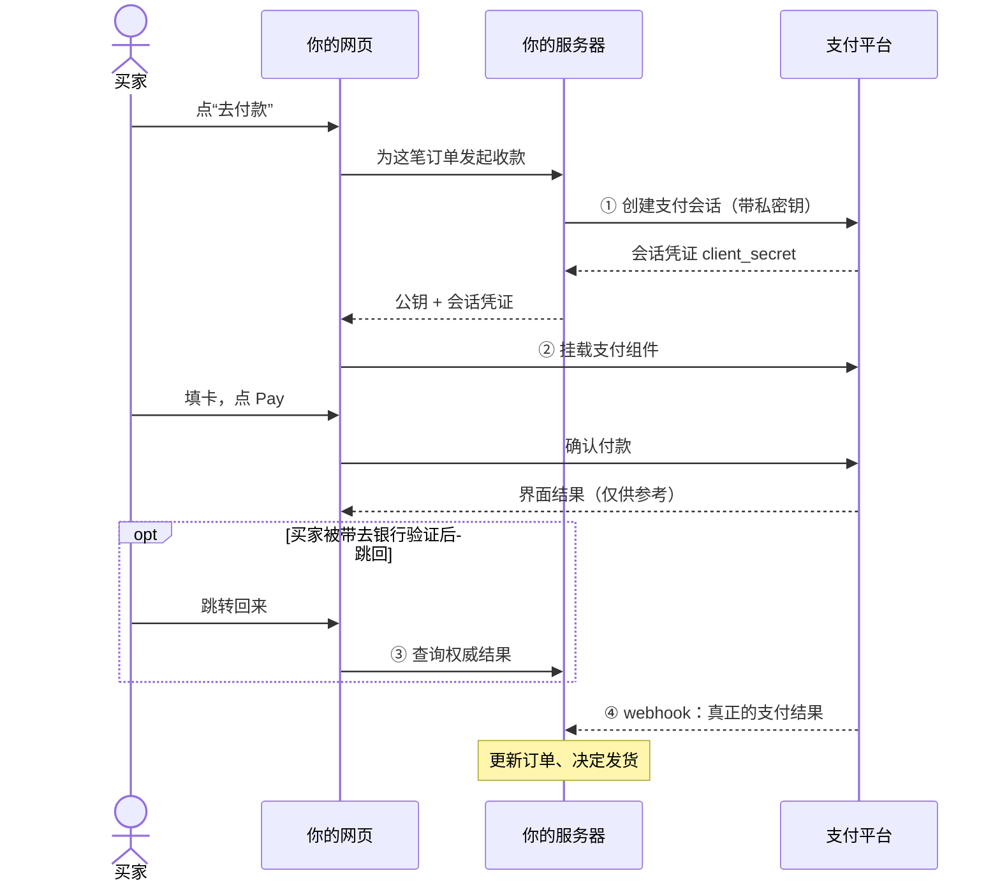
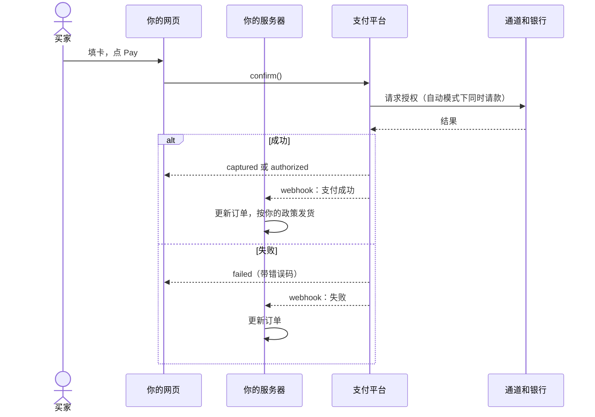
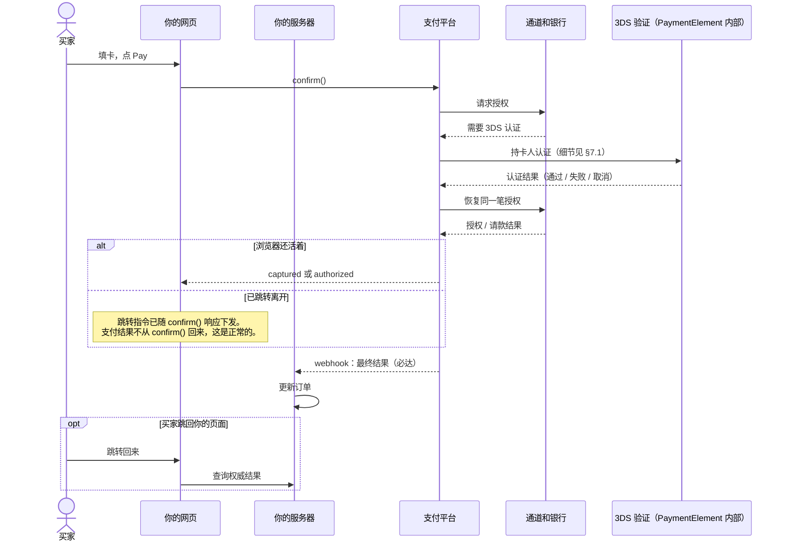
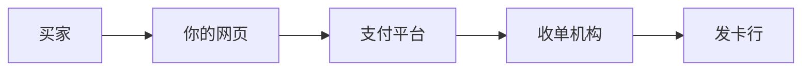
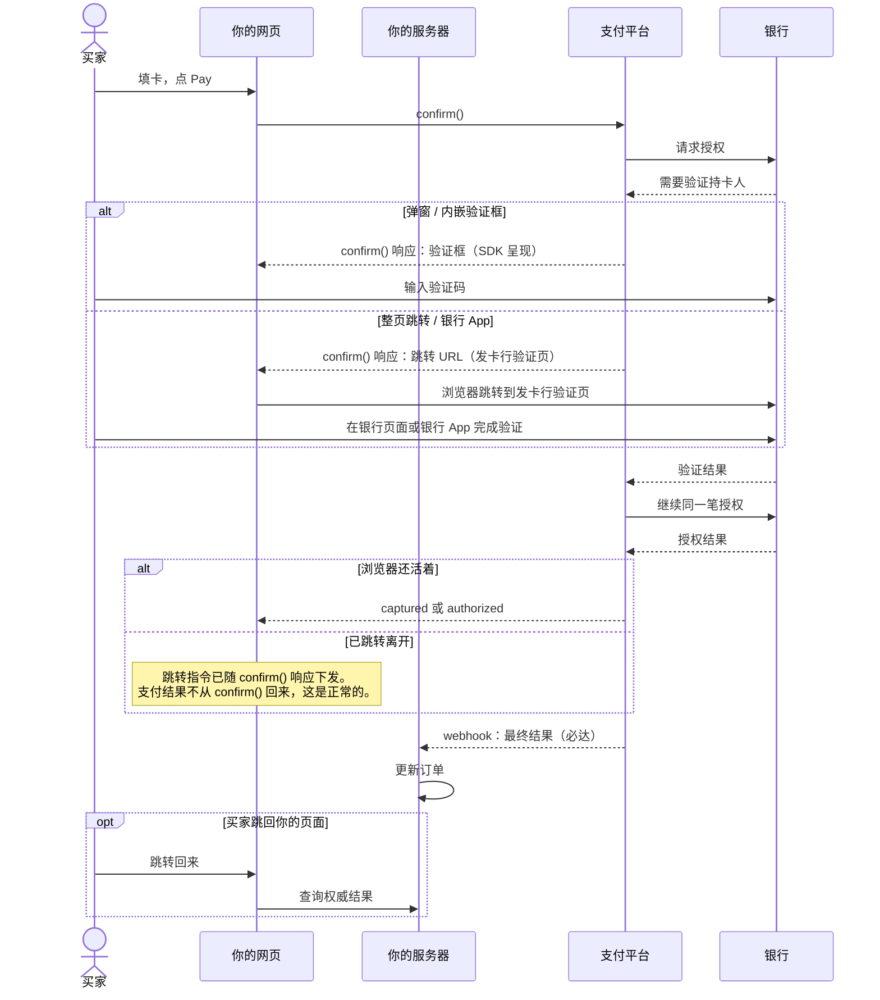

# Payment Element 商户接入指南

状态：拟定设计的配套接入指南。接口尚未实施，细节以契约为准。

## 写给谁看

- 你是商户的开发工程师。你要在自家网站上收款。
- 本文**假设你没有支付对接经验**。所有支付概念在第一次使用前都有解释。
- 你需要的预备知识只有：TypeScript、HTTP、基本的前后端分工。
- **本文自成一体。** 读完本文就能完成接入，不需要阅读其他文档。文末的延伸阅读是可选的。

## 1. 整体时序（先看全貌）

先看完整的付款流程。图里的名词在 §2 解释，具体做法在 §3–§6。看图先看走向，不必逐词都懂。

### 1.1 全景：你要做的四件事

| 步骤 | 在哪里做 | 做什么 | 详见 |
| --- | --- | --- | --- |
| 1 | 你的服务端 | 创建支付会话，拿到会话凭证 | §3 |
| 2 | 你的网页 | 挂载支付组件，让买家付款 | §4 |
| 3 | 你的网页 + 服务端 | 处理跳转回来的买家，查权威结果 | §5 |
| 4 | 你的服务端 | 接收 webhook，更新订单 | §6 |

全景流程是这样：



下面按步骤讲。每步都有可直接参考的代码。

### 1.2 直接付款（没有银行验证）

最常见的流程。买家填卡，点 Pay，结束。



### 1.3 银行验证 + 付款（3DS）

多一步“银行确认是本人”。你的代码**不变**，仍是同一个 `confirm()`。总览图里 3DS **折叠为一步**；它由 PaymentElement 内部实现（你不需要写任何 3DS 代码），流程细节见 §7.1。



## 2. 背景：一次在线支付都发生了什么

### 2.1 五个参与方

一次卡支付涉及五方。你只需要记住自己的位置。

| 参与方 | 做什么 | 对你的意义 |
| --- | --- | --- |
| 买家 | 付钱的人 | 在你的网页里填卡或用钱包 |
| 商户（你） | 卖东西收钱 | 接入本 SDK |
| 支付平台 | 处理支付流程 | 本文所说的“平台” |
| 收单机构（通道） | 平台对接的支付渠道 | 平台替你对接，你不直接接触 |
| 发卡行 | 买家的银行 | 它决定这笔钱批不批 |

卡组织（Visa、Mastercard 等）连接收单和发卡。你不直接接触它。



### 2.2 三个动作：授权、请款、结算

用酒店押金类比。记住这三个词，后文一直用。

- **支付授权 (authorization)**：银行批准并冻结这笔钱。就像入住时酒店刷押金。钱还在买家账户里，但不能再花。
- **请款 (capture)**：真正把钱划走。就像退房结账。
- **结算 (settlement)**：钱经过清算，最终进入你的可提现余额。它晚于请款。

创建支付会话时你选一种请款模式：

- `automatic`（自动请款）：授权和请款一步完成。大多数电商用这个。
- `manual`（手动请款）：先授权，发货前再请款。适合预售、酒店、租车这类延迟交付。

### 2.3 为什么要用支付组件，而不是自己做表单

不要自己收集卡号。直接收卡号会让你承担卡组织的合规义务（PCI DSS），风险极高。

所以支付组件的输入框运行在**平台的域名**里（跨域 iframe）。你的网页碰不到卡号。你只拿到“这张卡能不能付”的结果。这是刻意设计，不是技术限制。iframe 的实现完全由平台负责（JS 实现细节见内部设计说明 §3.4），你不写 iframe 代码。

### 2.4 什么是 3DS（银行验证）

银行有时要求买家证明“是本人”。例如短信验证码，或在银行 App 里点确认。这一步叫 **3-D Secure（3DS）**。

它可能出现在付款过程中。买家验证完成后，付款继续。对你的代码来说，有验证和没验证是**同一个函数调用**。你不需要为此写分支代码。

### 2.5 为什么“付没付成”要以后端为准

网页可能被买家关掉。网络可能断。银行页面跳转后可能不回来。所以：

- 浏览器显示的结果只是**界面状态**。它可以参考，不能作为发货依据。
- 真正的支付结果由两条可靠途径到达：平台主动发给你的 **webhook**（第 4 步），和你的后端**主动查询**（第 3 步的一部分）。
- 两条路都会到。它们先后不定。你的处理函数必须能承接两条路。

## 3. 第 1 步：服务端创建支付会话

### 3.1 为什么金额必须由服务端说了算

网页里的价格可以被买家篡改（改浏览器里的数字很容易）。所以付款金额不能由网页提交。正确做法：在服务端创建**支付会话**，把金额、币种、订单号冻结进这个会话。之后网页只能用这个会话付款，改不了金额。

### 3.2 你的“私密钥”

- 在平台后台创建得到。它以 `sk_` 开头（测试环境 `sk_test_...`，正式环境 `sk_live_...`）。
- 它代表你的商户身份。**谁拿到它，谁就能以你的名义收退款。**
- 只放在服务端的环境变量里。不要进前端代码。不要提交进 Git。不要出现在聊天记录里。
- 测试和正式是两套密钥、两套数据。测试环境的数据不会跑到正式环境。

### 3.3 代码

用服务端 SDK（`@walletpay/node`）。不用 SDK、直接调 REST 也可以，两者等价。

```ts
// server/checkout.ts
import { WalletPay } from "@walletpay/node";

// sk_test_... / sk_live_...；绝不出现在前端代码或响应里
const walletpay = new WalletPay(process.env.WALLETPAY_SECRET_KEY!);

app.post("/api/checkout", async (req, res) => {
  const order = await loadOrder(req); // 你自己的权威订单与总价

  const session = await walletpay.checkoutSessions.create(
    {
      merchant_order_reference: order.reference,
      order_version: order.version,
      amount: { value: order.totalMinor, currency: order.currency },
      capture_mode: "automatic", // 或 "manual"
      return_url: "https://shop.example/payments/return",
      locale: "zh-CN",
      expires_in_seconds: 1800,
    },
    // 幂等键：防止“点了两次/网络重试”创建两个会话
    { idempotencyKey: `checkout_${order.reference}_v${order.version}` },
  );

  // 只把 client_secret 发给该买家的浏览器页面
  res.json({
    clientSecret: session.client_secret,
    publicKey: "pk_test_merchant",
  });
});
```

等价的 REST 请求（不用 SDK 时）：

```http
POST /v1/checkout-sessions
Authorization: Bearer sk_test_...
Idempotency-Key: checkout_ORDER-100123_v1
Content-Type: application/json
```

```json
{
  "merchant_order_reference": "ORDER-100123",
  "order_version": 1,
  "amount": { "value": 1099, "currency": "USD" },
  "capture_mode": "automatic",
  "return_url": "https://shop.example/payments/return",
  "locale": "zh-CN",
  "expires_in_seconds": 1800
}
```

三个要点：

1. 金额用**货币最小单位**。`1099` + `USD` 表示 10.99 美元。日元没有小数位，`100` + `JPY` 就是 100 日元。
2. **幂等键**用“订单号 + 订单版本”组成，保持稳定。同一个请求重试一百次，也只创建一个会话。
3. **购物车变了就创建新会话**（`order_version` 加一），不要修改旧会话的金额。买家已经在付的旧会话会被平台停用。

### 3.4 请求参数说明

| 参数 | 必填 | 说明 |
| --- | --- | --- |
| `merchant_order_reference` | 是 | 你的订单号。平台用它对账 |
| `order_version` | 是 | 订单版本。购物车变一次加一 |
| `amount.value` | 是 | 金额，货币最小单位 |
| `amount.currency` | 是 | 币种，三位代码（USD、HKD、JPY） |
| `capture_mode` | 是 | `automatic` 或 `manual`（见 §2.2） |
| `return_url` | 是 | 买家跳转回来的地址。必须是平台登记过的域名 |
| `locale` | 否 | 组件界面语言，如 `zh-CN` |
| `expires_in_seconds` | 否 | 会话有效期，建议 15–30 分钟 |

### 3.5 返回值与会话状态

创建成功返回：

```json
{
  "id": "cs_01J...",
  "client_secret": "cs_01J..._secret_...",
  "expires_at": "2026-09-24T12:30:00Z",
  "session_status": "open",
  "payment_status": "unpaid"
}
```

两个状态字段分开看：

- `session_status`：会话的生命周期。`open`（可付款）→ `processing`（付款进行中）→ `completed` 或 `expired`。
- `payment_status`：钱的状态。`unpaid`（未付）或 `paid`（已付）。

**普通查询接口永远不会再返回 `client_secret`。** 只有创建接口返回它。所以拿到后要立刻交给浏览器，不要指望再查一次。

### 3.6 你还会用到的接口

| 接口 | 用途 |
| --- | --- |
| `GET /v1/checkout-sessions/{id}` | 查会话状态和关联的支付（§5 用它） |
| `GET /v1/payments/{id}` | 查权威的授权 / 请款状态 |
| `POST /v1/checkout-sessions/{id}/expire` | 主动作废会话（例如订单取消） |

手工请款、取消、退款是另外的管理接口。它们同样用私密钥调用。退款的累计金额不能超过原请款金额。

## 4. 第 2 步：浏览器挂载支付组件

### 4.1 页面会拿到两个值

第 1 步的接口返回两个字符串。它们用途不同：

| 值 | 样子 | 能公开吗 | 作用 |
| --- | --- | --- | --- |
| 公钥 | `pk_test_merchant` | 能。前端代码可以写死 | 告诉组件你是哪家商户、用哪个环境 |
| 会话能力凭证 | `cs_01J..._secret_...` | **不能公开**。只能发给正在付款的那个买家 | “一次性门票”，只对这一笔订单有效 |

为什么这样分：公钥泄露没有风险（它不授权任何付款操作）。会话能力凭证泄露的风险也有限（只能用于这一笔会话、几分钟后过期），但仍要按敏感值对待：不要放进 URL、日志、埋点和截图。

### 4.2 代码（vanilla JS / TypeScript）

JS 与 React 共用同一核心 SDK，行为完全一致，任选一种。纯 JavaScript 项目去掉类型标注即可。

```ts
// checkout-page.ts
import { loadWalletPay } from "@walletpay/checkout-js";

// publicKey 与 clientSecret 来自第 1 步的后端接口
const walletPay = await loadWalletPay({ publicKey });
const checkout = await walletPay.createCheckout({ clientSecret });

const paymentElement = checkout.createPaymentElement({ layout: "accordion" });
paymentElement.mount("#payment-element");

paymentElement.on("ready", () => setFormEnabled(true));
paymentElement.on("change", ({ complete, paymentMethod }) => {
  setPayEnabled(complete); // 填完整了才亮起 Pay 按钮
  recordSelectedMethod(paymentMethod);
});
paymentElement.on("loaderror", ({ code, requestId }) => {
  showIntegrationError(code, requestId);
});

// 银行验证/跳转期间锁住界面（见 §2.4）
checkout.on("actionstart", ({ type }) => disableCheckoutNavigation(type));
checkout.on("actionend", ({ type, outcome }) => {
  restoreCheckoutNavigation(type, outcome);
});

form.addEventListener("submit", async (event) => {
  event.preventDefault();

  // 注意：3DS 跳转场景下 confirm() 响应会带跳转 URL，SDK 自动跳转；
  // 跳转会销毁 JS 上下文，支付结果不会从这个 Promise 回来
  const result = await checkout.confirm({
    returnUrl: "https://shop.example/payments/return",
  });

  switch (result.status) {
    case "authorized":
      showAuthorizedState(result.capture); // 已授权；capture: manual / pending / failed
      break;
    case "captured":
      showPaymentReceived(); // 已扣款
      break;
    case "processing":
      showProcessingState(); // 处理中。以 webhook 为准
      break;
    case "failed":
      showPaymentError(result.error); // 失败。提示买家重试或换支付方式
      break;
  }
});

// 页面离开时清理
// paymentElement.destroy();
```

### 4.3 代码（React，与 4.2 等价）

```tsx
// CheckoutPage.tsx —— 与 4.2 覆盖相同的事件与结果处理
import { useEffect, useState } from "react";
import {
  WalletPayProvider,
  CheckoutProvider,
  PaymentElement,
  useCheckout,
} from "@walletpay/react";

function CheckoutForm() {
  const { confirm, on } = useCheckout();
  const [payEnabled, setPayEnabled] = useState(false);

  // 银行验证 / 跳转期间锁住界面（与 4.2 相同）
  useEffect(() => {
    const off1 = on("actionstart", ({ type }) => disableCheckoutNavigation(type));
    const off2 = on("actionend", ({ type, outcome }) =>
      restoreCheckoutNavigation(type, outcome),
    );
    return () => {
      off1();
      off2();
    };
  }, [on]);

  return (
    <>
      <PaymentElement
        options={{ layout: "accordion" }}
        onReady={() => setFormEnabled(true)}
        onChange={({ complete }) => setPayEnabled(complete)}
        onLoadError={({ code, requestId }) => showIntegrationError(code, requestId)}
      />
      <button
        type="submit"
        disabled={!payEnabled}
        onClick={async () => {
          // 3DS 跳转场景下响应会带跳转 URL，SDK 自动跳转
          const result = await confirm({
            returnUrl: "https://shop.example/payments/return",
          });
          switch (result.status) {
            case "authorized":
              showAuthorizedState(result.capture);
              break;
            case "captured":
              showPaymentReceived();
              break;
            case "processing":
              showProcessingState();
              break;
            case "failed":
              showPaymentError(result.error);
              break;
          }
        }}
      >
        Pay
      </button>
    </>
  );
}

export function CheckoutPage({ publicKey, clientSecret }: Props) {
  return (
    <WalletPayProvider publicKey={publicKey}>
      <CheckoutProvider clientSecret={clientSecret}>
        <CheckoutForm />
      </CheckoutProvider>
    </WalletPayProvider>
  );
}
```

Pay 按钮由**你**拥有。这样你可以协调“同意条款”、表单校验等周边逻辑。组件内部的支付方式专属按钮（如钱包按钮）由 SDK 管理。React 绑定自动在卸载时销毁 frame 与监听（等价 `destroy()`）；Strict Mode 重放不会重复建会话或 attempt。两种写法行为一致。

### 4.4 组件事件一览

| 事件 | 什么时候触发 | 你该做什么 |
| --- | --- | --- |
| `ready` | 组件可以接受输入 | 启用表单 |
| `change` | 填写完整性、校验、所选支付方式变化 | 联动 Pay 按钮（见 4.2 代码） |
| `focus` / `blur` | 焦点进入 / 离开输入框 | 可选。做界面联动 |
| `loaderror` | 组件初始化或加载失败 | 显示集成错误（带 `code` 和 `requestId`） |
| `actionstart` | 银行验证 / 跳转开始 | 锁住导航和重复提交 |
| `actionend` | 银行验证 / 跳转结束 | 恢复界面 |

注意两点：

1. **没有 `paymentSucceeded` 事件。** 这是刻意的。浏览器事件只是界面信号。
2. `actionend` 可能永远不来（买家在银行页面直接关了浏览器）。界面恢复尽力而为，正确性靠 §5 和 §6。

### 4.5 confirm() 的返回值

```ts
type ConfirmResult =
  | { status: "authorized"; paymentId: string; capture: "manual" | "pending" | "failed" }
  | { status: "captured"; paymentId: string }
  | { status: "processing"; paymentId?: string; reason: "pending_method" | "unknown_outcome" }
  | { status: "failed"; paymentId?: string; error: PaymentError };
```

### 4.6 错误码对照

| 错误码 | 什么意思 | 你该做什么 |
| --- | --- | --- |
| `invalid_configuration` | 集成配置有错 | 核对公钥、环境、`return_url` 配置 |
| `session_expired` | 会话过期 | 回到第 1 步创建新会话 |
| `validation_failed` | 买家填写不完整或不合法 | 让买家修正输入 |
| `authentication_failed` | 银行验证失败 | 提示买家重试或换卡 |
| `payment_declined` | 银行拒绝付款 | 提示买家换支付方式。这不是你的代码问题 |
| `capture_failed` | 授权成功但扣款失败 | 订单标异常，走人工处理 |
| `action_canceled` | 买家主动取消验证 | 引导买家重新付款 |
| `popup_blocked` | 浏览器拦截了弹窗 | 提示买家允许弹窗后重试 |
| `network_error` | 网络问题 | 允许重试 |
| `unknown_outcome` | 结果未知 | 显示“处理中”，等 webhook。**不要报失败** |

## 5. 第 3 步：处理跳转回来的买家

### 5.1 场景

3DS 验证或某些支付方式会把买家带去银行页面，完成后跳回你配置的 `return_url`。

### 5.2 URL 上没有“成功”参数

跳回的 URL 只有一个**不透明引用**：

```text
https://shop.example/payments/return?checkout_session=cs_01J...
```

没有 `success=true`。这是刻意的：URL 可以被伪造、被收藏、被转发。任何页面上的“成功”字样都不算数。要拿真实结果，必须问你的后端。

### 5.3 代码

浏览器侧只取引用，然后问自己的后端：

```ts
// /payments/return（浏览器）
const ref = new URLSearchParams(location.search).get("checkout_session");
const res = await fetch(`/api/checkout/result?session=${encodeURIComponent(ref)}`, {
  credentials: "include", // 带买家会话，供后端确认“你是谁”
});
renderResult(await res.json());
```

后端用私密钥查平台，并确认这个买家只能看到自己的订单：

```ts
// server/result.ts
app.get("/api/checkout/result", async (req, res) => {
  const buyer = await authenticateBuyer(req); // 你自己的买家/游客鉴权
  const session = await walletpay.checkoutSessions.retrieve(req.query.session);

  // 订单从会话的固定绑定推导。浏览器提交的订单号不算数。
  const order = await loadOrder(session.merchant_order_reference, session.order_version);
  if (!order || order.buyerId !== buyer.id) {
    return res.status(404).end(); // 不泄露任何跨订单数据
  }

  const payment = session.payment_id
    ? await walletpay.payments.retrieve(session.payment_id)
    : null;
  res.json({
    status: payment?.status ?? session.payment_status,
    capture: payment?.capture,
  });
});
```

结果的展示与 webhook 用**同一个**订单更新函数。谁先到就先执行，效果只生效一次。

## 6. 第 4 步：接收 webhook 通知

### 6.1 为什么必须做

买家可能付完钱直接关页面。也可能整个过程都在银行 App 里完成，浏览器根本没回来。webhook 是平台**主动 POST 到你的服务器**的支付结果。它是唯一必达的路径。

平台后台会给你一个**签名密钥**（webhook secret）。它和私密钥不同，专门用来验证“这条消息真的来自平台”。

### 6.2 代码

硬性顺序：**验签 → 落库 → 应答 → 幂等处理**。

```ts
// server/webhook.ts —— 必须用原始 body 验签，不能先 JSON 解析
import crypto from "node:crypto";

app.post(
  "/api/walletpay-webhook",
  express.raw({ type: "application/json" }),
  async (req, res) => {
    const eventId = req.get("WalletPay-Event-Id");
    const timestamp = req.get("WalletPay-Timestamp");
    const signature = req.get("WalletPay-Signature") ?? "";
    const rawBody = req.body;

    // 1) 新鲜度：拒绝过期时间戳，防重放
    if (Math.abs(Date.now() / 1000 - Number(timestamp)) > 300) {
      return res.status(400).end();
    }

    // 2) 验签：HMAC-SHA256(签名密钥, `${timestamp}.${rawBody}`)
    const expected =
      "v1=" +
      crypto
        .createHmac("sha256", process.env.WALLETPAY_WEBHOOK_SECRET!)
        .update(`${timestamp}.`)
        .update(rawBody)
        .digest("hex");
    const valid = crypto.timingSafeEqual(
      Buffer.from(signature),
      Buffer.from(expected),
    );
    if (!valid) return res.status(400).end();

    // 3) 先落库，再应答；按 event_id 去重
    const event = JSON.parse(rawBody.toString());
    const isNew = await db.insertEventIfNew(eventId, event);
    res.status(200).end();

    // 4) 业务效果幂等应用。与第 5 步的查询共用同一个函数。
    if (isNew) await applyOrderEffectsOnce(event);
  },
);
```

### 6.3 事件信封与投递语义

每个请求带三个头：

| 头 | 含义 |
| --- | --- |
| `WalletPay-Event-Id` | 事件 ID。你用它去重 |
| `WalletPay-Timestamp` | 发送时间。你用它防重放 |
| `WalletPay-Signature` | `v1=<hmac>` 签名 |

平台发给你的事件有四类：授权成功、扣款成功、处理中出结果、失败。每类都带支付 ID 和订单关联，你的处理函数据此更新订单。

投递语义三条：

1. **至少一次。** 收到重复事件是正常的。靠 `event_id` 去重。
2. **不保证顺序。** “成功”可能比“处理中”先到。处理函数按事件里的最终状态为准，不要按到达顺序做状态机。
3. **失败会重试。** 你的端点暂时不可用不会丢事件。但请注意：重试期间同一事件可能送达多次。

webhook 端点配置在**商户/环境**级（平台后台登记）。不支持为单个订单指定回调地址。

## 7. 3DS 流程详解与结果异常

两种流程的时序见 §1.2 与 §1.3。那里的 3DS 折叠为一步。这一章展开 3DS：谁实现它、流程长什么样、结果怎么读、异常怎么办。

### 7.1 3DS 流程（单独呈现）

**3DS 要我实现吗？** 不要。3DS 的验证流程由 PaymentElement 内部实现：平台 SDK 负责呈现验证框和执行跳转，平台后端负责与银行 / 3DS 体系对接。你没有 3DS 专属代码。

你只有三件相关的事：

1. 可选：监听 `actionstart` / `actionend`（§4.4）做界面协调，如锁导航、显示加载。
2. 必做：跳转回流页（§5）与 webhook（§6）收口。跳转会销毁页面上下文。
3. 不要做：不处理验证数据、不自己拼跳转 URL、不把“验证通过”当“支付成功”。

银行验证的内部流程如下。你的代码只有一个 `confirm()`。



### 7.2 3DS 的四种呈现方式

银行验证长什么样由银行决定，你的代码不受影响。四种方式的买家体验：

| 方式 | 买家看到什么 | 对你的影响 |
| --- | --- | --- |
| 免打扰 (frictionless) | 无感知，直接出结果 | 无 |
| 内嵌 / 弹窗挑战 | 组件里弹出银行验证框 | `actionstart`/`actionend` 会触发 |
| 整页跳转 | 跳去银行页面再跳回 | `confirm()` 响应带跳转 URL，浏览器自动跳转；页面会销毁，结果靠 §5、§6 |
| 银行 App 跳转 | 拉起银行 App，回来后可能落在浏览器外 | 同上。手机上最常见 |

**关于“跳转”的澄清**：整页跳转会替换**整个页面**（地址栏都变），不是在组件那个框里换内容。div 里只能内嵌显示验证框；发卡行常禁止自己的页面被嵌入（`X-Frame-Options`），所以才需要跳转或弹窗。跳转由 SDK 执行（`confirm()` 响应带回跳转 URL），会先触发 `actionstart`（type: `"redirect"`）让你锁界面；跳转后页面销毁，结果靠 §5、§6。弹窗必须发生在买家点 Pay 的手势里，否则被浏览器拦截（`popup_blocked`）。如果你的页面结构不接受整页跳转，可在配置里只启用内嵌 / 弹窗模式。

### 7.3 结果怎么读

| 你收到的状态 | 含义 | 你该做什么 |
| --- | --- | --- |
| `captured` | 已授权且已扣款 | 按你的政策发货 |
| `authorized` + `capture: "manual"` | 已授权、未扣款 | 发货前用管理接口请款 |
| `authorized` + `capture: "pending"` | 已扣款但平台还在重试 | 等 webhook 更新 |
| `authorized` + `capture: "failed"` | 授权成功但扣款失败 | 订单标异常，人工处理 |
| `processing` | 还没有定论 | 显示“处理中”，等 webhook。不要报失败 |
| `failed` | 明确失败 | 按错误码提示买家重试或换支付方式 |

两条提醒：

- **“验证通过”不等于“付款成功”。** 银行验证只证明是持卡人本人。之后授权仍可能被拒（余额不足等）。
- **“已授权”是否足够发货，是你自己的业务决策。** 平台不替你决定。多数商户以“已扣款”为发货依据。

### 7.4 异常情况对照表

| 情况 | 平台行为 | 你该做什么 |
| --- | --- | --- |
| 买家验证失败 | 结束本次付款，错误 `authentication_failed` | 策略允许时让买家重试 |
| 买家取消 / 关闭验证框 | 尽力返回 `action_canceled`；不确定时转“处理中” | 显示“处理中”，等 webhook。不要断言失败 |
| 弹窗被浏览器拦截 | 返回 `popup_blocked` | 提示允许弹窗，或改用跳转方式 |
| 验证期间浏览器被关闭 | 付款在平台侧继续 | 等 webhook。订单不要标失败 |
| 浏览器先回来、webhook 还没到 | 查询结果是“处理中” | 显示“处理中”，收到 webhook 再更新 |
| webhook 先到、浏览器还没回 | 正常 | 正常处理 webhook |
| 验证通过但授权被拒 | 错误 `payment_declined` | 提示买家换支付方式 |
| 授权成功但扣款失败 | `authorized` + `capture: failed` | 订单标异常，人工处理 |
| 验证后网络超时 | 结果未知 | 等 webhook。禁止引导买家重复付款 |
| 会话在验证期间过期 | 已提交的付款继续跟踪 | 接受迟到的合法结果 |
| 验证期间购物车变化 | 不改在途金额 | 按迟到付款政策处理（如缺货退款）。**不要发起第二笔扣款** |

## 8. 不要做的事

- 不要把私密钥放进前端代码、移动端安装包或 Git 仓库。
- 不要把 `client_secret` 放进 URL、日志、埋点或客服截图。
- 不要从按钮点击或浏览器回调推断支付成功。以后端结果为准。
- 不要修改已创建会话的金额。创建新会话。
- 不要在 webhook 里先应答后处理。
- 不要假设 webhook 不重复、不乱序。
- 不要自己收集卡号或 CVV。组件之外没有卡号。
- 不要依赖 `confirm()` 的 Promise 一定返回。跳转会销毁页面。
- 不要在结果未知时引导买家再付一次。等 webhook。

## 9. 术语表

### 9.1 通用术语

| 术语 | 含义 |
| --- | --- |
| 私密钥 | `sk_` 开头的服务端密钥。代表商户身份 |
| 公钥 | `pk_` 开头的公开标识。不授权任何操作 |
| 会话能力凭证 | `client_secret`。一笔订单的“一次性门票” |
| 支付授权 | 银行批准并冻结金额 |
| 请款 | 真正划走金额 |
| 结算 | 资金进入你的可提现余额 |
| 3DS | 银行对持卡人的身份验证 |
| webhook | 平台主动发到你服务器的支付结果通知 |
| 幂等 | 同一操作执行多次，效果与执行一次相同 |

### 9.2 金额与费用术语（对账时会遇到）

| 术语 | 含义 |
| --- | --- |
| 请款金额 (presentment_amount) | 向通道请款的金额。部分请款时是实际请款值 |
| 入账金额 (booking_amount) | 请款金额按入账汇率换汇成结算币种后、扣费前的金额 |
| 结算净额 (net_settlement_amount) | 入账金额减去 MDR、按笔费、滚动、固定后的金额。请款后进 `pending`，结算后才可提现 |
| 主币种 (primary_currency) | 你的主币。按笔费和固定保证金按它标价 |
| MDR | 按请款金额百分比计价的平台费率。退款按同一比例退回 |
| 按笔费 (per_item_fee) | 网关费、3DS 等按笔收取的费用。退款不退 |
| 滚动保证金 (rolling_reserve) | 入账金额 × 比例的保证金，按结算币种计 |
| 退款请款金额 (refund_presentment_amount) | 退给买家的请款币种金额。累计不超过原请款金额 |
| 退款入账金额 (refund_booking_amount) | 退款请款金额 × 退款汇率，从结算币种钱包扣减 |

## 10. 延伸阅读（可选）

以下文档与本文重叠或更深。接入不需要读它们：

- [Payment Element 认证与接入内部设计说明](payment-element-auth-integration-design.md)（平台为什么这样设计）
- [Payment Element SDK design](payment-element-design.md)（英文契约原文）
- [Payment Element 3DS design](payment-element-3ds-design.md)（3DS 扩展原文）
- [CONTEXT.md](../CONTEXT.md)（金额与费用术语的完整定义）
